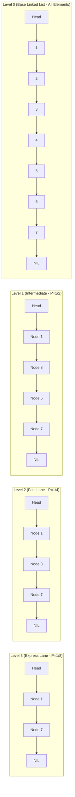

# Module 15: Systems-Level Structures: SkipLists, BloomFilters & LRU (0 to 100 Mastery)

> **Hardware Memory Caches, Probabilistic Sets, Probabilistic Trees & Storage Engines**

Modern production engines (Redis, Cassandra, RocksDB, Linux Page Cache) rely on specialized data structures optimized for disk I/O, cache hit ratios, and concurrency. In this module, you master **$O(1)$ LRU and LFU Eviction**, **Kirsch-Mitzenmacher Probabilistic Bloom Filters**, and **Skip Lists**.

---


## Skip List Multi-Level Index Towers



---

## 🗺️ Recommended Step-by-Step Learning Path

Follow this exact sequence to achieve complete mastery of this module:

| Step | File to Open | What You Will Do |
| :---: | :--- | :--- |
| **1** | **[01_README.md](01_README.md)** | Read conceptual overview, architectural foundations, and mental models. |
| **2** | **[02_FOUNDATIONS_PLAYGROUND.md](02_FOUNDATIONS_PLAYGROUND.md)** | Practice beginner spoonfed micro-drills and line-by-line syntax breakdowns. |
| **3** | **[03_try_it_yourself.py](03_try_it_yourself.py)** | Run in terminal (`python 03_try_it_yourself.py`) for an interactive zero-dependency sandbox. |
| **4** | **[00_interactive_systems_level_structures_skiplists_bloomfilters_lru.ipynb](00_interactive_systems_level_structures_skiplists_bloomfilters_lru.ipynb)** | Open in Jupyter/VS Code to run interactive visual experiments and benchmarks. |
| **5** | **[06_TROUBLESHOOTING_AND_EDGE_CASES.md](06_TROUBLESHOOTING_AND_EDGE_CASES.md)** | Study forensic runbooks, edge cases, and real-world failure post-mortems. |
| **6** | **[05_SELF_ASSESSMENT_AND_CHALLENGES.md](05_SELF_ASSESSMENT_AND_CHALLENGES.md)** | Test your knowledge with self-assessment quizzes, challenges, and diagnostic scenarios. |
| **7** | **[04_PROJECT_GUIDE.md](04_PROJECT_GUIDE.md)** | Follow guided project implementation for `starter/` and `project_solution/`. |
| **8** | **[problems/](problems/)** | Solve hands-on problem bank challenges and verify with `pytest problems/tests`. |
| **9** | **[debug_lab/](debug_lab/)** | Diagnose and fix silent production bugs in the Bug Hunter Drill. |

---

## 1. Storage Systems Mapping

| Data Structure | Real-World System | Why It Is Chosen |
| :--- | :--- | :--- |
| **LRU Cache** | Linux Virtual Memory / Redis | $O(1)$ eviction of cold pages |
| **Bloom Filter** | Cassandra / Bigtable / RocksDB | Prevents expensive disk reads for non-existent SSTable keys |
| **Skip List** | Redis Sorted Sets (`ZSET`) / LevelDB | Simpler concurrent lock-free implementation than Red-Black trees |

---

## 2. Curated LeetCode Problem Breakdowns (Brute Force vs. Optimized)

This section walks through the **6 canonical LeetCode challenges** curated for this module.
Each problem is analyzed from brute force intuition to the optimal invariant-driven solution, along with the critical edge cases to guard against in production.

### Problem 1: LRU Cache ([LeetCode #146](https://leetcode.com/problems/lru-cache/)) — Medium

> **Pattern**: `Hash Map + Doubly Linked List` | **Target Time**: $O(1) all ops$ | **Target Space**: $O(C)

#### Problem Specification
Design a data structure that follows the constraints of a Least Recently Used (LRU) cache.
Implement the `LRUCache` class:
- `LRUCache(int capacity)` Initialize the LRU cache with positive size `capacity`.
- `int get(int key)` Return the value of the `key` if the key exists, otherwise return `-1`.
- `void put(int key, int value)` Update the value of the key if the key exists. Otherwise, add the key-value pair to the cache. If the number of keys exceeds the capacity, evict the least recently used key.
Both functions must run in $O(1)$ average time complexity.

#### Algorithmic Invariants & Optimal Derivation
Combine a Hash Map (for $O(1)$ lookups) with a Doubly Linked List (for $O(1)$ node splicing and reordering upon read/write).

```python
class DNode:
    def __init__(self, key=0, val=0):
        self.key = key
        self.val = val
        self.prev = None
        self.next = None

class LRUCache:
    def __init__(self, capacity: int):
        self.cap = capacity
        self.cache = {}  # key -> node
        self.head = DNode()
        self.tail = DNode()
        self.head.next = self.tail
        self.tail.prev = self.head

    def _remove(self, node):
        prev, nxt = node.prev, node.next
        prev.next = nxt
        nxt.prev = prev

    def _insert(self, node):
        prev, nxt = self.tail.prev, self.tail
        prev.next = node
        nxt.prev = node
        node.prev = prev
        node.next = nxt

    def get(self, key: int) -> int:
        if key in self.cache:
            node = self.cache[key]
            self._remove(node)
            self._insert(node)
            return node.val
        return -1

    def put(self, key: int, value: int) -> None:
        if key in self.cache:
            self._remove(self.cache[key])
        node = DNode(key, value)
        self.cache[key] = node
        self._insert(node)
        if len(self.cache) > self.cap:
            lru = self.head.next
            self._remove(lru)
            del self.cache[lru.key]
```

#### Critical Production Edge Cases to Guard:
- **Boundary Limits**: Empty inputs, single-element collections, and minimum constraint sizes.
- **Extremes & Negative Values**: Negative indices, zero values, and maximum integer magnitude constraints.
- **Duplicates & Uniform Sequences**: All identical values, alternating keys, or repeated entries.
- **Structural Invariants**: Target at boundary indices (index `0` or `N-1`), missing targets, or cycles.

---

### Problem 2: LFU Cache ([LeetCode #460](https://leetcode.com/problems/lfu-cache/)) — Hard

> **Pattern**: `Frequency Hash Map of Doubly Linked Lists` | **Target Time**: $O(1) all ops$ | **Target Space**: $O(C)

#### Problem Specification
Design and implement a data structure for a Least Frequently Used (LFU) cache.
When the cache reaches its capacity, it should invalidate and remove the least frequently used key before inserting a new item. For this problem, when there is a tie (i.e., two or more keys with the same frequency), the least recently used key would be invalidated.

#### Algorithmic Invariants & Optimal Derivation
Maintain `freq_keys` mapping each frequency count to an `OrderedDict` (LRU chain). Track `min_freq` to evict the lowest frequency and LRU element in $O(1)$.

```python
from collections import defaultdict, OrderedDict

class LFUCache:
    def __init__(self, capacity: int):
        self.cap = capacity
        self.min_freq = 0
        self.key_val = {}
        self.key_freq = {}
        self.freq_keys = defaultdict(OrderedDict)

    def _update_freq(self, key):
        freq = self.key_freq[key]
        del self.freq_keys[freq][key]
        if not self.freq_keys[freq]:
            del self.freq_keys[freq]
            if self.min_freq == freq:
                self.min_freq += 1
        self.key_freq[key] = freq + 1
        self.freq_keys[freq + 1][key] = None

    def get(self, key: int) -> int:
        if key not in self.key_val:
            return -1
        self._update_freq(key)
        return self.key_val[key]

    def put(self, key: int, value: int) -> None:
        if self.cap <= 0:
            return
        if key in self.key_val:
            self.key_val[key] = value
            self._update_freq(key)
            return
        if len(self.key_val) >= self.cap:
            evict_key, _ = self.freq_keys[self.min_freq].popitem(last=False)
            del self.key_val[evict_key]
            del self.key_freq[evict_key]
        self.key_val[key] = value
        self.key_freq[key] = 1
        self.freq_keys[1][key] = None
        self.min_freq = 1
```

#### Critical Production Edge Cases to Guard:
- **Boundary Limits**: Empty inputs, single-element collections, and minimum constraint sizes.
- **Extremes & Negative Values**: Negative indices, zero values, and maximum integer magnitude constraints.
- **Duplicates & Uniform Sequences**: All identical values, alternating keys, or repeated entries.
- **Structural Invariants**: Target at boundary indices (index `0` or `N-1`), missing targets, or cycles.

---

### Problem 3: Design Circular Queue ([LeetCode #622](https://leetcode.com/problems/design-circular-queue/)) — Medium

> **Pattern**: `Ring Buffer with Modulo Indexing` | **Target Time**: $O(1) all ops$ | **Target Space**: $O(K)

#### Problem Specification
Design your implementation of the circular queue. The circular queue is a linear data structure in which the operations are performed based on FIFO principle, and the last position is connected back to the first position to make a circle.
Implement the `MyCircularQueue` class:
- `MyCircularQueue(k)` Initializes the object with the size of the queue to be `k`.
- `boolean enQueue(int value)` Inserts an element into the circular queue. Return true if the operation is successful.
- `boolean deQueue()` Deletes an element from the circular queue. Return true if the operation is successful.
- `int Front()` Gets the front item from the queue. If the queue is empty, return -1.
- `int Rear()` Gets the last item from the queue. If the queue is empty, return -1.
- `boolean isEmpty()` Checks whether the circular queue is empty or not.
- `boolean isFull()` Checks whether the circular queue is full or not.

#### Algorithmic Invariants & Optimal Derivation
Store values in a fixed-size buffer of length K. Calculate logical tail as `(head + count) % K`. All operations are strictly $O(1)$.

```python
class MyCircularQueue:
    def __init__(self, k: int):
        self.k = k
        self.queue = [0] * k
        self.head = 0
        self.count = 0

    def enQueue(self, value: int) -> bool:
        if self.isFull():
            return False
        tail = (self.head + self.count) % self.k
        self.queue[tail] = value
        self.count += 1
        return True

    def deQueue(self) -> bool:
        if self.isEmpty():
            return False
        self.head = (self.head + 1) % self.k
        self.count -= 1
        return True

    def Front(self) -> int:
        return -1 if self.isEmpty() else self.queue[self.head]

    def Rear(self) -> int:
        if self.isEmpty():
            return -1
        tail = (self.head + self.count - 1) % self.k
        return self.queue[tail]

    def isEmpty(self) -> bool:
        return self.count == 0

    def isFull(self) -> bool:
        return self.count == self.k
```

#### Critical Production Edge Cases to Guard:
- **Boundary Limits**: Empty inputs, single-element collections, and minimum constraint sizes.
- **Extremes & Negative Values**: Negative indices, zero values, and maximum integer magnitude constraints.
- **Duplicates & Uniform Sequences**: All identical values, alternating keys, or repeated entries.
- **Structural Invariants**: Target at boundary indices (index `0` or `N-1`), missing targets, or cycles.

---

### Problem 4: Design Twitter ([LeetCode #355](https://leetcode.com/problems/design-twitter/)) — Medium

> **Pattern**: `K-Way Merge Heap + Hash Sets` | **Target Time**: $O(K \log F) news feed$ | **Target Space**: $O(U + T)

#### Problem Specification
Design a simplified version of Twitter where users can post tweets, follow/unfollow another user, and see the 10 most recent tweets in the user's news feed.
Implement the `Twitter` class:
- `Twitter()` Initializes your twitter object.
- `void postTweet(int userId, int tweetId)` Composes a new tweet with ID `tweetId` by the user `userId`.
- `List<Integer> getNewsFeed(int userId)` Retrieves the 10 most recent tweet IDs in the user's news feed.
- `void follow(int followerId, int followeeId)` The user `followerId` started following the user `followeeId`.
- `void unfollow(int followerId, int followeeId)` The user `followerId` started unfollowing the user `followeeId`.

#### Algorithmic Invariants & Optimal Derivation
Model feed aggregation as a K-way merge of sorted lists: use a max-heap keyed by timestamp across all followed users to pull the 10 newest tweets in $O(10 \log K)$.

```python
import heapq
from collections import defaultdict

class Twitter:
    def __init__(self):
        self.timestamp = 0
        self.tweets = defaultdict(list)    # userId -> [(timestamp, tweetId)]
        self.following = defaultdict(set) # userId -> set of followeeIds

    def postTweet(self, userId: int, tweetId: int) -> None:
        self.timestamp += 1
        self.tweets[userId].append((self.timestamp, tweetId))

    def getNewsFeed(self, userId: int) -> list[int]:
        min_heap = []
        followees = set(self.following[userId])
        followees.add(userId)

        for followee in followees:
            if followee in self.tweets and self.tweets[followee]:
                idx = len(self.tweets[followee]) - 1
                t, tw_id = self.tweets[followee][idx]
                min_heap.append((-t, tw_id, followee, idx - 1))

        heapq.heapify(min_heap)
        res = []
        while min_heap and len(res) < 10:
            neg_t, tw_id, followee, next_idx = heapq.heappop(min_heap)
            res.append(tw_id)
            if next_idx >= 0:
                t, next_tw_id = self.tweets[followee][next_idx]
                heapq.heappush(min_heap, (-t, next_tw_id, followee, next_idx - 1))
        return res

    def follow(self, followerId: int, followeeId: int) -> None:
        if followerId != followeeId:
            self.following[followerId].add(followeeId)

    def unfollow(self, followerId: int, followeeId: int) -> None:
        self.following[followerId].discard(followeeId)
```

#### Critical Production Edge Cases to Guard:
- **Boundary Limits**: Empty inputs, single-element collections, and minimum constraint sizes.
- **Extremes & Negative Values**: Negative indices, zero values, and maximum integer magnitude constraints.
- **Duplicates & Uniform Sequences**: All identical values, alternating keys, or repeated entries.
- **Structural Invariants**: Target at boundary indices (index `0` or `N-1`), missing targets, or cycles.

---

### Problem 5: Design HashMap ([LeetCode #706](https://leetcode.com/problems/design-hashmap/)) — Easy

> **Pattern**: `Separate Chaining Hash Table` | **Target Time**: $O(1) average all ops$ | **Target Space**: $O(K + N)

#### Problem Specification
Design a HashMap without using any built-in hash table libraries.
Implement the `MyHashMap` class:
- `MyHashMap()` initializes the object with an empty map.
- `void put(int key, int value)` inserts a (key, value) pair into the HashMap. If the key already exists in the map, update the corresponding value.
- `int get(int key)` returns the value to which the specified key is mapped, or -1 if this map contains no mapping for the key.
- `void remove(key)` removes the key and its corresponding value if the map contains the mapping for the key.

#### Algorithmic Invariants & Optimal Derivation
Use a fixed array of buckets (e.g. 1000) and modulo hashing $h = 	ext{key} \% 1000$. Resolve collisions via separate chaining using lists.

```python
class MyHashMap:
    def __init__(self):
        self.size = 1000
        self.table = [[] for _ in range(self.size)]

    def _hash(self, key):
        return key % self.size

    def put(self, key: int, value: int) -> None:
        idx = self._hash(key)
        bucket = self.table[idx]
        for i, (k, v) in enumerate(bucket):
            if k == key:
                bucket[i] = (key, value)
                return
        bucket.append((key, value))

    def get(self, key: int) -> int:
        idx = self._hash(key)
        bucket = self.table[idx]
        for k, v in bucket:
            if k == key:
                return v
        return -1

    def remove(self, key: int) -> None:
        idx = self._hash(key)
        bucket = self.table[idx]
        for i, (k, v) in enumerate(bucket):
            if k == key:
                del bucket[i]
                return
```

#### Critical Production Edge Cases to Guard:
- **Boundary Limits**: Empty inputs, single-element collections, and minimum constraint sizes.
- **Extremes & Negative Values**: Negative indices, zero values, and maximum integer magnitude constraints.
- **Duplicates & Uniform Sequences**: All identical values, alternating keys, or repeated entries.
- **Structural Invariants**: Target at boundary indices (index `0` or `N-1`), missing targets, or cycles.

---

### Problem 6: Insert Delete GetRandom O(1) ([LeetCode #380](https://leetcode.com/problems/insert-delete-getrandom-o1/)) — Medium

> **Pattern**: `Hash Map + Dynamic Array Swap` | **Target Time**: $O(1) all ops$ | **Target Space**: $O(N)

#### Problem Specification
Implement the `RandomizedSet` class:
- `RandomizedSet()` Initializes the RandomizedSet object.
- `bool insert(int val)` Inserts an item `val` into the set if not present. Returns `true` if item was not present, `false` otherwise.
- `bool remove(int val)` Removes an item `val` from the set if present. Returns `true` if item was present, `false` otherwise.
- `int getRandom()` Returns a random element from the current set of elements (guaranteed that each element has same probability).
Each function must work in $O(1)$ average time complexity.

#### Algorithmic Invariants & Optimal Derivation
To remove in $O(1)$ from an array: swap the target element with the last element in the array, update the hash map index, and call `pop()` on the last position.

```python
import random

class RandomizedSet:
    def __init__(self):
        self.indices = {}
        self.elements = []

    def insert(self, val: int) -> bool:
        if val in self.indices:
            return False
        self.indices[val] = len(self.elements)
        self.elements.append(val)
        return True

    def remove(self, val: int) -> bool:
        if val not in self.indices:
            return False
        idx = self.indices[val]
        last = self.elements[-1]
        self.elements[idx] = last
        self.indices[last] = idx
        self.elements.pop()
        del self.indices[val]
        return True

    def getRandom(self) -> int:
        return random.choice(self.elements)
```

#### Critical Production Edge Cases to Guard:
- **Boundary Limits**: Empty inputs, single-element collections, and minimum constraint sizes.
- **Extremes & Negative Values**: Negative indices, zero values, and maximum integer magnitude constraints.
- **Duplicates & Uniform Sequences**: All identical values, alternating keys, or repeated entries.
- **Structural Invariants**: Target at boundary indices (index `0` or `N-1`), missing targets, or cycles.

---


## 3. Hands-On Project & Test Suite

Verify your LRU Cache and Bloom Filter engine:
- Starter Template: [`starter/lru_and_bloom_filter_engine.py`](starter/lru_and_bloom_filter_engine.py)
- Production Solution: [`project_solution/lru_and_bloom_filter_engine.py`](project_solution/lru_and_bloom_filter_engine.py)
- Pytest Suite: [`project_solution/test_lru_and_bloom_filter_engine.py`](project_solution/test_lru_and_bloom_filter_engine.py)

## 🧪 Practice & Verification

Reading a module teaches recognition. Only the problems teach recall — and the
debug lab teaches the thing neither of them does, which is diagnosis.

### 1. Build the module project

```bash
cd starter
python -m pytest ../project_solution -q      # must FAIL before you start
```

Every shipped test must fail with `NotImplementedError` on an untouched
starter. If any passes, the grading loop is broken and is telling you your work
is correct when it has not been done — run `make integrity` from the course
root.

### 2. Work the problem bank — 8 problems

```bash
cd problems
python -m pytest tests -q                    # all of this module's problems
python -m pytest tests -q -k p03             # just problem 3
```

| # | Problem | Pattern | Difficulty | Target |
| :--- | :--- | :--- | :--- | :--- |
| 01 | [LRU Cache With O(1) Operations](problems/p01_lru_cache.py) | Hash map + doubly linked list | Hard | `Time O(1) per operation, Space O(capacity)` |
| 02 | [Bloom Filter: No False Negatives](problems/p02_bloom_filter.py) | Bloom filter | Hard | `Time O((n + q) * hashes), Space O(bits)` |
| 03 | [Skip List: Insert, Search, Delete](problems/p03_skip_list.py) | Skip list | Hard | `Expected O(log n) per operation, Space O(n)` |
| 04 | [Fixed-Capacity Ring Buffer](problems/p04_ring_buffer.py) | Circular buffer | Medium | `Time O(1) per operation, Space O(capacity)` |
| 05 | [LFU Cache](problems/p05_lfu_cache.py) | Frequency buckets | Hard | `Time O(1) per operation, Space O(capacity)` |
| 06 | [Approximate Distinct Count](problems/p06_hyperloglog.py) | Probabilistic cardinality estimation | Hard | `Time O(n), Space O(registers)` |
| 07 | [Count-Min Sketch: Frequency Estimation](problems/p07_count_min_sketch.py) | Count-Min sketch | Hard | `Time O((n + q) * depth), Space O(width * depth)` |
| 08 | [Consistent Hashing Ring](problems/p08_consistent_hash_ring.py) | Consistent hashing | Hard | `Time O((n*v) log(n*v) + k log(n*v)), Space O(n*v)` |

Each stub carries the statement, the constraints, a complexity target and a
**three-step hint ladder**. Read one hint, try again, and only then read the
next. Every reference solution in `problems/solutions/` is cross-checked against
a brute force or a second implementation, so the answers are verified rather
than asserted.

### 3. Work the debug lab

```bash
cd debug_lab
python broken_cache_layer.py
echo "exit=$?"
```

It exits 0 and prints wrong answers. Read [`SYMPTOMS.md`](debug_lab/SYMPTOMS.md),
write a diagnosis for each, and only then open `ANSWERS.md`. The diagnostic
reasoning is the transferable skill; reading the answer first skips it.

---

## ✅ You have mastered this module when you can…

1. Explain the Bloom filter's one-sided guarantee and which direction of error it permits.
2. Build an O(1) LRU from a hash map plus a doubly linked list, and say why neither alone suffices.
3. State what HyperLogLog and Count-Min each trade away, and what they buy.
4. Explain why consistent hashing remaps ~1/N of keys where modulo hashing remaps nearly all.

Each of these is something you **do**, not something you know. If you cannot do
one without reference, that is the section to revisit — not the whole module.

---

## 🧭 Navigation

- [Pattern Recognition Guide](../PATTERN_RECOGNITION_GUIDE.md) — how to attack a problem you have never seen
- [Course README](../README.md) · [Master Syllabus](../MASTER_SYLLABUS.md)
- [Problem bank](problems/README.md) · [Debug lab](debug_lab/SYMPTOMS.md)