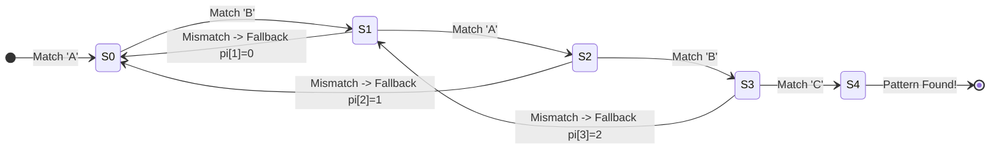

# Module 16: String Algorithms and Pattern Matching

> **Brand new to this topic?** Start with
> [`02_FOUNDATIONS_PLAYGROUND.md`](02_FOUNDATIONS_PLAYGROUND.md) - the same ideas
> in plain language with runnable code.

Every algorithm in this module beats the same baseline: the naive scan, which
tries the pattern at every offset and costs `O(n*m)`. Each one beats it by
noticing something the naive scan throws away.

| Algorithm | Cost | What it exploits |
| :--- | :--- | :--- |
| Naive | `O(n*m)` | nothing |
| KMP | `O(n + m)` | the pattern's own self-overlap |
| Z-algorithm | `O(n + m)` | the same, arranged as a prefix array |
| Rabin-Karp | `O(n + m)` expected | a hash you can update in `O(1)` per shift |
| Aho-Corasick | `O(n + total + hits)` | many patterns sharing prefixes |


## KMP String Matching Failure Automaton (Prefix Table Pi)



## Learning path

| Step | File | What you do |
| :---: | :--- | :--- |
| 1 | [`02_FOUNDATIONS_PLAYGROUND.md`](02_FOUNDATIONS_PLAYGROUND.md) | Plain-language version, runnable |
| 2 | This README | The mechanisms and when each applies |
| 3 | [`03_try_it_yourself.py`](03_try_it_yourself.py) | Watch the prefix table being built |
| 4 | [`starter/`](starter) | Implement the engine yourself |
| 5 | [`problems/`](problems) | Six problems, stubs and reference solutions |
| 6 | [`debug_lab/SYMPTOMS.md`](debug_lab/SYMPTOMS.md) | Diagnose three planted defects |
| 7 | [`04_PROJECT_GUIDE.md`](04_PROJECT_GUIDE.md) | Build the whole engine |

---

---

## 🗺️ Recommended Step-by-Step Learning Path

Follow this exact sequence to achieve complete mastery of this module:

| Step | File to Open | What You Will Do |
| :---: | :--- | :--- |
| **1** | **[01_README.md](01_README.md)** | Read conceptual overview, architectural foundations, and mental models. |
| **2** | **[02_FOUNDATIONS_PLAYGROUND.md](02_FOUNDATIONS_PLAYGROUND.md)** | Practice beginner spoonfed micro-drills and line-by-line syntax breakdowns. |
| **3** | **[03_try_it_yourself.py](03_try_it_yourself.py)** | Run in terminal (`python 03_try_it_yourself.py`) for an interactive zero-dependency sandbox. |
| **4** | **[00_interactive_string_algorithms_and_pattern_matching.ipynb](00_interactive_string_algorithms_and_pattern_matching.ipynb)** | Open in Jupyter/VS Code to run interactive visual experiments and benchmarks. |
| **5** | **[06_TROUBLESHOOTING_AND_EDGE_CASES.md](06_TROUBLESHOOTING_AND_EDGE_CASES.md)** | Study forensic runbooks, edge cases, and real-world failure post-mortems. |
| **6** | **[05_SELF_ASSESSMENT_AND_CHALLENGES.md](05_SELF_ASSESSMENT_AND_CHALLENGES.md)** | Test your knowledge with self-assessment quizzes, challenges, and diagnostic scenarios. |
| **7** | **[04_PROJECT_GUIDE.md](04_PROJECT_GUIDE.md)** | Follow guided project implementation for `starter/` and `project_solution/`. |
| **8** | **[problems/](problems/)** | Solve hands-on problem bank challenges and verify with `pytest problems/tests`. |
| **9** | **[debug_lab/](debug_lab/)** | Diagnose and fix silent production bugs in the Bug Hunter Drill. |

---

## 1. Why the naive scan is wasteful

Search for `aaaab` in `aaaaaaaaab`. At offset 0 you compare four `a`s and fail on
the `b`. The naive scan then restarts at offset 1 and compares four `a`s again -
characters it has already read and already knows about.

That repeated reading is the entire inefficiency, and it becomes quadratic
exactly when the pattern overlaps itself. On random English text the naive scan
is fine; on repetitive data - DNA, logs, binary formats - it collapses.

## 2. KMP: the prefix function

`pi[i]` is the length of the longest proper prefix of `pattern[:i+1]` that is
also a suffix of it.

For `ababaca`:

```
index :  0  1  2  3  4  5  6
char  :  a  b  a  b  a  c  a
pi    :  0  0  1  2  3  0  1
```

At index 4 the value is 3, because `aba` is both a prefix and a suffix of
`ababa`. So if a match fails after five characters, you do not restart - three
characters are still legitimately matched, and you resume from there.

The consequence is a guarantee: **the text pointer never moves backwards**.
Every character of the text is read once. The inner `while` loop only walks the
*pattern* back, and since `pi[k-1] < k` strictly, the total number of those steps
across the whole scan is bounded by `n`.

### The trap

After a *successful* match, you must also fall back to `pi[k-1]` rather than
resetting to 0. Reset to 0 and `aa` is found twice in `aaaa` instead of three
times. Whether you want overlapping matches is a product decision; getting it by
accident is not. This is planted defect 1 in the debug lab.

## 3. Z-algorithm: the same information, differently shaped

`z[i]` is the length of the longest substring starting at `i` that is also a
prefix of the whole string. The implementation maintains a window `[left, right)`
already known to match the prefix, and reuses previously computed answers inside
it rather than rescanning.

Searching with it is a trick: run the Z-function over `pattern + separator +
text` and look for entries equal to `len(pattern)`. The separator must appear in
neither string, or a match can run across the join and report a hit that does not
exist. The implementation raises rather than allowing that silently.

Use Z when you want the prefix-match lengths themselves - string periodicity,
comparing many substrings. Use KMP when you want occurrences.

## 4. Rabin-Karp: hashing a sliding window

Treat the window as a number in base 257 modulo a large prime. Sliding one
character right is `O(1)`: subtract the outgoing character's contribution,
multiply by the base, add the incoming one.

**A hash match is not a match.** Different strings can hash the same, so every
candidate must be verified with a real comparison. Skipping that check is the
classic Rabin-Karp bug, and it is one-sided: you never miss a real occurrence,
you only report extra ones. That is precisely what makes it survive testing -
the output looks like a superset rather than garbage.

`rabin_karp_search_unverified` in the engine keeps the bug deliberately, and a
test demonstrates a concrete false positive rather than asserting collisions are
rare.

Where Rabin-Karp genuinely wins is when hashing is reusable: comparing many
substrings against each other, or **2-D search**, where you hash every row
window and then roll vertically down the resulting grid. `rabin_karp_2d` does
exactly that.

## 5. Aho-Corasick: many patterns in one pass

Build a trie of all the patterns, then add **failure links**: from each node, a
pointer to the longest proper suffix of the current string that is also a node.
That is the KMP prefix function generalised from one pattern to a set.

Cost is `O(total pattern length)` to build and `O(n + hits)` to search,
*regardless of how many patterns there are*. Running KMP once per pattern costs
`O(k*n)`.

### The trap

Output sets must be merged along the failure links. Without that, a node reports
only the word ending exactly there - so `she` is found and the `he` inside it is
missed. A content filter with this bug is bypassed by padding and passes every
test written with non-overlapping examples. This is planted defect 3.

---

## 6. Curated LeetCode Problem Breakdowns (Brute Force vs. Optimized)

This section walks through the **6 canonical LeetCode challenges** curated for this module.
Each problem is analyzed from brute force intuition to the optimal invariant-driven solution, along with the critical edge cases to guard against in production.

### Problem 1: Find the Index of the First Occurrence in a String ([LeetCode #28](https://leetcode.com/problems/find-the-index-of-the-first-occurrence-in-a-string/)) — Easy

> **Pattern**: `Knuth-Morris-Pratt (KMP) / LPS Array` | **Target Time**: $O(N + M)$ | **Target Space**: $O(M)

#### Problem Specification
Given two strings `needle` and `haystack`, return the index of the first occurrence of `needle` in `haystack`, or `-1` if `needle` is not part of `haystack`.

#### Algorithmic Invariants & Optimal Derivation
KMP algorithm builds the Longest Prefix Suffix (LPS) array in $O(M)$ time and skips redundant character comparisons in haystack, matching in $O(N + M)$ total time.

```python
class Solution:
    def strStr(self, haystack: str, needle: str) -> int:
        if not needle:
            return 0
        # Build KMP LPS array
        lps = [0] * len(needle)
        prev_lps, i = 0, 1
        while i < len(needle):
            if needle[i] == needle[prev_lps]:
                lps[i] = prev_lps + 1
                prev_lps += 1
                i += 1
            elif prev_lps == 0:
                lps[i] = 0
                i += 1
            else:
                prev_lps = lps[prev_lps - 1]

        # KMP Matching
        h_idx, n_idx = 0, 0
        while h_idx < len(haystack):
            if haystack[h_idx] == needle[n_idx]:
                h_idx += 1
                n_idx += 1
            else:
                if n_idx == 0:
                    h_idx += 1
                else:
                    n_idx = lps[n_idx - 1]
            if n_idx == len(needle):
                return h_idx - len(needle)
        return -1
```

#### Critical Production Edge Cases to Guard:
- **Boundary Limits**: Empty inputs, single-element collections, and minimum constraint sizes.
- **Extremes & Negative Values**: Negative indices, zero values, and maximum integer magnitude constraints.
- **Duplicates & Uniform Sequences**: All identical values, alternating keys, or repeated entries.
- **Structural Invariants**: Target at boundary indices (index `0` or `N-1`), missing targets, or cycles.

---

### Problem 2: Repeated DNA Sequences ([LeetCode #187](https://leetcode.com/problems/repeated-dna-sequences/)) — Medium

> **Pattern**: `Rabin-Karp / Rolling Hash Substring` | **Target Time**: $O(N)$ | **Target Space**: $O(N)

#### Problem Specification
The DNA sequence is composed of a series of nucleotides abbreviated as `'A'`, `'C'`, `'G'`, and `'T'`.
Given a string `s` that represents a DNA sequence, return all the 10-letter-long sequences (substrings) that occur more than once in a DNA molecule. You may return the answer in any order.

#### Algorithmic Invariants & Optimal Derivation
Extract length-10 substrings with sliding window. Add to `seen` set, and if already seen, record in `repeated` set.

```python
class Solution:
    def findRepeatedDnaSequences(self, s: str) -> list[str]:
        seen = set()
        repeated = set()
        for i in range(len(s) - 9):
            sub = s[i:i + 10]
            if sub in seen:
                repeated.add(sub)
            else:
                seen.add(sub)
        return list(repeated)
```

#### Critical Production Edge Cases to Guard:
- **Boundary Limits**: Empty inputs, single-element collections, and minimum constraint sizes.
- **Extremes & Negative Values**: Negative indices, zero values, and maximum integer magnitude constraints.
- **Duplicates & Uniform Sequences**: All identical values, alternating keys, or repeated entries.
- **Structural Invariants**: Target at boundary indices (index `0` or `N-1`), missing targets, or cycles.

---

### Problem 3: Longest Happy Prefix ([LeetCode #1392](https://leetcode.com/problems/longest-happy-prefix/)) — Hard

> **Pattern**: `KMP Prefix Function (Pi-Array)` | **Target Time**: $O(N)$ | **Target Space**: $O(N)

#### Problem Specification
A string is called a happy prefix if is a non-empty prefix which is also a suffix (excluding itself).
Given a string `s`, return the longest happy prefix of `s`. Return an empty string `""` if no such prefix exists.

#### Algorithmic Invariants & Optimal Derivation
The length of the longest proper prefix that is also a suffix for string s is given directly by the final entry of the KMP LPS array `lps[-1]`.

```python
class Solution:
    def longestPrefix(self, s: str) -> str:
        n = len(s)
        lps = [0] * n
        length = 0
        i = 1
        while i < n:
            if s[i] == s[length]:
                length += 1
                lps[i] = length
                i += 1
            elif length > 0:
                length = lps[length - 1]
            else:
                lps[i] = 0
                i += 1
        return s[:lps[-1]]
```

#### Critical Production Edge Cases to Guard:
- **Boundary Limits**: Empty inputs, single-element collections, and minimum constraint sizes.
- **Extremes & Negative Values**: Negative indices, zero values, and maximum integer magnitude constraints.
- **Duplicates & Uniform Sequences**: All identical values, alternating keys, or repeated entries.
- **Structural Invariants**: Target at boundary indices (index `0` or `N-1`), missing targets, or cycles.

---

### Problem 4: Distinct Subsequences ([LeetCode #115](https://leetcode.com/problems/distinct-subsequences/)) — Hard

> **Pattern**: `2D String Matching Dynamic Programming` | **Target Time**: $O(M 	imes N)$ | **Target Space**: $O(M 	imes N)

#### Problem Specification
Given two strings `s` and `t`, return the number of distinct subsequences of `s` which equals `t`.

#### Algorithmic Invariants & Optimal Derivation
If `s[i-1] == t[j-1]`, we can either match the character ($dp[i-1][j-1]$) or skip it ($dp[i-1][j]$). If they don't match, we must skip ($dp[i-1][j]$).

```python
class Solution:
    def numDistinct(self, s: str, t: str) -> int:
        m, n = len(s), len(t)
        dp = [[0] * (n + 1) for _ in range(m + 1)]
        for i in range(m + 1):
            dp[i][0] = 1
        for i in range(1, m + 1):
            for j in range(1, n + 1):
                if s[i - 1] == t[j - 1]:
                    dp[i][j] = dp[i - 1][j - 1] + dp[i - 1][j]
                else:
                    dp[i][j] = dp[i - 1][j]
        return dp[m][n]
```

#### Critical Production Edge Cases to Guard:
- **Boundary Limits**: Empty inputs, single-element collections, and minimum constraint sizes.
- **Extremes & Negative Values**: Negative indices, zero values, and maximum integer magnitude constraints.
- **Duplicates & Uniform Sequences**: All identical values, alternating keys, or repeated entries.
- **Structural Invariants**: Target at boundary indices (index `0` or `N-1`), missing targets, or cycles.

---

### Problem 5: Palindrome Pairs ([LeetCode #336](https://leetcode.com/problems/palindrome-pairs/)) — Hard

> **Pattern**: `Prefix/Suffix Partitioning with Hash Map` | **Target Time**: $O(N 	imes K^2)$ | **Target Space**: $O(N 	imes K)

#### Problem Specification
Given a list of unique words, return all pairs of distinct indices `(i, j)` in the given list, so that the concatenation of the two words `words[i] + words[j]` is a palindrome.

#### Algorithmic Invariants & Optimal Derivation
Split word into prefix and suffix. If prefix is palindromic, look up reversed suffix in hash map. If suffix is palindromic, look up reversed prefix in hash map.

```python
class Solution:
    def palindromePairs(self, words: list[str]) -> list[list[int]]:
        word_map = {w: i for i, w in enumerate(words)}
        res = []

        for i, word in enumerate(words):
            n = len(word)
            for j in range(n + 1):
                # Prefix split
                pref = word[:j]
                suff = word[j:]
                # If prefix is palindrome, reverse of suffix followed by word is palindrome
                if pref == pref[::-1]:
                    rev_suff = suff[::-1]
                    if rev_suff in word_map and word_map[rev_suff] != i:
                        res.append([word_map[rev_suff], i])
                # If suffix is palindrome, word followed by reverse of prefix is palindrome
                if j != n and suff == suff[::-1]:
                    rev_pref = pref[::-1]
                    if rev_pref in word_map and word_map[rev_pref] != i:
                        res.append([i, word_map[rev_pref]])
        return res
```

#### Critical Production Edge Cases to Guard:
- **Boundary Limits**: Empty inputs, single-element collections, and minimum constraint sizes.
- **Extremes & Negative Values**: Negative indices, zero values, and maximum integer magnitude constraints.
- **Duplicates & Uniform Sequences**: All identical values, alternating keys, or repeated entries.
- **Structural Invariants**: Target at boundary indices (index `0` or `N-1`), missing targets, or cycles.

---

### Problem 6: Longest Palindromic Substring ([LeetCode #5](https://leetcode.com/problems/longest-palindromic-substring/)) — Medium

> **Pattern**: `Expand Around Center / Two Pointers` | **Target Time**: $O(N^2)$ | **Target Space**: $O(1)

#### Problem Specification
Given a string `s`, return the longest palindromic substring in `s`.

#### Algorithmic Invariants & Optimal Derivation
Every palindrome has a center: either a single character (odd length) or between two characters (even length). Expand outward from all $2N - 1$ centers.

```python
class Solution:
    def longestPalindrome(self, s: str) -> str:
        res = ""
        res_len = 0

        for i in range(len(s)):
            # Odd length center
            l, r = i, i
            while l >= 0 and r < len(s) and s[l] == s[r]:
                if (r - l + 1) > res_len:
                    res = s[l:r + 1]
                    res_len = r - l + 1
                l -= 1
                r += 1

            # Even length center
            l, r = i, i + 1
            while l >= 0 and r < len(s) and s[l] == s[r]:
                if (r - l + 1) > res_len:
                    res = s[l:r + 1]
                    res_len = r - l + 1
                l -= 1
                r += 1

        return res
```

#### Critical Production Edge Cases to Guard:
- **Boundary Limits**: Empty inputs, single-element collections, and minimum constraint sizes.
- **Extremes & Negative Values**: Negative indices, zero values, and maximum integer magnitude constraints.
- **Duplicates & Uniform Sequences**: All identical values, alternating keys, or repeated entries.
- **Structural Invariants**: Target at boundary indices (index `0` or `N-1`), missing targets, or cycles.

---


---

## Choosing between them

| Situation | Use |
| :--- | :--- |
| One pattern, exact, worst-case guarantee needed | KMP |
| Many patterns at once | Aho-Corasick |
| Comparing many substrings, or 2-D | Rabin-Karp |
| Periodicity, borders, prefix lengths | Z-algorithm |
| One pattern, ordinary text, no guarantee needed | `str.find` - genuinely |

That last row is not a joke. CPython's `str.find` uses a tuned hybrid and beats
a Python-level KMP on almost all real input. Write KMP because you need to
understand the mechanism and because interviews ask for it - not because
`in` is slow.

---

## You have mastered this when you can

- [ ] Write the prefix function from memory and explain why the text pointer
      never moves backwards.
- [ ] Say what `pi[i] = 3` means about `pattern[:i+1]`, in one sentence.
- [ ] Explain why resetting `k = 0` after a match loses overlapping occurrences.
- [ ] State what a Rabin-Karp hash match proves, and what it does not.
- [ ] Explain why Rabin-Karp is *expected* linear rather than worst-case linear.
- [ ] Draw the failure links for the dictionary `{he, she, his, hers}` and say
      why `he` is found inside `ushers`.
- [ ] Give the cost of Aho-Corasick and say why it does not depend on the number
      of patterns.
- [ ] Recognise "longest prefix that is also a suffix", "is this string a
      repeated block" and "shortest palindrome by prepending" as the same table.