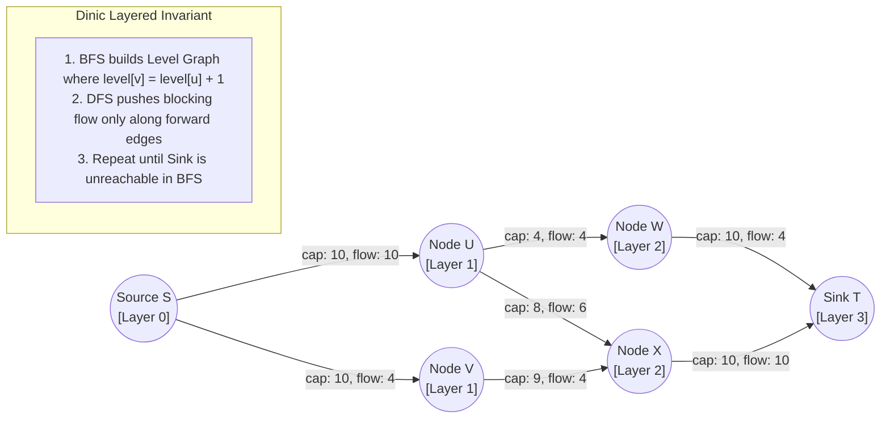

# Beginner Playground: Network Flow

> *"Water through pipes. Every pipe has a width, and the question is how much can
> get from the tap to the drain."*


> 💡 **Try It in the Live Runner:** You can run and modify any snippet in this playground directly in your browser! Click the **`▶ Run`** button in the header of any code block to test it instantly on the side, or toggle **`Live Runner`** in the top navigation bar to experiment with Python, PowerShell, and CLI commands while reading.

---


## Dinic Network Flow: Level Graph & Augmenting Path



## 1. The setup

A graph where every edge has a **capacity** - the most that can pass along it.
You want the most that can travel from a start node to an end node at once.

```python
pipes = {
    ("tap", "a"): 3,
    ("a", "drain"): 2,
    ("tap", "b"): 2,
    ("b", "drain"): 3,
}
print("capacity leaving the tap  :", 3 + 2)
print("capacity entering the drain:", 2 + 3)
```

Both totals are 5, but the answer is not 5. Route `tap -> a -> drain` is limited
by its narrowest pipe, which is 2. Route `tap -> b -> drain` is also limited to
2. So the answer is 4.

**The bottleneck is what counts, not the total.** That is the first thing to
internalise.

---

## 2. Why greedy is not enough

Here is the graph that catches everyone:

```python
edges = {("s", "a"): 1, ("s", "b"): 1, ("a", "b"): 1,
         ("a", "t"): 1, ("b", "t"): 1}
```

Suppose you pick `s -> a -> b -> t` first. Every pipe on it is now full. Look for
another route: `s -> b` is free, but `b -> t` is full. Stuck at 1.

The true answer is 2: `s -> a -> t` and `s -> b -> t`.

The fix is not a cleverer choice of first route. It is allowing the algorithm to
**take flow back**. Every time you push along a pipe, you record that you could
undo it:

```python
capacity = {("a", "b"): 1, ("b", "a"): 0}
pushed = 1
capacity[("a", "b")] -= pushed
capacity[("b", "a")] += pushed      # the undo credit
print(capacity)                      # {('a','b'): 0, ('b','a'): 1}
```

`("b", "a")` is not a pipe. It is a note saying "one unit is going a->b and could
be diverted". With that note, the search finds `s -> b -> a -> t`, which cancels
the bad middle step and leaves two clean routes.

---

## 3. The theorem that makes it useful

Find the most that can flow, and you have simultaneously found the **cheapest set
of pipes to cut** in order to stop anything getting through. Those two numbers
are always the same.

```python
routes = {"upper": 2, "lower": 2}
print("max flow:", sum(routes.values()))
print("cheapest cut: the two pipes that limit each route, total", 2 + 2)
```

That is worth a free self-check in any code you write: add up the capacities of
the cut you found, and it must equal the flow. If it does not, your code is
wrong - never the input.

---

## 4. The disguise

Most flow problems do not mention water. Here is assigning workers to jobs:

```python
qualified = [("ana", "till"), ("ana", "stock"), ("bo", "till")]

# Invent a start node that feeds every worker with capacity 1,
# and an end node that every job drains into with capacity 1.
# One unit of flow = one person doing one job.
# The capacity of 1 out of the start is what stops ana doing both jobs.
print("ana can do:", [j for w, j in qualified if w == "ana"])
print("bo can do :", [j for w, j in qualified if w == "bo"])
print("best assignment: ana -> stock, bo -> till  (2 jobs covered)")
```

Take the obvious greedy route - give ana the till because it is first in the list
- and bo has nothing left. One job covered instead of two.

Every capacity in the model encodes one rule. Write the rule down in words before
you set the number, and check it afterwards.

---

## 5. Predict before you run

Three workers, two jobs, and you accidentally set the capacity out of the start
node to 2 instead of 1. How many jobs get covered, and does the *total* look
wrong?

Write your answer, then look at [`debug_lab/SYMPTOMS.md`](debug_lab/SYMPTOMS.md)
symptom 3.

---

## Where this shows up for real

Airline crew rostering, hospital shift allocation, network reliability planning,
image segmentation, and the sports-elimination question ("can my team still
finish top?"). All the same algorithm with a different graph in front of it.

**Next:** [`01_README.md`](01_README.md) for the mechanisms in full.