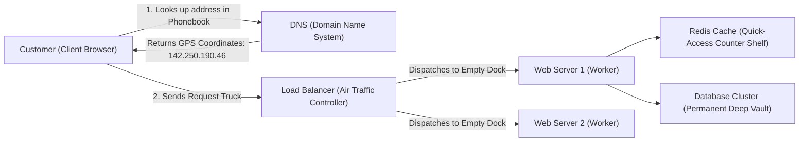
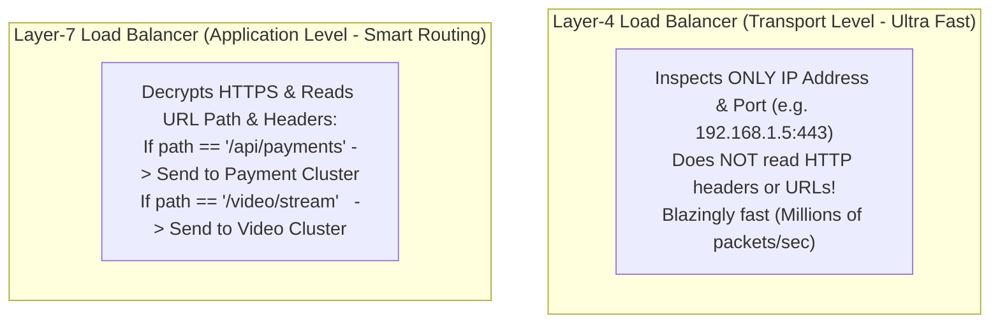

# Chapter 00-B: Zero-Prerequisite Global Infrastructure Primer

> **The Bridge: Moving from Code to the Cloud!**
> In Tracks 1 and 2, you mastered writing clean, thread-safe Python code.
> 
> But what happens when **100 million people simultaneously** use your application across London, Tokyo, New York, and Sydney?
> 
> A single server—no matter how powerful—will melt under that traffic. Network cables under the Atlantic Ocean have physical speed-of-light latency limits ($100\text{ms}$). Hard drives fail. Entire AWS data centers lose power during hurricanes.
> 
> **High-Level Design (HLD)** is the architecture of planetary-scale distributed systems. It is the science of making 1,000 computers collaborate so seamlessly that to the user, they feel like one single, indestructible machine.
> 
> Before we design systems like YouTube, Uber, and WhatsApp, this primer will spoon-feed the foundational infrastructure vocabulary with zero jargon!

---

## 0. The Jargon Demystifier: The "Global Logistics & Postal Network"

Think of the internet not as mysterious cloud magic, but as a **worldwide shipping and delivery system**:

| Distributed System Concept | Physical Postal Metaphor | Plain-English Definition |
| :--- | :--- | :--- |
| **Client** | The Customer at home | The mobile phone app or laptop web browser requesting information. |
| **Server** | A Postal Worker in a warehouse | A computer with high CPU/RAM and no monitor, sitting in a refrigerated data center. |
| **IP Address** | The Physical Postal Address | A unique digital street address (e.g. `192.168.1.1` or `142.250.190.46`). |
| **DNS** | The Universal Phonebook | Translates friendly human names (`google.com`) into computer IP addresses. |
| **Latency** | Delivery Transit Time | The number of milliseconds it takes for a data packet to travel round-trip. |
| **Throughput (QPS)** | Packages Processed per Second | Queries Per Second: how many requests your system can handle every second. |
| **Load Balancer (LB)** | The Air Traffic Controller | Stands in front of your servers; distributes incoming traffic evenly across healthy machines. |
| **Reverse Proxy** | The Security Guard at the Gate | Intercepts requests, checks credentials, compresses data, and shields backend servers from attackers. |
| **CDN (Content Delivery Network)** | Regional Neighborhood Warehouses | Caches static images/videos close to users (e.g. Tokyo edge server for Tokyo users). |
| **Sharding** | Splitting a giant 5,000-page dictionary | Dividing a massive database into smaller pieces (Volume A–M on Server 1, Volume N–Z on Server 2). |
| **Replication** | Photocopying documents in another city | Keeping identical copies of data on multiple servers in case one server catches fire. |

---

## 1. Network Protocols: TCP vs. UDP (Spoon-Fed)

When two computers speak across the internet, they choose between two shipping modes:

### 1. TCP (Transmission Control Protocol) = "Registered Certified Mail"
* **How it works:** Sender and receiver perform a 3-way handshake (`SYN` $\rightarrow$ `SYN-ACK` $\rightarrow$ `ACK`). Every single packet is numbered. If Packet #3 is lost in the Atlantic Ocean, the receiver asks the sender to re-transmit Packet #3 before reading Packet #4.
* **Guarantee:** **100% Reliability & Strict Ordering**. Zero lost bytes.
* **Used for:** Bank transfers, text messages, database queries, and web page HTML.

### 2. UDP (User Datagram Protocol) = "Live Radio Broadcast"
* **How it works:** The sender fires packets into the network as fast as possible without waiting for acknowledgments. If 5 packets drop due to wifi interference, they are gone forever.
* **Guarantee:** **Maximum Speed & Minimum Latency**, but packets may be lost or arrive out of order.
* **Used for:** Live Zoom video calls, online multiplayer games, and VoIP (nobody cares if one video pixel dropped 50 milliseconds ago).

---

## 2. Load Balancing: Layer-4 vs. Layer-7 (Spoon-Fed)

* **Layer-4 (L4 - e.g. AWS NLB, IPVS):** Fast routing based strictly on raw TCP/UDP packet headers. It never decrypts HTTPS or looks inside the payload.
* **Layer-7 (L7 - e.g. NGINX, AWS ALB, Envoy):** Decrypts the request, inspects cookies, user headers, and URL routes, allowing smart routing, rate limiting, and SSL termination.

---

## 3. The 45-Minute HLD Interview Survival Script

When an interviewer asks: *"Design Netflix"* or *"Design Twitter"*, never jump into drawing boxes immediately! Follow this exact **5-minute opening script**:

### Step 1: Scope & Functional Boundaries (Minutes 0 – 3)
> *"To ensure we build the right system, let's establish the core scope. Are we focusing on:*
> 1. *User video playback and streaming?*
> 2. *Or the content creator video upload and transcoding pipeline?*
> 3. *Should we design recommendations, or can we treat that as an external service?"*

### Step 2: Back-of-the-Envelope Estimation (Minutes 3 – 5)
> *"Let's estimate the scale:*
> * *Assume 100 Million Daily Active Users (DAU).*
> * *Average write load: 10% of users upload 1 video/week $\rightarrow \sim 150\text{ QPS}$.*
> * *Average read load: 5 videos watched per user/day $\rightarrow \frac{500 \times 10^6}{10^5} \approx \mathbf{5,000\text{ QPS}}$ playback requests.*
> * *This is a **Read-Heavy System (ratio 33:1)**, which means aggressive multi-tier caching (Redis + CDN edge) is our highest architectural priority."*

---

## 4. Milestone Check: What You Just Mastered!

You now understand:
1. The global postal metaphor behind DNS, load balancers, and reverse proxies.
2. The exact mechanical difference between **TCP** (reliability) and **UDP** (speed).
3. Why companies use **Layer-4 for raw network routing** and **Layer-7 for smart application routing**.
4. The exact 5-minute opening script to dominate any High-Level Design interview.
