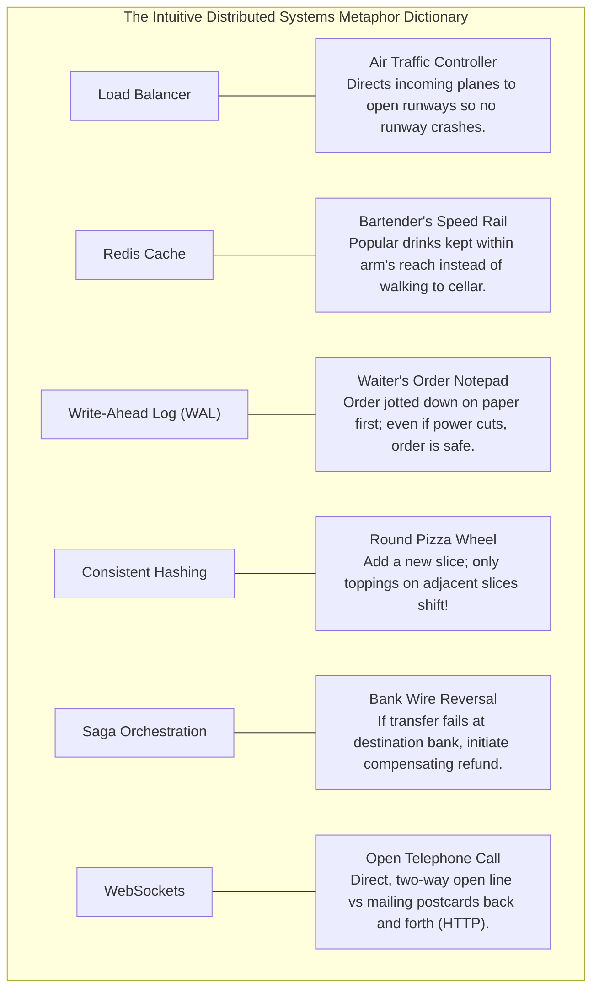

# HLD Chapter 0: Intuitive Distributed Systems Primer & Visual Metaphors

> **Core Learning Objective:** Eliminate the abstract intimidation of High-Level Design. Master every core distributed systems building block using vivid real-world analogies, understand the 10 systems side-by-side in a single matrix, and practice with the 45-minute blank interview template.

---

## 1. The Distributed Systems Metaphor Dictionary (Zero Jargon)

Whenever a distributed systems concept feels confusing, ground your thinking in these intuitive physical analogies:



---

## 2. The 13 High-Level Systems Rosetta Stone Comparison

Click on any system to jump directly into its end-to-end architecture, back-of-the-envelope math, database schema, and failure mode deep dives:

| System | Traffic Type | Read : Write Ratio | Primary Storage | Primary Cache | The Single Hardest Bottleneck |
| :--- | :--- | :---: | :--- | :--- | :--- |
| **[1. Messaging App (WhatsApp)](systems/01-messaging-app.md)** | Bi-directional Real-Time | $1 : 1$ | **Cassandra** (LSM-Tree) | Redis (Session registry) | 50M open WebSockets + offline delivery |
| **[2. Ticketing Platform](systems/02-ticketing-system-hotel-reservation.md)** | Flash Spikes (Concerts) | $5 : 1$ | **PostgreSQL** (ACID) | Redis (Distributed lock + TTL) | Zero double-booking across 50,000 users in 5s |
| **[3. Photo Feed (Instagram)](systems/03-instagram.md)** | Read-Heavy (Photos) | $50 : 1$ | **Cassandra** + S3 | CDN (Edge) + Redis (Timelines) | Celebrity fan-out on write explosion |
| **[4. Distributed Scheduler](systems/04-distributed-task-scheduler.md)** | Compute / Batch Heavy | $1 : 1$ | **PostgreSQL** + etcd | Timing Wheel in RAM | Worker crash failure recovery + leader election |
| **[5. Video Streaming (YouTube)](systems/05-video-streaming-youtube.md)** | High Bandwidth Egress | $100 : 1$ | **S3** (Object Store) | Multi-Tier CDN Edge | Adaptive Bitrate chunking without playback stall |
| **[6. E-Commerce (Amazon)](systems/06-ecommerce-platform.md)** | Financial Transactions | $10 : 1$ | **MySQL** (Partitioned) | Redis (Atomic Lua inventory) | Multi-service inventory/payment Saga rollback |
| **[7. Proximity Service (Yelp)](systems/07-proximity-service.md)** | Geospatial Read-Heavy | $100 : 1$ | **PostGIS** + ScyllaDB | Redis (H3 Spatial Indices) | Fast nearest-neighbor search without 2D lag |
| **[8. Mutual Match (Tinder)](systems/08-tinder.md)** | High Write / Swipes | $1 : 1$ | **DynamoDB** / Cassandra| Redis (Sets of user likes) | Sub-10ms mutual match detection on swipes |
| **[9. Ride Dispatch (Uber)](systems/09-uber.md)** | Massive GPS Ingestion | $1 : 5$ (Write Heavy!) | **CockroachDB** (Trips) | Redis (H3 Spatial driver grid) | 1.25M GPS writes/sec without DB meltdown |
| **[10. Social Feed (Twitter/X)](systems/10-twitter.md)** | Read-Heavy Microblogging| $10 : 1$ | **Cassandra** + S3 | Redis Cluster (800 IDs timeline)| Celebrity fan-out hybrid push-pull architecture |
| **[11. Distributed Cache (Redis)](systems/11-distributed-cache-redis-cluster.md)** | Ultra Low-Latency In-Memory| $10 : 1$ | **Memory** (RAM + RDB/AOF)| Redis Master-Replica Shards | Split-brain prevention & consistent hash slot rebalancing |
| **[12. Search Engine (Elasticsearch)](systems/12-distributed-search-engine-elasticsearch.md)**| High-Volume Inverted Index| $5 : 1$ | **Lucene Segments** (Disk) | File System Page Cache | Near real-time index refresh & segment merge throttling |
| **[13. Time-Series (Prometheus)](systems/13-time-series-metrics-monitoring-prometheus.md)**| Append-Only Metrics Flush | $1 : 100$ (Write Heavy!)| **Gorilla TSDB Chunking** | Head Chunk Memory Buffer | 10M metric samples/sec ingestion & compactor downsampling |

---

## 3. The 45-Minute Printable Interview Cheat Template

Print this 1-page canvas to structure your whiteboard during mock interviews:

```text
================================================================================
           THE 45-MINUTE SYSTEM DESIGN WHITEBOARD BLUEPRINT
================================================================================

[00:00 - 05:00] PHASE 1: REQUIREMENTS
  - Functional: (List 3 core features only: e.g. Post, Follow, Feed)
  - Non-Functional: (Availability %? Read vs Write latency? Eventual vs Strong consistency?)

[05:00 - 10:00] PHASE 2: MATH & ESTIMATIONS
  - Daily Active Users (DAU): _______ M
  - Write QPS: (DAU * writes / 10^5) = _______ QPS (Peak: 2x = _______)
  - Read QPS: (DAU * reads / 10^5) = _______ QPS (Peak: 2x = _______)
  - 5-Year Storage: (Daily writes * size * 2000) = _______ TB / PB
  - Cache RAM: (Daily read volume * 0.20) = _______ GB / TB

[10:00 - 25:00] PHASE 3: HIGH-LEVEL ARCHITECTURE
  [Client] -> [DNS Anycast] -> [CDN (Static Media)]
                             -> [Load Balancer (L4/L7)]
                                 -> [API Gateway (Auth/Rate-Limit)]
                                     -> [Stateless Microservices]
                                         -> [Cache Layer (Redis)]
                                         -> [Primary DB (SQL/NoSQL)]
                                         -> [Message Broker (Kafka)]

[25:00 - 38:00] PHASE 4: THE DEEP DIVE (Pick 2 Core Bottlenecks)
  1. Concurrency / Hot Keys: __________________________________________________
  2. Data Partitioning / Sharding Key: ________________________________________

[38:00 - 45:00] PHASE 5: RESILIENCE & FAILURE MODES
  - Single Point of Failure (SPOF) eliminations?
  - Cross-region replication strategy (Active-Active vs Active-Passive)?
  - Disaster Recovery / Observability (Metrics, Traces, Alerts)?
================================================================================
```


## Further Reading

- [System Design Primer](https://github.com/donnemartin/system-design-primer)
- [AWS Builders' Library](https://aws.amazon.com/builders-library/)
- [Wikipedia: Eventual consistency](https://en.wikipedia.org/wiki/Eventual_consistency)


---

## Check Yourself

Answer in your head or on paper first, then open each answer.

<details>
<summary><strong>1.</strong> What does 'eventual consistency' mean?</summary>

If no new updates occur, all replicas will converge to the same value, but reads may be stale for a while.

</details>

<details>
<summary><strong>2.</strong> What is a single point of failure?</summary>

A component whose failure takes the whole system down; remove it with redundancy.

</details>

<details>
<summary><strong>3.</strong> What is idempotency?</summary>

Repeating an operation gives the same result as doing it once, which makes retries safe.

</details>

<details>
<summary><strong>4.</strong> What is backpressure?</summary>

Slowing producers when consumers cannot keep up so queues stay bounded.

</details>
