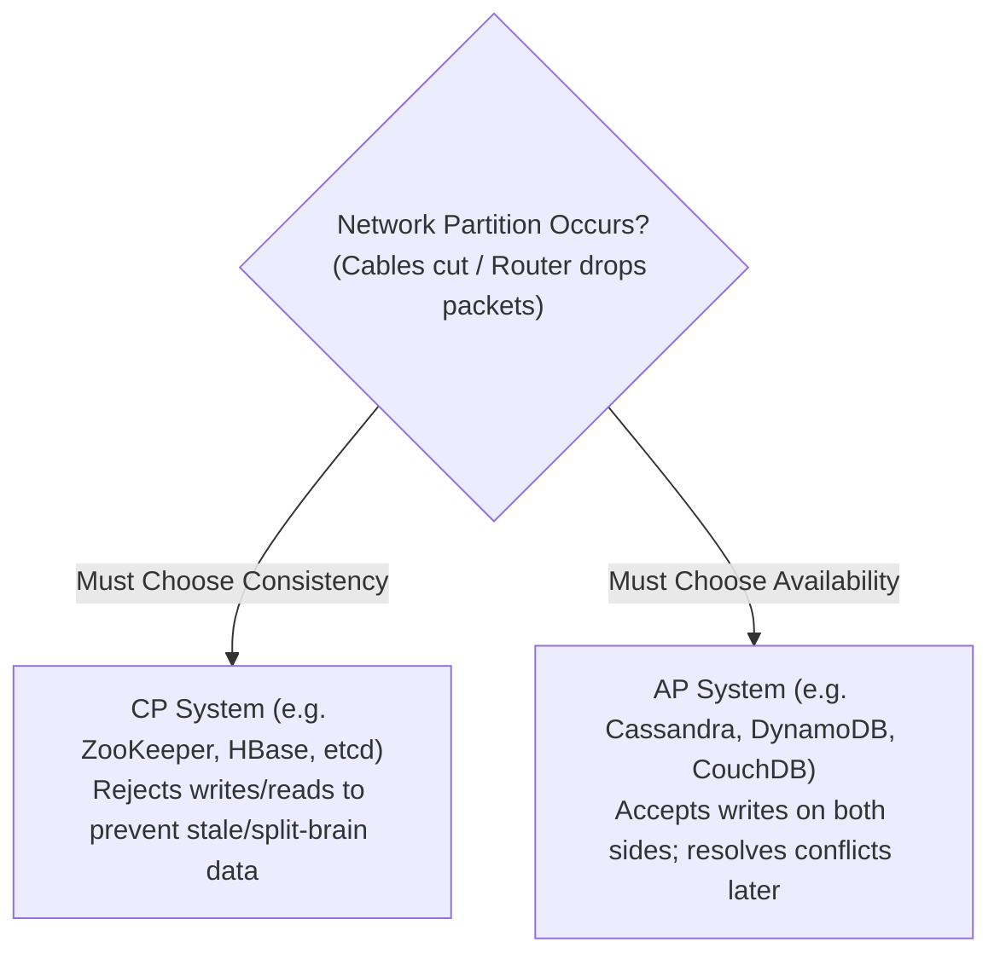
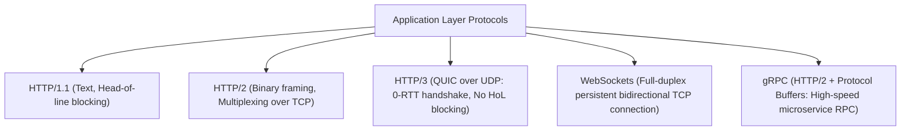
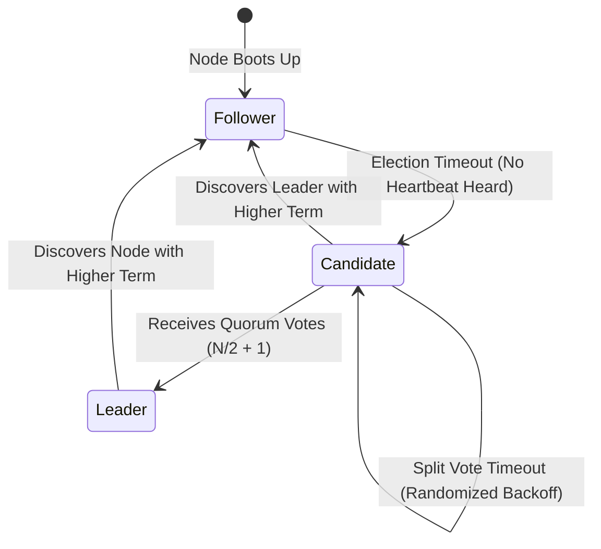
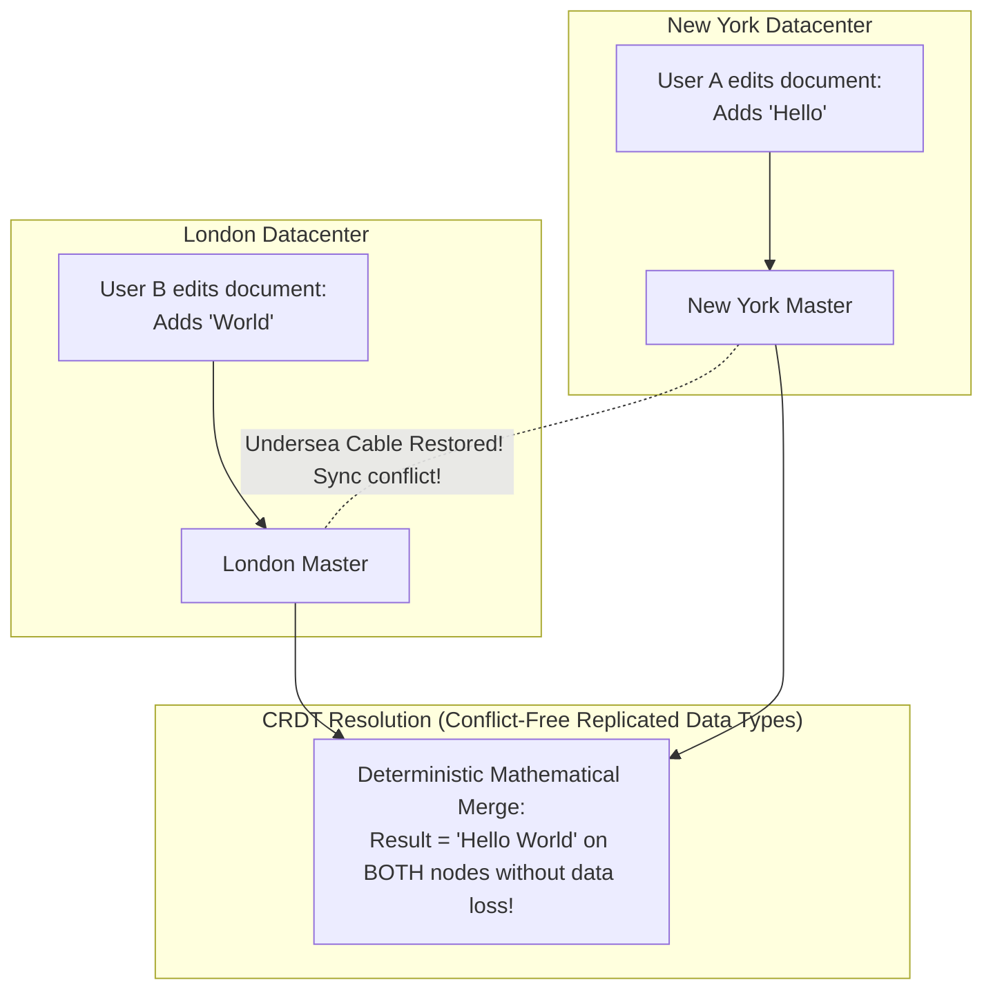

# HLD Chapter 1: Distributed Systems Core Prerequisites & Latency Numbers

> **Core Learning Objective:** Master the foundational theorems, network protocols, and hardware latency figures that govern every distributed system at planetary scale.

---

## 1. Latency Numbers Every Systems Engineer Must Know

Peter Norvig and Jeff Dean's famous hardware latency comparison demonstrates why network calls and disk reads require caching and asynchronous architectures:

| Operation | Real Time | Scaled Human Equivalent (1 CPU cycle $\approx$ 1 sec) |
| :--- | :--- | :--- |
| **L1 CPU Cache reference** | $0.5 \text{ ns}$ | $1 \text{ second}$ |
| **L2 CPU Cache reference** | $7 \text{ ns}$ | $14 \text{ seconds}$ |
| **Main RAM memory access** | $100 \text{ ns}$ | $3.3 \text{ minutes}$ |
| **SSD random read (NVMe)** | $16 \text{ }\mu\text{s}$ | $5.5 \text{ hours}$ |
| **Rotational Disk Seek (HDD)** | $4 \text{ ms}$ | $1.3 \text{ months}$ |
| **Same Datacenter Roundtrip (LAN)** | $0.5 \text{ ms}$ | $5.7 \text{ days}$ |
| **Cross-Continent Roundtrip (SF to London)** | $150 \text{ ms}$ | $4.7 \text{ years}!$ |

> [!IMPORTANT]
> **Key Takeaway:** Reading from RAM is $\sim 160\times$ faster than an SSD, and $\sim 40,000\times$ faster than a mechanical disk! Sending a network packet across the ocean is equivalent to waiting **almost 5 years**. This is why CDNs and distributed caches exist.

---

## 2. CAP Theorem vs PACELC Theorem

### The Classic CAP Theorem
In any asynchronous distributed network subject to partitions ($P$), you can guarantee at most **two** of the following three properties:
* **Consistency ($C$):** Every read receives the most recent write or an error (Linearizability).
* **Availability ($A$):** Every non-failing node returns a non-error response, though not guaranteed to be the newest write.
* **Partition Tolerance ($P$):** The system continues to operate despite arbitrary network drops between nodes.

> [!NOTE]
> Since network partitions are an unavoidable physical reality in distributed networks, **"CA" systems do not exist in distributed computing**. Your true choice is **CP vs AP**.

### The PACELC Theorem (The Complete Reality)
CAP only describes system behavior *during a network partition*. The **PACELC Theorem** extends this to normal operations:
* **If there is a Partition ($P$):** How does the system trade off **Availability ($A$)** vs **Consistency ($C$)**?
* **Else ($E$):** When the network is normal, how does the system trade off **Latency ($L$)** vs **Consistency ($C$)**?

*Examples:*
* **PA/EL (Cassandra, DynamoDB):** On Partition $\rightarrow$ Available. Else $\rightarrow$ Low Latency (Eventual Consistency).
* **PC/EC (MongoDB, Spanner):** On Partition $\rightarrow$ Consistent. Else $\rightarrow$ Strong Consistency (higher latency due to sync replication).

---

## 3. Network Transport Protocols: TCP, UDP, HTTP/2, HTTP/3, gRPC & WebSockets

### Protocol Comparison Matrix
| Protocol | Transport | Connection Model | Multiplexed? | Ideal Use Case |
| :--- | :--- | :--- | :--- | :--- |
| **HTTP/1.1** | TCP | Request-Response (Keep-Alive) | No | Legacy REST APIs |
| **HTTP/2** | TCP | Multiplexed binary streams | Yes (Stream-level) | Modern REST APIs, web apps |
| **HTTP/3 (QUIC)** | UDP | Multiplexed independent packet streams | Yes (Packet-level) | Mobile devices, spotty cell networks, YouTube |
| **WebSockets** | TCP | Persistent, full-duplex bidirectional | No (Single stream) | Real-time chat, live trading, gaming |
| **gRPC** | HTTP/2 | Typed RPC with binary Protobuf | Yes | Internal microservice-to-microservice traffic |

---

## 4. Distributed Consensus: Raft & Paxos Essentials

When multiple nodes must agree on a shared state (e.g. Who is the leader? What is the current commit log index?), distributed consensus algorithms ensure agreement even if nodes crash:

### Raft in a Nutshell (Leader-Based Consensus)

1. **Leader Election:**
   * Nodes start as **Followers**. If a follower hears no heartbeat from a leader within a randomized election timeout ($150\text{ms} - 300\text{ms}$), it transitions to **Candidate**, increments the `term` number, and requests votes.
   * A candidate receiving votes from a **Quorum ($\lfloor N/2 \rfloor + 1$)** becomes the new **Leader**.
   * If two candidates split votes evenly, both timeout with randomized backoffs ($150\text{ms}$ vs $280\text{ms}$), guaranteeing that one triggers an election earlier on the next round!
2. **Log Replication:**
   * Clients send all write requests strictly to the Leader.
   * The Leader appends the entry to its local log and broadcasts `AppendEntries` RPCs to all followers.
   * Once a Quorum of followers acknowledge the entry, the leader commits it and notifies the client.

---

## 5. Active-Active Multi-Region Replication: CRDTs & Vector Clocks

What happens when your database has two primary master databases—one in **New York** and one in **London**—and both accept simultaneous writes while an undersea cable is temporarily cut?

### The Conflict Resolution Options:
1. **Last-Write-Wins (LWW):** Compare timestamps and pick the latest write.
   * *The Danger:* Physical computer clocks drift (NTP clock skew). You might accidentally overwrite a critical edit made 5 milliseconds earlier!
2. **Vector Clocks:** Every node maintains an array of logical counters: `[NY: 3, LON: 2]`. This allows the database to detect whether Write A *happened-before* Write B, or if they were **concurrent conflicting writes** requiring application resolution.
3. **CRDTs (Conflict-Free Replicated Data Types):** Data structures mathematically designed so that any concurrent edits can be merged in any arbitrary order, and **all replicas are mathematically guaranteed to converge to the exact same state without locks!** (Used by Figma, Google Docs, Apple Notes, and Redis Enterprise).
