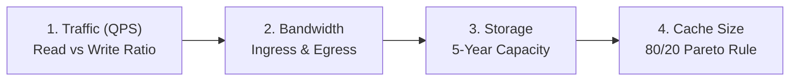

# HLD Chapter 2: Back-of-the-Envelope Estimations Masterclass

> **Core Learning Objective:** Master the mathematical formulas, rules of thumb, and conversion shortcuts required to estimate QPS, storage, bandwidth, and cache sizes in under 5 minutes during a systems design interview.

---

## 1. Golden Rules of Thumb & Approximation Constants

In an interview, **never spend time doing manual long division with decimals**. Interviewers expect clean, fast order-of-magnitude estimations ($10^x$).

### The 86,400 Approximation Rule
$$1 \text{ day} = 24 \text{ hours} \times 60 \text{ minutes} \times 60 \text{ seconds} = 86,400 \text{ seconds} \approx \mathbf{10^5 \text{ seconds}}$$

$$\text{QPS} = \frac{\text{Daily Requests}}{10^5}$$

* **10 Million requests/day** $\approx \frac{10^7}{10^5} = \mathbf{100 \text{ QPS}}$
* **100 Million requests/day** $\approx \frac{10^8}{10^5} = \mathbf{1,000 \text{ QPS}}$
* **1 Billion requests/day** $\approx \frac{10^9}{10^5} = \mathbf{10,000 \text{ QPS}}$

### Peak Traffic Multiplier
Systems must be provisioned for **Peak QPS**, not average QPS:
$$\text{Peak QPS} = \text{Average QPS} \times \mathbf{2} \text{ (or } \mathbf{3\times} \text{ for spiky apps like Twitter/Uber)}$$

---

## 2. Storage & Memory Units Mapping

| Power of 2 | Power of 10 | Value | Unit | Concrete Example |
| :--- | :--- | :--- | :--- | :--- |
| $2^{10}$ | $10^3$ | $1,024$ | **Kilobyte (KB)** | Small JSON payload / metadata |
| $2^{20}$ | $10^6$ | $1,048,576$ | **Megabyte (MB)** | High-res compressed photo |
| $2^{30}$ | $10^9$ | $1,073,741,824$ | **Gigabyte (GB)** | Modern RAM memory stick |
| $2^{40}$ | $10^{12}$ | $10^{12}$ | **Terabyte (TB)** | Hard drive disk capacity |
| $2^{50}$ | $10^{15}$ | $10^{15}$ | **Petabyte (PB)** | Datacenter storage tier |

---

## 3. The 4-Step Estimation Blueprint



### Step 1: Traffic Estimation (Read vs Write QPS)
1. Identify **Daily Active Users (DAU)**.
2. Determine user actions per day (e.g. 10 reads, 1 write per user).
3. Compute Read QPS and Write QPS.

### Step 2: Storage Requirements (5-Year Capacity)
$$\text{Daily Storage} = \text{Writes/Day} \times \text{Size per Record}$$
$$\text{5-Year Storage} = \text{Daily Storage} \times 365 \times 5 \approx \text{Daily Storage} \times \mathbf{2,000}$$

### Step 3: Network Bandwidth (Ingress & Egress)
* **Ingress (Incoming):** $\text{Write QPS} \times \text{Average Write Payload Size}$
* **Egress (Outgoing):** $\text{Read QPS} \times \text{Average Read Payload Size}$

### Step 4: Cache Memory Sizing (The 80/20 Pareto Principle)
In almost every consumer system, **$20\%$ of daily read requests account for $80\%$ of total read volume** (the "hot" data).
$$\text{Cache RAM} = \text{Daily Total Read Data Volume} \times \mathbf{0.20}$$

---

## 4. End-to-End Walkthrough: Twitter-Scale Social Platform

### Assumptions & Given Metrics:
* **DAU:** $300 \text{ Million}$ active users.
* **Writes:** Each user posts an average of $2$ tweets per day.
* **Reads:** Each user views an average of $20$ tweets per day.
* **Media:** $10\%$ of tweets contain an image ($200 \text{ KB}$), $90\%$ are pure text ($200 \text{ bytes}$).

### 1. QPS Calculation:
* **Total Writes/Day:** $300\text{M} \times 2 = 600 \text{ Million tweets/day}$.
$$\text{Write QPS} = \frac{600 \times 10^6}{10^5} = \mathbf{6,000 \text{ QPS}} \quad (\text{Peak} = 6,000 \times 2 = \mathbf{12,000 \text{ QPS}})$$
* **Total Reads/Day:** $300\text{M} \times 20 = 6 \text{ Billion reads/day}$.
$$\text{Read QPS} = \frac{6 \times 10^9}{10^5} = \mathbf{60,000 \text{ QPS}} \quad (\text{Peak} = 60,000 \times 2 = \mathbf{120,000 \text{ QPS}})$$
* **Read-to-Write Ratio:** $10 : 1$ (Read-heavy architecture).

### 2. Storage Calculation:
* **Average Tweet Size:** $(0.90 \times 200 \text{ B}) + (0.10 \times 200 \text{ KB}) \approx 180 \text{ B} + 20 \text{ KB} \approx \mathbf{20 \text{ KB}}$.
* **Daily Storage:** $600\text{M writes} \times 20 \text{ KB} = 12 \text{ TB / day}$.
* **5-Year Storage:** $12 \text{ TB} \times 365 \times 5 \approx \mathbf{22 \text{ PB}}$ (Petabytes).

### 3. Cache Sizing (80/20 Rule):
* **Daily Read Volume:** $6 \text{ Billion reads} \times 20 \text{ KB} = 120 \text{ TB / day}$.
* **Cache 20% of Hot Daily Data:** $120 \text{ TB} \times 0.20 = \mathbf{24 \text{ TB of RAM}}$.
* If each Redis cache server has $256 \text{ GB}$ of RAM:
$$\text{Number of Redis Nodes} = \frac{24 \text{ TB}}{0.256 \text{ TB}} \approx \mathbf{94 \text{ Cache Instances}}$$.


## 5. Latency Numbers and a Reusable Calculator

### Orders of magnitude worth memorising

| Operation | Rough time | Use it to decide |
| :--- | :--- | :--- |
| Main memory reference | 100 ns | An in-process cache is effectively free |
| Read 1 MB sequentially from memory | 10 to 50 microseconds | Why you cache hot data in RAM |
| SSD random read | 100 microseconds | Databases on SSD handle thousands of reads per second per disk |
| Round trip inside one data centre | 0.5 ms | A chain of ten service calls costs about 5 ms of pure network |
| Read 1 MB sequentially from SSD | about 1 ms | Large scans are bandwidth-bound |
| Disk seek (spinning disk) | 5 to 10 ms | Why random access on HDD is slow |
| Cross-continent round trip | 100 to 150 ms | Why you put data near users (CDNs, regional replicas) |

These are order-of-magnitude figures; hardware changes them by factors of two or three, but the ratios (memory about 1,000 times faster than SSD, SSD about 100 times faster than a cross-continent call) stay stable.

### One function for every estimation question

```python
SECONDS_PER_DAY = 86_400

def estimate(dau, actions_per_user, read_write_ratio, bytes_per_write, years=5, peak_factor=3, replicas=3):
    writes_per_day = dau * actions_per_user
    write_qps = writes_per_day / SECONDS_PER_DAY
    read_qps = write_qps * read_write_ratio
    storage_tb = writes_per_day * 365 * years * bytes_per_write * replicas / 1e12
    return {
        "write_qps": round(write_qps),
        "read_qps": round(read_qps),
        "peak_read_qps": round(read_qps * peak_factor),
        "storage_tb": round(storage_tb, 1),
    }

# Practice 1: URL shortener, 10M new links a day, 100 reads per write, 500 bytes each, single copy
url = estimate(dau=10e6, actions_per_user=1, read_write_ratio=100, bytes_per_write=500, replicas=1)
assert url == {"write_qps": 116, "read_qps": 11574, "peak_read_qps": 34722, "storage_tb": 9.1}

# Practice 2: chat, 500M DAU sending 40 messages of 100 bytes, reads equal to writes, 3 copies, 1 year
chat = estimate(dau=500e6, actions_per_user=40, read_write_ratio=1, bytes_per_write=100, years=1, replicas=3)
assert chat["write_qps"] == 231_481 and chat["storage_tb"] == 2_190.0

# Practice 3: photo upload, 10M DAU uploading 2 photos of 2 MB, 5 years, 3 copies
photos = estimate(dau=10e6, actions_per_user=2, read_write_ratio=50, bytes_per_write=2e6, replicas=3)
assert photos["storage_tb"] == 219_000.0                 # 219 PB: this one is dominated by media storage, not QPS
```

How to use the three results: URL shortener storage is **single-digit terabytes** (a database), chat text is **a few petabytes a year** (a sharded wide-column store), and photos are **hundreds of petabytes** (an object store plus a CDN). The estimate tells you which architecture family you are in before you draw anything.

### Mistakes to avoid

1. Forgetting the peak factor: average QPS sizes the budget, peak QPS sizes the servers.
2. Forgetting replication in storage (a factor of 3 is easy to omit).
3. Mixing bits and bytes in bandwidth (a 1 Gbps link carries about 125 MB per second).
4. Quoting false precision: say "about 10 TB", not "9.13 TB"; the inputs are guesses.
5. Skipping the sanity check: does one server's worth of memory, disk or network hold this? If yes, do not shard.

---

## Further Reading

- [Latency numbers every programmer should know](https://gist.github.com/jboner/2841832)
- [System Design Primer: appendix](https://github.com/donnemartin/system-design-primer)
- [AWS Builders' Library](https://aws.amazon.com/builders-library/)


---

## Check Yourself

Answer in your head or on paper first, then open each answer.

<details>
<summary><strong>1.</strong> Approximate seconds in a day, for QPS maths?</summary>

About 86,400 (use 100,000 for quick estimates).

</details>

<details>
<summary><strong>2.</strong> 1M requests per day is roughly how many QPS?</summary>

About 12 per second on average (1,000,000 / 86,400); size for peak, often 3 to 10 times average.

</details>

<details>
<summary><strong>3.</strong> How much storage is 1 KB per record for 1 billion records?</summary>

About 1 TB.

</details>

<details>
<summary><strong>4.</strong> Why show your arithmetic in an interview?</summary>

It reveals your assumptions and lets the interviewer correct them; the design choices follow from the numbers.

</details>
