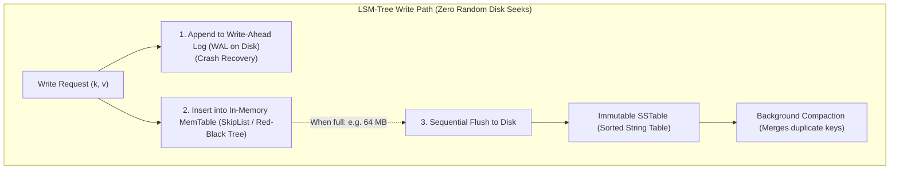
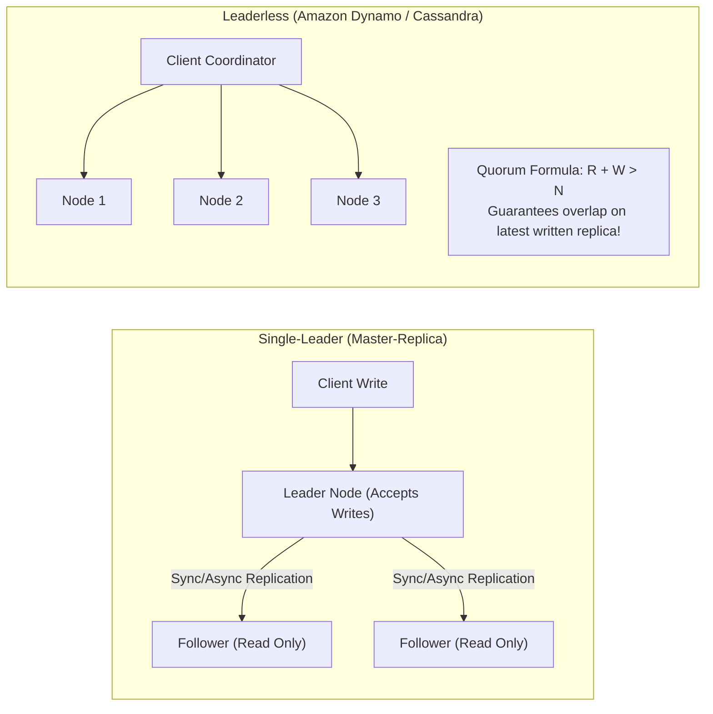
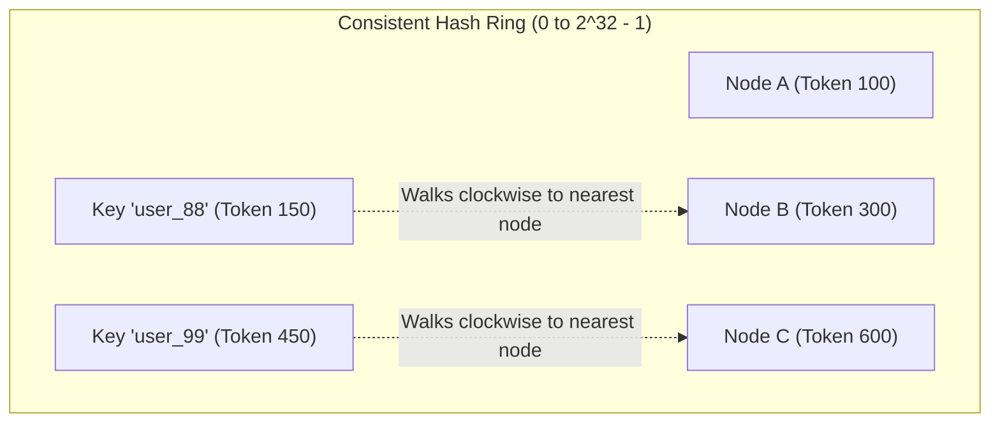

# HLD Chapter 3: Databases, Storage Engines, Sharding & Consistent Hashing

> **Core Learning Objective:** Master database architecture at planetary scale. Understand B-Trees vs LSM-Trees, replication topologies, horizontal partitioning (sharding), and the mathematics of Consistent Hashing with virtual nodes.

---

## 1. Storage Engines Under the Hood: B-Trees vs LSM-Trees

Every database's performance characteristics are dictated by its underlying on-disk storage engine:

| Metric | B-Tree (PostgreSQL, MySQL InnoDB) | LSM-Tree (Cassandra, RocksDB, ScyllaDB) |
| :--- | :--- | :--- |
| **Primary Optimization** | **Read-Heavy** workloads | **Write-Heavy** workloads |
| **Write Mechanism** | In-place random page updates | Append-only sequential writes to MemTable + WAL |
| **Storage Structure** | Self-balancing tree of fixed-size disk blocks ($4\text{KB} - 16\text{KB}$) | Memory buffer (MemTable) flushed to sorted disk files (SSTables) |
| **Write Amplification** | Higher (full page rewrite on single row update) | Lower for writes; compaction overhead later |
| **Lookup Latency** | $O(\log N)$ predictable disk seeks | In-memory MemTable check $\rightarrow$ Bloom Filter check $\rightarrow$ SSTable seek |



---

## 2. Replication Models: Leader vs Leaderless



### The Quorum Mathematics ($R + W > N$)
In leaderless systems:
* $N$ = Number of replicas stored for each key.
* $W$ = Number of write acknowledgements required before reporting success.
* $R$ = Number of replicas queried on read.
* **If $R + W > N$:** By the Pigeonhole Principle, at least **one** of the queried nodes in $R$ is guaranteed to contain the most recent write.

---

## 3. Sharding & Horizontal Partitioning

When data exceeds the disk capacity or throughput limits of a single machine ($> 2 \text{ TB}$ or $> 20,000 \text{ QPS}$), the database must be partitioned:

### Partitioning Strategies:
1. **Range-Based Partitioning:** (e.g. Users $A-C$ on Node 1, $D-F$ on Node 2).  
   * *Flaw:* Causes massive **hot spots** (e.g. Celebrity accounts or localized surges).
2. **Hash-Based Partitioning:** $\text{Node} = \text{hash}(\text{key}) \pmod N$.  
   * *Fatal Flaw:* When a node is added or removed ($N \rightarrow N + 1$), nearly $100\%$ of keys hash to a new node, causing a catastrophic full-cluster re-indexing storm!

---

## 4. Consistent Hashing with Virtual Nodes (The Standard)

Consistent Hashing maps both **nodes** and **data keys** to an abstract circular ring ($[0, 2^{32}-1]$).



### Why It Eliminates Re-indexing Storms
When a new node is inserted into the ring, **only the keys immediately preceding the new node are moved**; all other nodes remain completely untouched! On average, only $\frac{K}{N}$ keys are relocated.

### Eliminating Hotspots: Virtual Nodes (vnodes)
If physical nodes are placed randomly on the ring, load distribution is unequal.
**Solution:** Each physical server is assigned multiple **Virtual Nodes** (e.g., 256 tokens scattered across the ring: `Node_A#1`, `Node_A#2`, etc.). This ensures statistical uniformity across all physical hardware.

### Complete Consistent Hash Ring Implementation in Python
```python
import hashlib
import bisect
from typing import List, Optional

class ConsistentHashRing:
    def __init__(self, replicas: int = 100):
        self.replicas = replicas # Number of virtual nodes per physical server
        self.ring: List[int] = [] # Sorted token list
        self.vnode_to_node: dict[int, str] = {} # Token -> Physical Node mapping

    def _hash(self, key: str) -> int:
        return int(hashlib.md5(key.encode('utf-8')).hexdigest(), 16)

    def add_node(self, node: str) -> None:
        for i in range(self.replicas):
            vnode_key = f"{node}#vnode_{i}"
            token = self._hash(vnode_key)
            bisect.insort(self.ring, token)
            self.vnode_to_node[token] = node
        print(f"[Hash Ring] Added physical node '{node}' ({self.replicas} vnodes).")

    def remove_node(self, node: str) -> None:
        for i in range(self.replicas):
            vnode_key = f"{node}#vnode_{i}"
            token = self._hash(vnode_key)
            idx = bisect.bisect_left(self.ring, token)
            if idx < len(self.ring) and self.ring[idx] == token:
                del self.ring[idx]
                del self.vnode_to_node[token]
        print(f"[Hash Ring] Removed physical node '{node}'.")

    def get_node(self, key: str) -> Optional[str]:
        if not self.ring:
            return None
        token = self._hash(key)
        # Binary search for the first node clockwise >= token
        idx = bisect.bisect_right(self.ring, token)
        if idx == len(self.ring):
            idx = 0 # Wrap around the circle
        return self.vnode_to_node[self.ring[idx]]

# Verification
ring = ConsistentHashRing(replicas=150)
ring.add_node("DB_Shard_A")
ring.add_node("DB_Shard_B")
ring.add_node("DB_Shard_C")

print("Key 'user_10291' maps to:", ring.get_node("user_10291"))
print("Key 'order_99812' maps to:", ring.get_node("order_99812"))
```


## 5. Runnable Models: Quorums and Consistent Hashing

### Quorum arithmetic: when is a read guaranteed to see the latest write?

With `N` replicas, a write acknowledged by `W` and a read that asks `R` replicas, **R + W > N** guarantees the read set overlaps the write set in at least one replica:

```python
from itertools import combinations

def overlap_guaranteed(n, w, r):
    replicas = range(n)
    return all(set(ws) & set(rs) for ws in combinations(replicas, w) for rs in combinations(replicas, r))

assert overlap_guaranteed(3, 2, 2) is True        # R + W = 4 > 3: always overlaps (the common "quorum" setting)
assert overlap_guaranteed(3, 1, 1) is False       # R + W = 2 <= 3: a read can miss the latest write
assert overlap_guaranteed(5, 3, 3) is True
assert overlap_guaranteed(5, 2, 3) is False       # 5 is not > 5

def available(n, w, r, failed):
    live = n - failed
    return {"write_ok": live >= w, "read_ok": live >= r}

assert available(3, 2, 2, failed=1) == {"write_ok": True, "read_ok": True}     # survives one failure
assert available(3, 2, 2, failed=2) == {"write_ok": False, "read_ok": False}   # two failures block both
assert available(3, 3, 1, failed=1) == {"write_ok": False, "read_ok": True}    # W=N favours reads, hurts write availability
```

Tuning: `W = N, R = 1` gives fast reads and fragile writes; `W = 1, R = N` does the opposite; `W = R = majority` balances them and tolerates a minority of failures. Quorum overlap alone does not give linearizability (concurrent writes, clock issues and sloppy quorums can still surprise you); it gives a bound on staleness.

### Consistent hashing: adding a node moves only about 1/n of the keys

```python
import bisect
import hashlib

def h(s: str) -> int:
    return int(hashlib.md5(s.encode()).hexdigest(), 16)

class Ring:
    def __init__(self, nodes, vnodes=100):
        self.points = sorted((h(f"{n}#{i}"), n) for n in nodes for i in range(vnodes))
        self.keys = [p for p, _ in self.points]
    def owner(self, key: str) -> str:
        i = bisect.bisect(self.keys, h(key)) % len(self.points)
        return self.points[i][1]

keys = [f"user:{i}" for i in range(20_000)]
before = Ring(["a", "b", "c", "d"])
after = Ring(["a", "b", "c", "d", "e"])
moved = sum(before.owner(k) != after.owner(k) for k in keys) / len(keys)
assert 0.12 < moved < 0.30                                  # about 1/5 of keys move (20%), not nearly all of them

modulo_moved = sum(h(k) % 4 != h(k) % 5 for k in keys) / len(keys)
assert modulo_moved > 0.7                                   # hash % n reshuffles about 80% of keys when n changes

load = {}
for k in keys:
    load[before.owner(k)] = load.get(before.owner(k), 0) + 1
assert max(load.values()) / min(load.values()) < 1.5        # virtual nodes keep the load balanced
```

Virtual nodes (here 100 per physical node) do two jobs: they even out the load, and they let a failed node's keys spread across many survivors instead of dumping onto one neighbour.

### Choosing a replication and partitioning scheme

| Need | Pick | Watch out for |
| :--- | :--- | :--- |
| Strong consistency, modest scale | Single-leader replication, synchronous follower | Leader is a write bottleneck; failover must avoid split brain |
| High write availability across regions | Multi-leader or leaderless with quorums | Conflict resolution (last-write-wins loses data; CRDTs or app-level merge preserve it) |
| Even load, simple lookups | Hash partitioning | Range queries must scatter-gather |
| Range scans by key | Range partitioning | Hot ranges (monotonic keys); split and rebalance |
| Elastic cluster | Consistent hashing with virtual nodes | Rebalancing traffic while data moves |

---

## Further Reading

- [PostgreSQL: high availability and replication](https://www.postgresql.org/docs/current/high-availability.html)
- [MongoDB sharding](https://www.mongodb.com/docs/manual/sharding/)
- [DynamoDB partition key design](https://docs.aws.amazon.com/amazondynamodb/latest/developerguide/bp-partition-key-design.html)


---

## Check Yourself

Answer in your head or on paper first, then open each answer.

<details>
<summary><strong>1.</strong> Replication versus partitioning (sharding)?</summary>

Replication copies the same data for availability and read scale; partitioning splits different data across nodes for write and storage scale.

</details>

<details>
<summary><strong>2.</strong> What makes a good shard key?</summary>

High cardinality and even distribution of load, aligned with the dominant query pattern; avoid monotonic keys that create hot shards.

</details>

<details>
<summary><strong>3.</strong> What is read-your-writes consistency?</summary>

A client always sees its own writes, e.g. by reading from the primary or sticky routing after a write.

</details>

<details>
<summary><strong>4.</strong> Why does a cross-shard transaction hurt?</summary>

It needs coordination (2PC or sagas), adding latency and failure modes.

</details>
