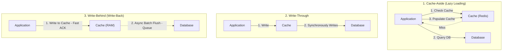
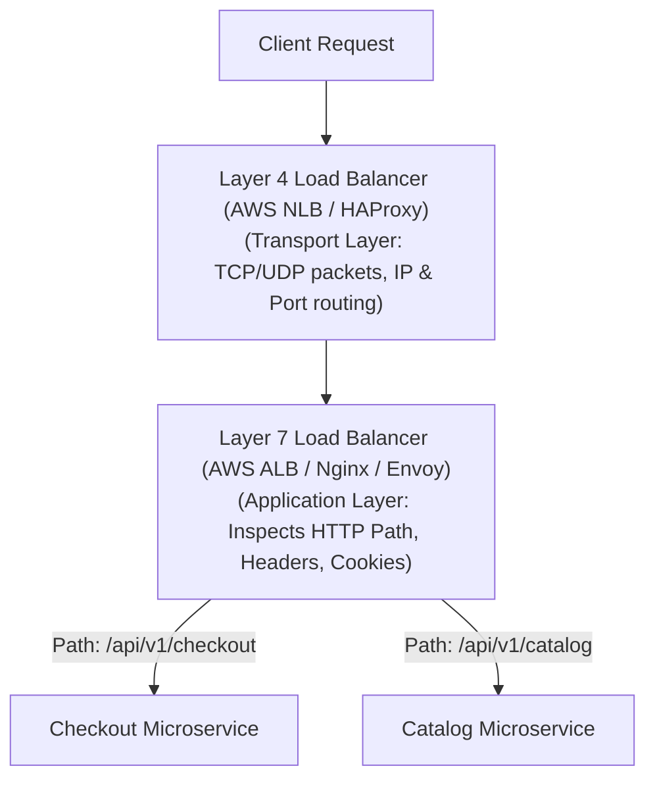

# HLD Chapter 4: Caching, Load Balancing, CDNs & Edge Networks

> **Core Learning Objective:** Master high-performance data delivery architectures. Understand the 4 write policies, how to defend against cache stampedes, L4 vs L7 load balancing, and global CDN edge caching.

---

## 1. Caching Strategies & Write Policies



### Write Policies Comparison Matrix

| Strategy | Read Latency | Write Latency | Data Consistency | Crash Risk |
| :--- | :--- | :--- | :--- | :--- |
| **Cache-Aside** | Fast on hit, slow on initial miss | Fast | Potential stale reads until TTL expires | Zero data loss (DB is source of truth) |
| **Write-Through** | Always fast (warm cache) | Higher (dual write: Cache + DB) | High consistency | Zero data loss |
| **Write-Behind** | Ultra fast | Minimal (RAM write speed) | Eventual consistency | **High**: Power loss before async flush loses data! |

---

## 2. The 4 Fatal Cache Failure Modes & Defenses

### 1. Cache Stampede (Thundering Herd)
* **What happens:** A hot key (e.g. homepage top news viewed by 50,000 QPS) expires from cache. 50,000 concurrent threads simultaneously miss the cache and overwhelm the underlying SQL database with identical queries, causing a total database outage.
* **Defense:** **Distributed Mutex Lock / Probabilistic Early Expiration (XFetch)**:
```python
# Defense: Only the single thread holding the lock queries DB; others wait or receive stale data
def get_with_stampede_protection(key: str, redis_client, db_fetch_fn):
    val = redis_client.get(key)
    if val is not None:
        return val

    # Acquire short distributed lock
    if redis_client.set(f"lock:{key}", "1", nx=True, ex=5):
        try:
            val = db_fetch_fn(key)
            redis_client.set(key, val, ex=300)
            return val
        finally:
            redis_client.delete(f"lock:{key}")
    else:
        # Another worker is refreshing; sleep briefly and retry
        time.sleep(0.05)
        return redis_client.get(key)
```

### 2. Cache Penetration
* **What happens:** An attacker queries non-existent keys (e.g., `user_id = -999999`). The cache misses, queries the DB, finds nothing, and does not cache the result. Every malicious request hits the database directly.
* **Defense:** **Bloom Filters** at the gateway (guarantees a key definitely does not exist in $O(1)$) OR cache `null` with a short 60-second TTL.

### 3. Cache Avalanche
* **What happens:** Hundreds of thousands of keys were populated at the same time with identical TTLs (e.g., exactly 24 hours). When the 24 hours expire, they all drop out simultaneously, crashing the DB.
* **Defense:** **Add Jitter to TTL**: `TTL = base_ttl + random.randint(0, 300)`.

---

## 3. Load Balancing: Layer 4 vs Layer 7



| Dimension | Layer 4 (Transport) | Layer 7 (Application) |
| :--- | :--- | :--- |
| **Data Inspected** | IP addresses & TCP/UDP Ports | Full HTTP/HTTPS payload, URI path, headers, cookies |
| **TLS / SSL Termination** | Pass-through (Client negotiates directly) | Terminates SSL at the load balancer |
| **Throughput & Latency** | Millions of QPS; microsecond latency (zero packet inspection) | High latency overhead; smart routing decisions |
| **Routing Capability** | Round-robin across static IP pools | Path-based routing, A/B testing, auth inspection |

---

## 4. Content Delivery Networks (CDNs) & Anycast Routing

A CDN is a geographically distributed network of **Edge Proxy Servers (Points of Presence - POPs)** that cache static and streaming content (images, videos, JS/CSS bundles) close to the user.

* **Anycast DNS Routing:** Multiple worldwide CDN POPs advertise the **exact same public IP address** via BGP (Border Gateway Protocol). The internet's routing fabric automatically directs user packets to the topologically closest datacenter.
* **Origin Shielding:** A secondary caching layer between CDN edge servers and your main datacenter to ensure origin servers are never flooded during cache misses.


## 5. Runnable Models: Stampede Protection, TTL Jitter and Negative Caching

### Cache stampede: 50 threads, one expensive loader

```python
import threading
import time

class Cache:
    def __init__(self):
        self.data, self.lock, self.inflight = {}, threading.Lock(), {}

    def get_naive(self, key, loader):
        if key not in self.data:
            self.data[key] = loader(key)                 # every thread that misses runs the loader
        return self.data[key]

    def get_singleflight(self, key, loader):
        with self.lock:
            if key in self.data:
                return self.data[key]
            event = self.inflight.get(key)
            leader = event is None
            if leader:
                event = self.inflight[key] = threading.Event()
        if leader:                                       # one thread loads, the others wait for its result
            try:
                self.data[key] = loader(key)
            finally:
                event.set()
                with self.lock:
                    self.inflight.pop(key, None)
        else:
            event.wait(5)
        return self.data[key]

def run(method_name):
    calls = []
    def slow_loader(key):
        calls.append(key)
        time.sleep(0.05)                                 # the database query
        return key.upper()
    cache = Cache()
    results = []
    fn = getattr(cache, method_name)
    ts = [threading.Thread(target=lambda: results.append(fn("user:1", slow_loader))) for _ in range(50)]
    for t in ts: t.start()
    for t in ts: t.join()
    return len(calls), set(results)

naive_calls, _ = run("get_naive")
single_calls, results = run("get_singleflight")
assert naive_calls > 5                                   # many threads hit the database at once
assert single_calls == 1 and results == {"USER:1"}       # exactly one load, everyone gets the value
```

Other stampede defences: **probabilistic early refresh** (refresh a hot key slightly before it expires, with some randomness), a **lock or lease per key** in a shared cache, and **serve stale while revalidating** (return the old value while one worker refreshes it).

### Avalanche and penetration

```python
import random

def expiry_with_jitter(base_seconds: int, jitter_fraction: float, rng) -> float:
    return base_seconds * (1 + rng.uniform(-jitter_fraction, jitter_fraction))

rng = random.Random(5)
fixed = {3600 for _ in range(1000)}
spread = {round(expiry_with_jitter(3600, 0.1, rng)) for _ in range(1000)}
assert len(fixed) == 1 and len(spread) > 200             # without jitter all keys expire together: an avalanche

class NegativeCachingStore:
    MISSING = object()
    def __init__(self, db):
        self.db, self.cache, self.db_hits = db, {}, 0
    def get(self, key):
        if key in self.cache:
            value = self.cache[key]
            return None if value is self.MISSING else value
        self.db_hits += 1
        value = self.db.get(key)
        self.cache[key] = self.MISSING if value is None else value    # cache the "does not exist" answer too
        return value

store = NegativeCachingStore({"real": 1})
for _ in range(1000):
    store.get("does-not-exist")                          # an attacker asking for random ids
assert store.db_hits == 1                                # the database was asked once, not 1,000 times
```

Penetration (requests for keys that never exist) is blocked by **negative caching** with a short TTL, or by a Bloom filter in front of the cache that answers "definitely not present". Avalanche (many keys expiring together) is blocked by **TTL jitter** and by keeping the cache cluster highly available.

### Which write policy for which workload

| Workload | Policy | Why |
| :--- | :--- | :--- |
| Mostly reads, tolerates brief staleness | Cache-aside with TTL | Simple, the database stays the source of truth |
| Reads must see the latest write | Write-through | Cache and store are updated together; writes pay both latencies |
| Write bursts, loss of the last few seconds acceptable | Write-back | Fast writes; risk of loss if the cache dies before flushing |
| Rarely read after write | Write-around | Do not pollute the cache with data nobody reads |

---

## Further Reading

- [Redis documentation](https://redis.io/docs/latest/)
- [NGINX load balancing](https://nginx.org/en/docs/http/load_balancing.html)
- [Wikipedia: Consistent hashing](https://en.wikipedia.org/wiki/Consistent_hashing)


---

## Check Yourself

Answer in your head or on paper first, then open each answer.

<details>
<summary><strong>1.</strong> Cache-aside versus write-through?</summary>

Cache-aside: the app loads on miss and writes to the DB then invalidates. Write-through: writes go through the cache to the store synchronously.

</details>

<details>
<summary><strong>2.</strong> What is a cache stampede and a fix?</summary>

Many requests miss at once and hammer the origin. Use request coalescing, jittered TTLs or probabilistic early refresh.

</details>

<details>
<summary><strong>3.</strong> Layer 4 versus layer 7 load balancing?</summary>

L4 balances on IP/port (fast, protocol-agnostic); L7 understands HTTP and can route on path, headers, cookies.

</details>

<details>
<summary><strong>4.</strong> What is consistent hashing for?</summary>

Distributing keys so adding/removing a node remaps only about 1/N of them.

</details>
