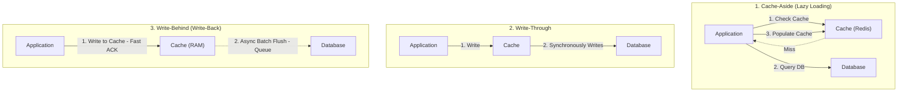
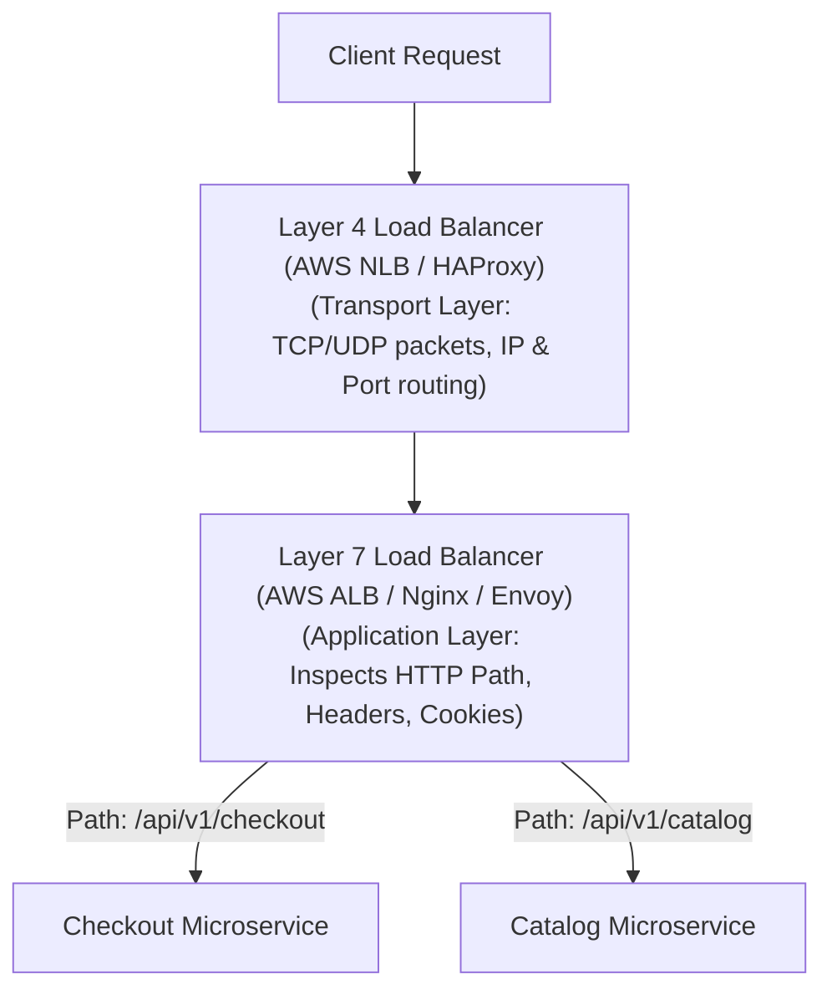

# HLD Chapter 4: Caching, Load Balancing, CDNs & Edge Networks

> **Core Learning Objective:** Master high-performance data delivery architectures. Understand the 4 write policies, how to defend against cache stampedes, L4 vs L7 load balancing, and global CDN edge caching.

---

## 1. Caching Strategies & Write Policies



### Write Policies Comparison Matrix

| Strategy | Read Latency | Write Latency | Data Consistency | Crash Risk |
| :--- | :--- | :--- | :--- | :--- |
| **Cache-Aside** | Fast on hit, slow on initial miss | Fast | Potential stale reads until TTL expires | Zero data loss (DB is source of truth) |
| **Write-Through** | Always fast (warm cache) | Higher (dual write: Cache + DB) | High consistency | Zero data loss |
| **Write-Behind** | Ultra fast | Minimal (RAM write speed) | Eventual consistency | **High**: Power loss before async flush loses data! |

---

## 2. The 4 Fatal Cache Failure Modes & Defenses

### 1. Cache Stampede (Thundering Herd)
* **What happens:** A hot key (e.g. homepage top news viewed by 50,000 QPS) expires from cache. 50,000 concurrent threads simultaneously miss the cache and overwhelm the underlying SQL database with identical queries, causing a total database outage.
* **Defense:** **Distributed Mutex Lock / Probabilistic Early Expiration (XFetch)**:
```python
# Defense: Only the single thread holding the lock queries DB; others wait or receive stale data
def get_with_stampede_protection(key: str, redis_client, db_fetch_fn):
    val = redis_client.get(key)
    if val is not None:
        return val

    # Acquire short distributed lock
    if redis_client.set(f"lock:{key}", "1", nx=True, ex=5):
        try:
            val = db_fetch_fn(key)
            redis_client.set(key, val, ex=300)
            return val
        finally:
            redis_client.delete(f"lock:{key}")
    else:
        # Another worker is refreshing; sleep briefly and retry
        time.sleep(0.05)
        return redis_client.get(key)
```

### 2. Cache Penetration
* **What happens:** An attacker queries non-existent keys (e.g., `user_id = -999999`). The cache misses, queries the DB, finds nothing, and does not cache the result. Every malicious request hits the database directly.
* **Defense:** **Bloom Filters** at the gateway (guarantees a key definitely does not exist in $O(1)$) OR cache `null` with a short 60-second TTL.

### 3. Cache Avalanche
* **What happens:** Hundreds of thousands of keys were populated at the same time with identical TTLs (e.g., exactly 24 hours). When the 24 hours expire, they all drop out simultaneously, crashing the DB.
* **Defense:** **Add Jitter to TTL**: `TTL = base_ttl + random.randint(0, 300)`.

---

## 3. Load Balancing: Layer 4 vs Layer 7



| Dimension | Layer 4 (Transport) | Layer 7 (Application) |
| :--- | :--- | :--- |
| **Data Inspected** | IP addresses & TCP/UDP Ports | Full HTTP/HTTPS payload, URI path, headers, cookies |
| **TLS / SSL Termination** | Pass-through (Client negotiates directly) | Terminates SSL at the load balancer |
| **Throughput & Latency** | Millions of QPS; microsecond latency (zero packet inspection) | High latency overhead; smart routing decisions |
| **Routing Capability** | Round-robin across static IP pools | Path-based routing, A/B testing, auth inspection |

---

## 4. Content Delivery Networks (CDNs) & Anycast Routing

A CDN is a geographically distributed network of **Edge Proxy Servers (Points of Presence - POPs)** that cache static and streaming content (images, videos, JS/CSS bundles) close to the user.

* **Anycast DNS Routing:** Multiple worldwide CDN POPs advertise the **exact same public IP address** via BGP (Border Gateway Protocol). The internet's routing fabric automatically directs user packets to the topologically closest datacenter.
* **Origin Shielding:** A secondary caching layer between CDN edge servers and your main datacenter to ensure origin servers are never flooded during cache misses.
