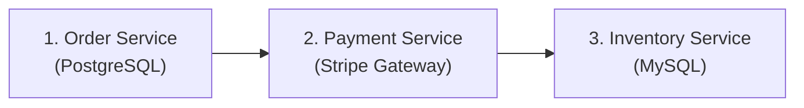
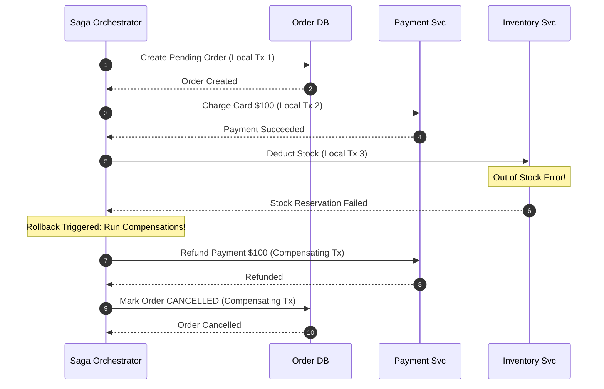
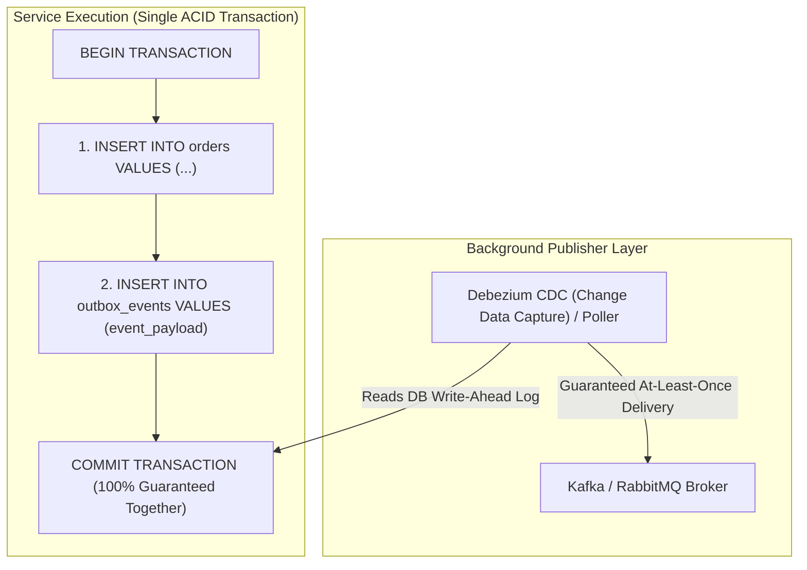

# HLD Chapter 5: Distributed Transactions, Sagas & The Outbox Pattern

> **Core Learning Objective:** Solve data consistency challenges across microservices without distributed deadlocks. Understand 2-Phase Commit pitfalls, Saga Orchestration vs Choreography, compensating rollbacks, the Transactional Outbox Pattern, and Idempotency Keys.

---

## 1. The Dual-Write Problem & The Fall of 2-Phase Commit (2PC)

In a microservice architecture, each service owns its private database. A business transaction (e.g. E-Commerce Checkout) spans multiple independent services:



### Why 2-Phase Commit (2PC) Fails in Production
Classic distributed systems used **Two-Phase Commit (Prepare $\rightarrow$ Commit)** with a central coordinator.
* **The Fatal Flaw:** 2PC is a **synchronous, blocking protocol**. If the coordinator or any participant crashes during the commit phase, database locks are held indefinitely, cascading into a total system freeze.
* **The Microservices Verdict:** 2PC violates service autonomy and does not scale across the internet.

---

## 2. The Saga Pattern: Orchestration vs Choreography

A **Saga** is a sequence of local transactions. Each step executes a local database transaction and emits an event to trigger the next step. If a step fails, the Saga executes **Compensating Transactions** to undo the previous steps in reverse order.



### Choreography vs Orchestration
* **Choreography (Event-Driven):** Services listen to Kafka events and trigger their own next step without a master controller.  
  * *Best for:* Simple 2-to-3 step workflows. (Danger: Becomes untraceable "spaghetti events" as services grow).
* **Orchestration (State Machine Controller):** A dedicated orchestrator (e.g. Temporal, AWS Step Functions, or custom worker) explicitly invokes each service and tracks state.  
  * *Best for:* Complex financial, e-commerce, and multi-step business transactions.

---

## 3. The Transactional Outbox Pattern (Eliminating Dual-Write Bugs)

A common bug in event-driven systems is updating the database and sending a Kafka message in two separate operations:
```text
# Pseudocode: the real, runnable version is in section 5
# FATAL ANTI-PATTERN:
db.execute("INSERT INTO orders ...") # Succeeded
kafka.send("order_created_topic")     # Network crash here! Event lost forever! Inconsistent state!
```

### The Outbox Solution
Store the event in an **`outbox` table inside the exact same local ACID transaction** as your business data!



---

## 4. Idempotency Keys: Defending Against Duplicate Retries

In distributed networks, when a client sends a request and the connection times out, the client cannot know whether:
1. The request failed to reach the server, OR
2. The server processed the request, but the response was dropped on the return path!

If the client retries, the server might execute the charge twice!

### Production Idempotency Key Architecture:
1. Client generates a unique **Idempotency-Key** UUID (e.g. `Idempotency-Key: e82f-410a-b32e`).
2. Server checks Redis/DB for this key atomically (`SET key token NX EX 120`).
3. If the key exists, return the cached result immediately without re-executing.
4. If the key is new, execute the transaction, persist the result, and reply.


## 5. Runnable Models: a Saga with Compensation, and an Outbox with Idempotent Consumers

### An orchestrated saga: if step N fails, undo steps N-1 to 1 in reverse

```python
class SagaFailed(Exception):
    pass

def run_saga(steps, log):
    """steps: list of (name, action, compensation). Run actions in order; on failure compensate completed steps in reverse."""
    done = []
    for name, action, compensate in steps:
        try:
            action()
            log.append(f"do:{name}")
            done.append((name, compensate))
        except Exception as err:
            log.append(f"fail:{name}")
            for done_name, comp in reversed(done):
                for attempt in range(3):                 # compensations must be retried: they are not allowed to give up
                    try:
                        comp()
                        log.append(f"undo:{done_name}")
                        break
                    except Exception:
                        log.append(f"retry-undo:{done_name}")
                else:
                    log.append(f"STUCK:{done_name}")      # alert a human: money or stock is in limbo
            raise SagaFailed(name) from err
    return "committed"

state = {"stock": 10, "charged": 0, "shipped": False}
log = []

def reserve():  state.update(stock=state["stock"] - 1)
def release():  state.update(stock=state["stock"] + 1)
def charge():   state.update(charged=state["charged"] + 50)
def refund():   state.update(charged=state["charged"] - 50)
def ship():     raise RuntimeError("carrier unavailable")      # the third step fails

try:
    run_saga([("reserve", reserve, release), ("charge", charge, refund), ("ship", ship, lambda: None)], log)
    raise AssertionError("expected SagaFailed")
except SagaFailed as e:
    assert str(e) == "ship"

assert log == ["do:reserve", "do:charge", "fail:ship", "undo:charge", "undo:reserve"]   # reverse order
assert state == {"stock": 10, "charged": 0, "shipped": False}                          # fully restored

flaky = {"n": 0}
def flaky_refund():
    flaky["n"] += 1
    if flaky["n"] < 3:
        raise ConnectionError("payment provider timeout")
    refund()

state.update(stock=10, charged=0); log.clear()
state["charged"] = 0
try:
    run_saga([("charge", charge, flaky_refund), ("ship", ship, lambda: None)], log)
except SagaFailed:
    pass
assert state["charged"] == 0 and log.count("retry-undo:charge") == 2    # the compensation was retried until it worked
```

Key rules to state in an interview: every step needs a **compensating action** (refund, release, cancel); compensations must be **idempotent and retried** because they can fail too; a saga gives **atomicity-by-undo, not isolation**, so other transactions can briefly see the intermediate state (design for it, for example with "pending" statuses).

### The transactional outbox plus an idempotent consumer

```python
import sqlite3

db = sqlite3.connect(":memory:")
db.executescript("""
CREATE TABLE orders(id INTEGER PRIMARY KEY, status TEXT);
CREATE TABLE outbox(id INTEGER PRIMARY KEY AUTOINCREMENT, event TEXT, published INT DEFAULT 0);
CREATE TABLE processed(event_id INTEGER PRIMARY KEY);
""")

def place_order(order_id, fail_after_insert=False):
    with db:                                              # one local transaction: the order AND its event, or neither
        db.execute("INSERT INTO orders VALUES (?, 'PLACED')", (order_id,))
        if fail_after_insert:
            raise RuntimeError("crash before commit")
        db.execute("INSERT INTO outbox(event) VALUES (?)", (f"OrderPlaced:{order_id}",))

place_order(1)
try:
    place_order(2, fail_after_insert=True)
except RuntimeError:
    pass
assert db.execute("SELECT COUNT(*) FROM orders").fetchone() == (1,)      # the failed order left no row...
assert db.execute("SELECT COUNT(*) FROM outbox").fetchone() == (1,)      # ...and no orphan event

delivered = []
def relay(broker_fails_once=False):
    """Publish unsent outbox rows. If we crash after publishing but before marking, the event is sent again (at-least-once)."""
    for eid, event in db.execute("SELECT id, event FROM outbox WHERE published = 0").fetchall():
        delivered.append((eid, event))
        if broker_fails_once:
            raise ConnectionError("crash before marking published")
        with db:
            db.execute("UPDATE outbox SET published = 1 WHERE id = ?", (eid,))

try:
    relay(broker_fails_once=True)
except ConnectionError:
    pass
relay()
assert len(delivered) == 2 and delivered[0] == delivered[1]              # duplicate delivery after the crash

effects = []
def consume(eid, event):
    try:
        with db:
            db.execute("INSERT INTO processed VALUES (?)", (eid,))     # primary key makes the second attempt fail
            effects.append(event)
    except sqlite3.IntegrityError:
        pass                                                           # already handled: ignore the duplicate

for eid, event in delivered:
    consume(eid, event)
assert effects == ["OrderPlaced:1"]                                    # at-least-once delivery, exactly-once effect
```

This pair is the standard answer to "how do you update a database and publish an event reliably?": **outbox for the producer, idempotent handling for the consumer**.

---

## Further Reading

- [Saga pattern](https://microservices.io/patterns/data/saga.html)
- [Transactional outbox](https://microservices.io/patterns/data/transactional-outbox.html)
- [Azure: Saga pattern](https://learn.microsoft.com/en-us/azure/architecture/patterns/saga)


---

## Check Yourself

Answer in your head or on paper first, then open each answer.

<details>
<summary><strong>1.</strong> Why not use two-phase commit across microservices?</summary>

It blocks on coordinator failure and couples availability of all participants; sagas with compensations are more resilient.

</details>

<details>
<summary><strong>2.</strong> Orchestration versus choreography saga?</summary>

Orchestration uses a central coordinator that issues commands; choreography has services react to each other's events.

</details>

<details>
<summary><strong>3.</strong> What problem does the transactional outbox solve?</summary>

Atomically updating state and publishing an event by writing both in one local transaction and publishing from the outbox table.

</details>

<details>
<summary><strong>4.</strong> What makes a saga step safe to retry?</summary>

Idempotency (idempotency keys) and a defined compensating action.

</details>
