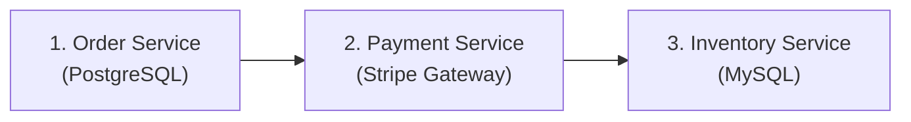
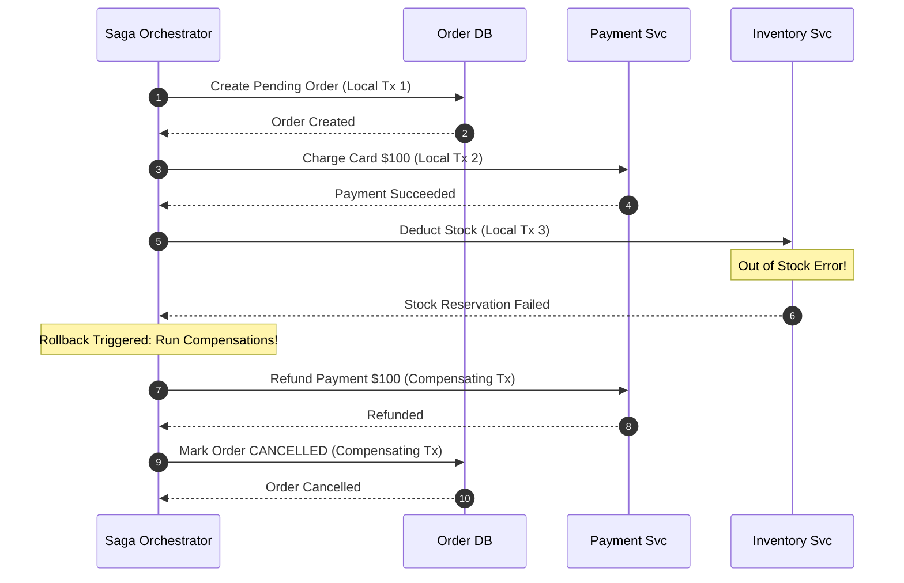
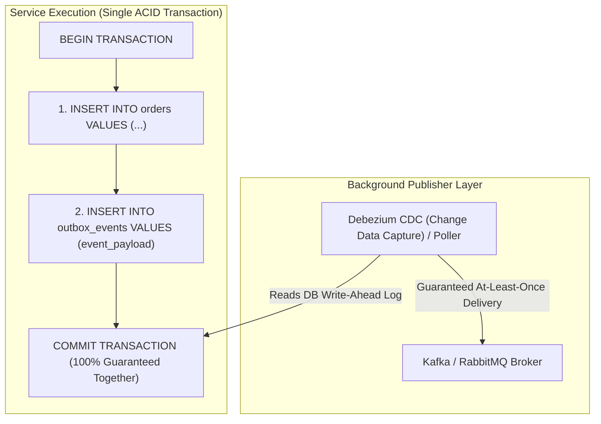

# HLD Chapter 5: Distributed Transactions, Sagas & The Outbox Pattern

> **Core Learning Objective:** Solve data consistency challenges across microservices without distributed deadlocks. Understand 2-Phase Commit pitfalls, Saga Orchestration vs Choreography, compensating rollbacks, the Transactional Outbox Pattern, and Idempotency Keys.

---

## 1. The Dual-Write Problem & The Fall of 2-Phase Commit (2PC)

In a microservice architecture, each service owns its private database. A business transaction (e.g. E-Commerce Checkout) spans multiple independent services:



### Why 2-Phase Commit (2PC) Fails in Production
Classic distributed systems used **Two-Phase Commit (Prepare $\rightarrow$ Commit)** with a central coordinator.
* **The Fatal Flaw:** 2PC is a **synchronous, blocking protocol**. If the coordinator or any participant crashes during the commit phase, database locks are held indefinitely, cascading into a total system freeze.
* **The Microservices Verdict:** 2PC violates service autonomy and does not scale across the internet.

---

## 2. The Saga Pattern: Orchestration vs Choreography

A **Saga** is a sequence of local transactions. Each step executes a local database transaction and emits an event to trigger the next step. If a step fails, the Saga executes **Compensating Transactions** to undo the previous steps in reverse order.



### Choreography vs Orchestration
* **Choreography (Event-Driven):** Services listen to Kafka events and trigger their own next step without a master controller.  
  * *Best for:* Simple 2-to-3 step workflows. (Danger: Becomes untraceable "spaghetti events" as services grow).
* **Orchestration (State Machine Controller):** A dedicated orchestrator (e.g. Temporal, AWS Step Functions, or custom worker) explicitly invokes each service and tracks state.  
  * *Best for:* Complex financial, e-commerce, and multi-step business transactions.

---

## 3. The Transactional Outbox Pattern (Eliminating Dual-Write Bugs)

A common bug in event-driven systems is updating the database and sending a Kafka message in two separate operations:
```python
# FATAL ANTI-PATTERN:
db.execute("INSERT INTO orders ...") # Succeeded
kafka.send("order_created_topic")     # Network crash here! Event lost forever! Inconsistent state!
```

### The Outbox Solution
Store the event in an **`outbox` table inside the exact same local ACID transaction** as your business data!



---

## 4. Idempotency Keys: Defending Against Duplicate Retries

In distributed networks, when a client sends a request and the connection times out, the client cannot know whether:
1. The request failed to reach the server, OR
2. The server processed the request, but the response was dropped on the return path!

If the client retries, the server might execute the charge twice!

### Production Idempotency Key Architecture:
1. Client generates a unique **Idempotency-Key** UUID (e.g. `Idempotency-Key: e82f-410a-b32e`).
2. Server checks Redis/DB for this key atomically (`SET key token NX EX 120`).
3. If the key exists, return the cached result immediately without re-executing.
4. If the key is new, execute the transaction, persist the result, and reply.
