# HLD Chapter 6: The 45-Minute System Design Interview Communication Playbook

> **Core Learning Objective:** Master the exact pacing, structured dialogue, and technical storytelling required to earn Strong Hire ratings from FAANG/PBC interviewers.

---

## 1. The 45-Minute System Design Timeline

```mermaid
gantt
    title 45-Minute System Design Interview Execution Plan
    dateFormat mm
    axisFormat %M min

    section Phase 1: Scope
    Requirements Gathering & Clarification : 00, 05
    
    section Phase 2: Math
    Back-of-the-Envelope Estimations : 05, 10
    
    section Phase 3: Architecture
    API Design & High-Level Block Diagram : 10, 25
    
    section Phase 4: Core Deep Dive
    Deep-Dive Scaling & Critical Components : 25, 38
    
    section Phase 5: Resilience
    Failure Modes, Bottlenecks & Wrap-Up : 38, 45
```

---

## 2. Phase-by-Phase Execution Guide

### Phase 1: Requirements Gathering (Minutes 0 - 5)
* **Never assume requirements.** System design questions are intentionally underspecified (e.g., "Design Twitter").
* **Functional Requirements (FR):** Pinpoint the exact 3 or 4 features you will design.  
  * *"Will users only post text, or also photos and videos? Can users follow each other? Do we need a live timeline feed?"*
* **Non-Functional Requirements (NFR):** Establish scale, availability, and latency SLAs.  
  * *High Availability ($99.99\%$) over Strong Consistency?*  
  * *Low latency read queries ($< 100\text{ms}$ at p99)?*

### Phase 2: Back-of-the-Envelope Estimations (Minutes 5 - 10)
* Calculate Daily Active Users (DAU), Read QPS, Write QPS, Storage per day, and 5-Year Storage footprint.
* Calculate Cache memory requirements using the 80/20 rule.
* Conclude with the architectural character: *"This is a 10:1 read-heavy system requiring extensive CDN caching and replica sharding."*

### Phase 3: High-Level Architecture Diagram (Minutes 10 - 25)
* Draw the end-to-end request lifecycle:
  1. Client (Mobile/Web) $\rightarrow$ DNS (Route53/Anycast) $\rightarrow$ CDN (Cloudflare/CloudFront) for static assets.
  2. Dynamic traffic $\rightarrow$ Load Balancer (ALB) $\rightarrow$ API Gateway (Authentication, Rate Limiting, SSL Termination).
  3. Microservices (Stateless application servers).
  4. Storage Layer: Cache (Redis cluster) $\rightarrow$ Primary DB (PostgreSQL/Cassandra) $\rightarrow$ Async Queues (Kafka).

### Phase 4: The Deep Dive (Minutes 25 - 38)
* Interviewers evaluate your depth on **2 or 3 critical system bottlenecks**. Focus on:
  1. **Hot Partitions & Celebrity Problem:** (e.g. A user with 100M followers posts a tweet).
  2. **Concurrency & Race Conditions:** (e.g. Distributed locking on ticket reservations).
  3. **Data Partitioning Strategy:** (e.g. Consistent hashing by user ID or geolocation).

### Phase 5: Bottlenecks & Failure Modes (Minutes 38 - 45)
* **Single Points of Failure (SPOF):** Show that every component has an active redundant replica.
* **Cross-Region Replication:** Explain multi-region active-active deployment or active-passive failover.
* **Observability:** Distributed tracing (OpenTelemetry), metrics (Prometheus), and alerting.

---

## 3. High-Scoring Behavioral Tactics (From Staff Interviewers)

1. **Keep Continuous Dialogue:** System design is a collaborative design session. If you go silent for 2 minutes while drawing, the interviewer feels detached. Vocalize your thought process: *"I am choosing Cassandra over PostgreSQL here because our write volume is 50,000 QPS and our query pattern is strictly key-value lookups by message ID..."*
2. **Never Rush into Components:** Junior candidates immediately draw Kafka, Redis, and Elasticsearch on the whiteboard within 2 minutes without justifying why. Senior candidates justify every box with mathematical estimation and trade-off analysis.
3. **Cross-Region Strategy is the Golden Touch:** Conclude by explaining how data replicates across US-East and EU-Central datacenters, handling data sovereignty (GDPR) and cross-ocean replication latency.
