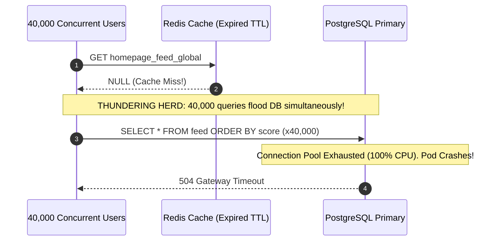
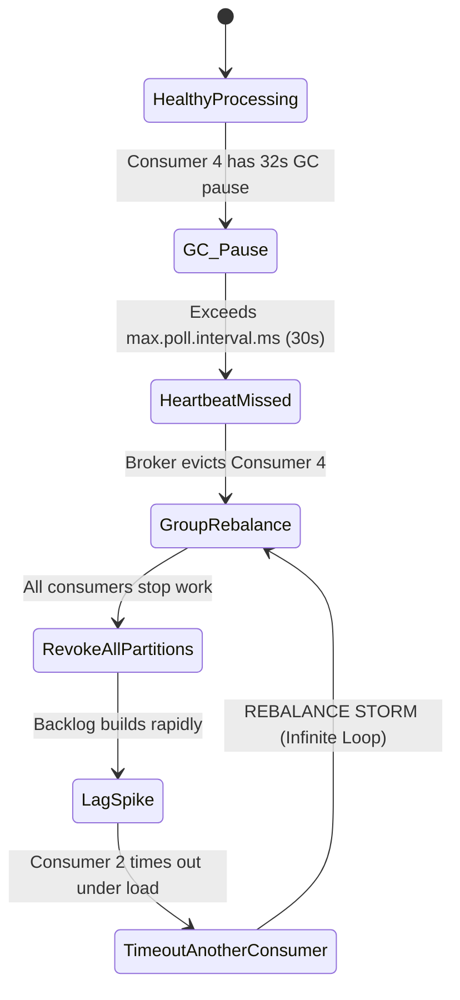
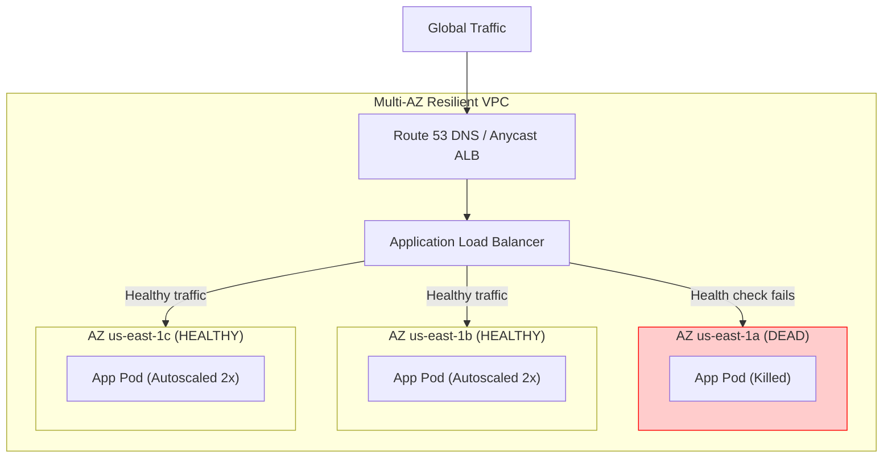

# Chapter 07: Chaos Engineering, Outage Disasters, & Post-Mortems

> **Everything Fails, All The Time**
> Werner Vogels (Amazon CTO) famously coined: *"Failures are a given and everything will eventually fail over time."*
> In textbook HLD diagrams, databases never drop connections, caches never crash, and network partitions don't exist. In enterprise production, hard drives fail, AWS Availability Zones suffer physical fiber cuts, and misconfigured load balancers unleash cascading thundering herds.
> 
> This chapter examines three iconic real-world system disasters, analyzes the exact root causes, and teaches the architectural defenses required to survive them.

---

## 1. Disaster 1: The Cache Stampede (Thundering Herd)

### What Happened
At 09:00:00 AM, the homepage cache key `homepage_feed_global` with a 1-hour TTL expired in Redis. 
Within 150 milliseconds:
* 40,000 incoming user HTTP requests checked Redis for `homepage_feed_global`.
* All 40,000 requests received a `CACHE_MISS` simultaneously.
* All 40,000 threads bypassed Redis and fired an identical heavy aggregation SQL query directly at the primary PostgreSQL database.
* PostgreSQL connection pools exhausted instantly (max 500 connections). CPU spiked to 100%. Database stopped responding to health checks.
* Kubernetes terminated the "unhealthy" Postgres pod, triggering failover to read replicas, which were immediately incinerated by the same 40,000 queries. Total global outage: 47 minutes.



### The Architectural Defenses

#### 1. Mutex Locking on Cache Miss (Single-Flight Pattern)
Only the *first* request that detects the cache miss is allowed to query the database. All other 39,999 requests wait on a lock or sleep for 50ms until the key is repopulated.

```python
import time
import redis

r = redis.Redis()

def get_feed_with_single_flight(key: str) -> str:
    # 1. Check cache
    val = r.get(key)
    if val:
        return val.decode()

    # 2. Acquire a distributed lease/lock to populate cache
    lock_key = f"lock:{key}"
    # Acquire lock with 5-second TTL (prevents deadlock if worker crashes)
    if r.set(lock_key, "1", nx=True, ex=5):
        try:
            # We won the race! We are the ONLY worker querying the DB
            data = query_expensive_database()
            r.set(key, data, ex=3600) # 1 hour TTL
            return data
        finally:
            r.delete(lock_key)
    else:
        # We lost the race. Sleep briefly and read the repopulated cache
        time.sleep(0.05)
        return get_feed_with_single_flight(key)
```

#### 2. Probabilistic Early Expiration (XFetch Algorithm)
Instead of waiting for the key to expire at hard second 3600, workers compute a probability of refreshing the key *ahead of time* based on read frequency and computation time:

$$\Delta - \beta \times \ln(\text{random}()) \times \text{computation\_cost} > \text{remaining\_ttl}$$

---

## 2. Disaster 2: The Kafka Partition Rebalance Storm

### What Happened
A consumer group processes analytics events from a 64-partition Kafka topic. 
* Consumer #4 experiences a temporary Garbage Collection (GC) pause of 32 seconds.
* Kafka broker's `max.poll.interval.ms` was set to the default 30 seconds.
* The broker assumes Consumer #4 has crashed and evicts it from the consumer group.
* The broker triggers a **Consumer Group Rebalance**. All 64 consumers stop processing messages, revoke their partition assignments, and renegotiate.
* During renegotiation, uncommitted offsets cause duplicate message processing, increasing latency.
* Another consumer exceeds its timeout, triggering a *second* rebalance.
* The system enters an **Infinite Rebalance Storm**: zero messages processed for 3 hours, backlog reaches 150 million events.



### The Architectural Defenses
1. **Decouple Polling from Processing (Worker Thread Pool):** Never run long computation inside the Kafka polling loop. The poller thread only fetches messages and pushes them into an in-memory queue (`asyncio.Queue` or `ThreadPoolExecutor`), ensuring `poll()` is invoked every 100ms regardless of business logic duration.
2. **Cooperative Sticky Assignor (`CooperativeStickyAssignor`):** Replaces the legacy "Eager" rebalance protocol. Instead of revoking all 64 partitions, only the partitions assigned to the failing consumer are reallocated. Healthy consumers continue processing without interruption!

---

## 3. Disaster 3: Complete AWS Availability Zone Blackout

### What Happened
A lightning strike knocks out power and backup generators at `us-east-1a`. 33% of your application instances vanish instantly.



### The Architectural Defenses
1. **Cross-Zone Load Balancing:** Load balancers must distribute incoming traffic evenly across all surviving zones.
2. **Target Tracking Autoscaling with Headroom:** Maintain at least 50% surplus capacity across remaining zones so that the sudden loss of an entire AZ does not cause CPU exhaustion on the surviving nodes.
3. **Multi-AZ Synchronous Database Replication:** Aurora PostgreSQL storage volumes replicate 6 ways across 3 AZs. When an AZ dies, read/write failover occurs automatically in under 30 seconds with zero data loss ($RPO = 0$).

---

## 4. The Blameless Post-Mortem Template

When an incident occurs, never assign personal blame. Human error is a symptom of systemic design flaws. Use this template:

```markdown
# INCIDENT POST-MORTEM: [INC-8092] Global Checkout Outage
**Date:** 2026-10-04  
**Severity:** SEV-1  
**Authors:** Principal SRE & Lead Architect  
**Duration:** 47 minutes (09:00 UTC - 09:47 UTC)

## 1. Executive Summary
Between 09:00 and 09:47 UTC, 100% of checkout transactions failed due to a database connection exhaustion triggered by a thundering herd cache stampede on expired homepage catalog keys. Estimated financial loss: $140,000.

## 2. Impact
* 42,100 users experienced HTTP 504 Gateway Timeouts.
* Average checkout latency spiked from 120ms to 30,000ms.

## 3. Root Cause
The `homepage_feed_global` cache key expired at 09:00 UTC. The application lacked single-flight request coalescing. 40,000 concurrent requests bypassed the cache layer and bombarded the primary PostgreSQL cluster with unindexed queries, consuming all 500 connections.

## 4. Timeline
* **09:00** - Key expires in Redis. DB CPU hits 100%.
* **09:03** - PagerDuty alerts on-call engineer for p99 latency > 5s.
* **09:12** - On-call engineer identifies DB connection pool saturation.
* **09:25** - Read traffic diverted to Aurora read-replica pool.
* **09:35** - Hotfix deployed enabling mutex lock around cache miss.
* **09:47** - Connection pool normalizes; checkout error rate drops to 0.00%.

## 5. Action Items (Preventative Engineering)
| Action Item | Type | Owner | Due Date |
| :--- | :--- | :--- | :--- |
| Implement Redis single-flight distributed lock for all tier-1 cache keys | Prevention | Backend Lead | 2026-10-07 |
| Deploy PgBouncer connection pooler in transaction mode | Mitigation | SRE Team | 2026-10-10 |
| Configure Chaos Mesh experiment to simulate cache flushes under 50k QPS | Detection | QA Lead | 2026-10-15 |
```
