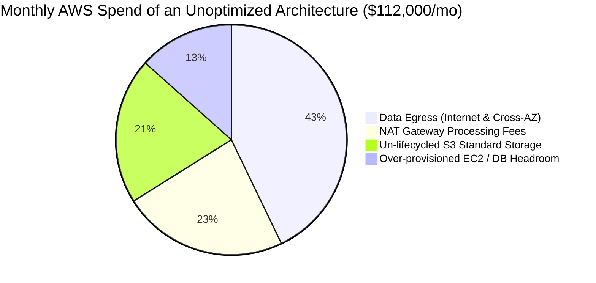
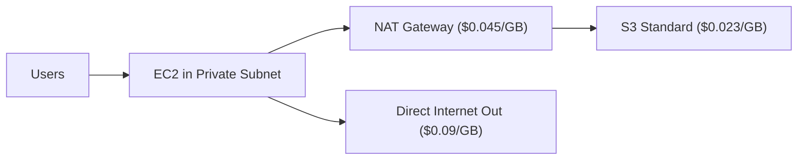
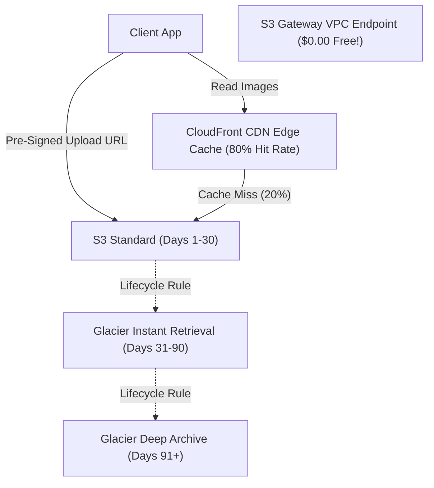

# Chapter 08: Real-World Cloud Cost Engineering & FinOps Architecture

> **The Principal Architect's True Constraint**
> In academic system design interviews, candidates treat AWS, GCP, and Azure as infinite pools of free resources. They casually say: *"We will add 200 EC2 instances, replicate 5 petabytes of video across 3 regions, and stream everything through Kafka."*
> 
> In the real world, system design is a game of **budget optimization**. An architecture that handles 100,000 QPS but costs $250,000/month when the business generates $80,000/month is a failed design. Principal engineers architect for cost efficiency (FinOps) just as rigorously as they architect for latency and availability.

---

## 1. The Four Silent Cloud Budget Killers

### 1. Data Egress Fees
Cloud providers make ingesting data free, but charge exorbitant fees for exporting data:
* **Internet Egress:** ~$0.09 per GB. (Sending 500 TB/month out to the public internet = **$45,000/month**).
* **Cross-AZ Egress:** ~$0.01 per GB in and out ($0.02/GB round-trip) when two EC2 instances or microservices communicate across Availability Zones within the same region!
* **Cross-Region Egress:** ~$0.02 per GB.

### 2. The NAT Gateway Tax
Placing backend microservices in private subnets is standard security best practice. However, when these instances download large Docker images or S3 objects, traffic passes through an AWS NAT Gateway:
* Hourly rate: $0.045/hour (~$32.40/month per gateway).
* **Data Processing Fee:** **$0.045 per GB processed!**
* If your services pull 200 TB/month from S3 via NAT Gateway, you pay **$9,000/month** just for bytes moving through your own subnet gateway!

### 3. S3 Storage Without Lifecycle Policies
Leaving cold, unread data in S3 Standard is an enormous financial waste:
* **S3 Standard:** $0.023 per GB/month ($23,000 per PB/month).
* **S3 Glacier Instant Retrieval:** $0.004 per GB/month ($4,000 per PB/month) — 82% cheaper with millisecond access!
* **S3 Glacier Flexible Archive:** $0.0036 per GB/month.
* **S3 Glacier Deep Archive:** $0.00099 per GB/month ($990 per PB/month) — **95.7% cheaper!**

---

## 2. FinOps Case Study: 10M Daily Photo Upload Service

Let's model the economics of a photo storage system handling:
* **Uploads:** 10,000,000 photos/day (average 2 MB each = 20 TB/day = 600 TB/month new storage).
* **Reads:** 50,000,000 views/day (average 2 MB each = 100 TB/day egress).

### Architecture A: The Naive Architecture (The $112,000/Month Nightmare)

1. **Storage (Month 6 Accumulation = 3.6 PB):** $3,600 \text{ TB} \times \$23/\text{TB} = \mathbf{\$82,800/\text{month}}$.
2. **NAT Gateway Processing:** $600 \text{ TB incoming via NAT} \times \$45/\text{TB} = \mathbf{\$27,000/\text{month}}$.
3. **Egress to Internet:** $3,000 \text{ TB/month} \times \$90/\text{TB} = \mathbf{\$270,000/\text{month}}$ (Uncached!).
* **Total Monthly Burn:** Over **$350,000/month!**

---

### Architecture B: The FinOps Optimized Architecture ($31,200/Month)

#### Optimization 1: Direct Pre-Signed Uploads (Bypassing App & NAT Gateway)
Instead of piping 600 TB of image binaries through application EC2 instances and NAT Gateways, the backend server generates an **S3 Pre-Signed PUT URL** (a few bytes). The client uploads the binary directly to S3.
* **NAT Gateway savings:** $27,000 $\rightarrow$ **$0/month**.
* **EC2 compute reduction:** Reduced from 100 EC2 instances to 8 instances (saving **$9,000/month**).

#### Optimization 2: S3 Gateway VPC Endpoint
For internal microservices reading S3, provision an **S3 Gateway VPC Endpoint** (a free routing table entry in AWS). Traffic routes directly to S3 across the internal AWS backbone at **$0.00/GB**.

#### Optimization 3: Image Transcoding & WebP Compression
Transcoding high-res JPEGs (2 MB) into modern WebP/AVIF (400 KB) right upon upload cuts storage and egress byte volume by **80%**.

#### Optimization 4: Tiered Lifecycle Rules
* Days 1–30: S3 Standard ($0.023/GB). (Captures 90% of views).
* Days 31–90: S3 Glacier Instant Retrieval ($0.004/GB).
* Days 91+: S3 Glacier Deep Archive ($0.00099/GB).
* Blended storage cost across 3.6 PB drops from $82,800/mo to **$11,400/month**!

#### Optimization 5: CloudFront Edge Caching
Caching hot images at edge PoPs reduces origin read traffic by 80%. CloudFront data egress is discounted compared to raw EC2 egress, and cache hits bypass S3 `GET` request fees ($0.0004 per 1,000 requests).

---

## 3. Financial Comparison Matrix

| Expense Line | Naive Architecture | FinOps Optimized Architecture | Monthly Savings |
| :--- | :--- | :--- | :--- |
| **Object Storage (3.6 PB)** | $82,800 / mo (S3 Standard) | $11,400 / mo (Tiered Lifecycles) | **$71,400 (86%)** |
| **NAT Gateway Processing** | $27,000 / mo | $0 / mo (Pre-Signed URLs + VPC EP) | **$27,000 (100%)** |
| **Egress / Delivery Bandwidth** | $270,000 / mo (Direct EC2 out) | $16,800 / mo (WebP + CDN caching) | **$253,200 (93%)** |
| **Compute Cluster (EC2/EKS)** | $12,000 / mo (Large ingress proxy) | $3,000 / mo (Lightweight metadata API) | **$9,000 (75%)** |
| **TOTAL** | **$391,800 / month** | **$31,200 / month** | **$360,600 / month** |

### Senior Architect Interview Tip
When wrapping up any High-Level Design interview, spend the final 2 minutes demonstrating business acumen:
> *"To ensure this architecture is commercially viable at scale, I've designed direct client-to-object pre-signed uploads to bypass our compute fleet and NAT gateways, utilized WebP compression to reduce egress transfer by 80%, and enforced a 30-day S3 Glacier Instant Retrieval lifecycle to slash long-term storage expenditure by 85%."*

This elevates you immediately from a mid-level engineer to a Staff/Principal candidate.
