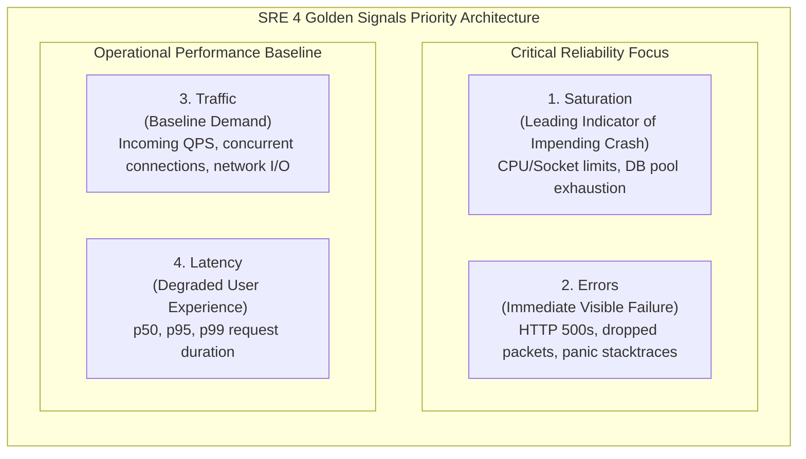
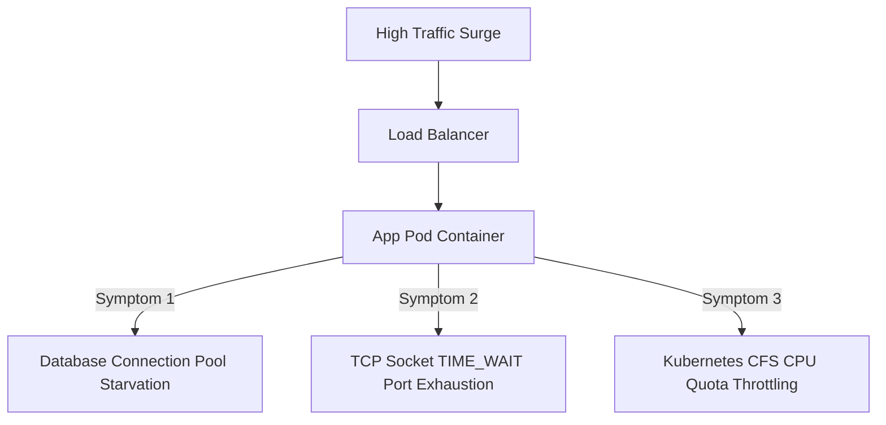

# Chapter 09: Load Testing, Benchmarking, & SRE Performance Playbook

> **The Vanity of Averages**
> *"Our service has an average response time of 45 milliseconds!"*
> In Site Reliability Engineering (SRE), reporting an average latency is considered malpractice. If 95% of your users experience 10ms response times, but the wealthiest 5% who add 50 items to their cart experience a 12-second timeout, your average might look acceptable while your revenue bleeds dry.
> 
> High-performance distributed engineering is defined by **Tail Latency** ($p99$ and $p99.9$) and **Saturation Dynamics**. This playbook teaches you how to benchmark distributed services under realistic synthetic loads, diagnose saturation choke points, and design to Google's Four Golden Signals.

---

## 1. The Four Golden Signals of Distributed Systems

Google SRE defines four essential metrics for diagnosing distributed systems health:



1. **Latency:** The time it takes to service a request. Always distinguish between the latency of successful requests vs. failed requests (a failing 500 error that returns in 2ms should not artificially lower your perceived latency!).
2. **Traffic:** A measure of demand on the system (e.g., HTTP requests/sec, Kafka messages/sec, network I/O bits/sec).
3. **Errors:** The rate of requests that fail, either explicitly (HTTP 500s) or implicitly (e.g., returning HTTP 200 with an empty JSON payload or incorrect data).
4. **Saturation:** How "full" your service is. Saturation measures constrained resources: CPU quota, RAM, disk I/O, database connection pool occupancy, or socket buffer limits. **Latency degrades exponentially once saturation crosses 80%.**

---

## 2. Hands-On Load Testing with Locust

Locust is an industrial-strength, Python-based load-testing framework that allows you to define complex, stateful user journeys in pure code.

### The Complete Production Load Test (`locustfile.py`)

```python
# locustfile.py
import random
from locust import HttpUser, task, between, events
import structlog

logger = structlog.get_logger()

class ECommerceShopper(HttpUser):
    # Wait between 1 and 3 seconds between user actions (Simulates human reading time)
    wait_time = between(1.0, 3.0)

    def on_start(self):
        """Executed when a simulated virtual user spawns."""
        self.auth_token = f"bearer_token_{random.randint(1000, 9999)}"
        self.headers = {"Authorization": f"Bearer {self.auth_token}"}
        self.cart_items = []

    @task(6) # Weight: 60% of traffic is browsing the catalog
    def browse_products(self):
        with self.client.get("/api/v1/products?limit=20", headers=self.headers, catch_response=True) as response:
            if response.status_code == 200:
                response.success()
            else:
                response.failure(f"Catalog browse failed with status: {response.status_code}")

    @task(3) # Weight: 30% of traffic adds to cart
    def add_to_cart(self):
        item_id = f"item_{random.randint(1, 100)}"
        payload = {"item_id": item_id, "quantity": 1}
        with self.client.post("/api/v1/cart", json=payload, headers=self.headers, catch_response=True) as response:
            if response.status_code == 201:
                self.cart_items.append(item_id)
                response.success()
            else:
                response.failure(f"Failed to add to cart: {response.text}")

    @task(1) # Weight: 10% of traffic executes checkout (Heavy transaction)
    def checkout(self):
        if not self.cart_items:
            return # Don't checkout empty carts

        payload = {"items": self.cart_items, "payment_method": "CREDIT_CARD"}
        # Strict SLA assertion: Checkout must complete within 800ms!
        with self.client.post("/api/v1/checkout", json=payload, headers=self.headers, catch_response=True) as response:
            if response.status_code == 200:
                if response.elapsed.total_seconds() > 0.800:
                    response.failure(f"SLA Breach: Checkout took {response.elapsed.total_seconds():.3f}s (> 0.8s)")
                else:
                    self.cart_items.clear()
                    response.success()
            else:
                response.failure(f"Checkout failed: {response.status_code}")

# Command to execute headless stress test:
# locust -f locustfile.py --headless -u 1000 -r 50 --run-time 5m --host http://api.staging.internal
```

### Deciphering the Latency Distribution

```text
Type     Name                   # reqs    # fails |    Avg     Min     Max    Median |   p90    p95    p99   p99.9
--------|---------------------|---------|---------|-------|-------|-------|----------|------|------|------|-------
GET      /api/v1/products       60,200         0 |     22       8     410        18 |    35     45     95    180
POST     /api/v1/cart           30,150         4 |     48      12     890        38 |    70     95    210    450
POST     /api/v1/checkout       10,050       120 |    210      45    4200       115 |   380    650   2800   3900
--------|---------------------|---------|---------|-------|-------|-------|----------|------|------|------|-------
Total                          100,400       124 |     48       8    4200        25 |    55     85    420   2900
```
Notice how `POST /api/v1/checkout` has an **Average of 210ms**, but its **$p99$ is 2,800ms (2.8 seconds)** and has 120 failures. This tail latency is where customers abandon their carts!

---

## 3. The 3 Most Common Saturation Bottlenecks



### 1. Database Connection Pool Exhaustion
* **Symptom:** Application threads stall waiting on `db.pool.get()`. Latency spikes linearly with traffic. Database CPU itself is low (20%), but application threads are blocked.
* **Root Cause:** Application instances (e.g., 50 pods $\times$ 20 pool size = 1,000 connections) exceed Postgres's `max_connections = 300`. Postgres starts rejecting connections.
* **The SRE Fix:** Introduce **PgBouncer** or **AWS RDS Proxy** in transaction pooling mode. This allows 5,000 application threads to multiplex safely over 50 real PostgreSQL server connections.

### 2. Ephemeral Port Exhaustion (`TIME_WAIT` Buildup)
* **Symptom:** Microservices communicating via HTTP/REST start throwing `Cannot assign requested address` or connection timeouts under 15,000 QPS.
* **Root Cause:** Creating a new HTTP client connection for every request opens a temporary outbound TCP port (range 32768–60999). When closed, TCP sockets enter the `TIME_WAIT` state for 60 seconds (RFC 793) to catch lingering packets. Rapid requests exhaust all ~28,000 available ports.
* **The SRE Fix:** Enforce **HTTP Keep-Alive Connection Pooling** (`urllib3.PoolManager` or `httpx.AsyncClient(limits=Limits(max_keepalive_connections=100))`). Reusing existing TCP sockets eliminates port churn completely.

### 3. Kubernetes CFS CPU Quota Throttling
* **Symptom:** Pod latency crawls to seconds, yet `kubectl top pod` shows CPU usage is only at 40% of its limit.
* **Root Cause:** The Linux Completely Fair Scheduler (CFS) measures CPU usage in 100ms periods. If a multi-threaded Python/Node app bursts across 8 cores for the first 20ms of the period, it exhausts its allocated quota and the Linux kernel **freezes the entire container for the remaining 80ms**!
* **The SRE Fix:** Remove arbitrary `cpu.limits` on microservices and rely strictly on `cpu.requests` with horizontal pod autoscaling (HPA), or tune the CFS quota period.

---

## 4. On-Call Incident Troubleshooting Runbook

When p99 alerts trigger at 2:00 AM, follow this systematic triage loop:

1. **Check Error Codes:** Are failures 502/504 (Upstream timeout / Bad Gateway) or 500 (Application crash)?
2. **Check Database Metrics:**
   * Active connections vs. Max connections pool.
   * Longest running active queries (`SELECT pid, now() - query_start, query FROM pg_stat_activity WHERE state != 'idle'`).
3. **Check Container Health:**
   * Is Pod restarting due to `OOMKilled` (Exit code 137)?
   * Is container CPU throttled (`container_cpu_cfs_throttled_periods_total`)?
4. **Isolate Recent Changes:** Did a deployment or database schema migration occur in the last 60 minutes? If yes, **rollback first, ask questions later.**
