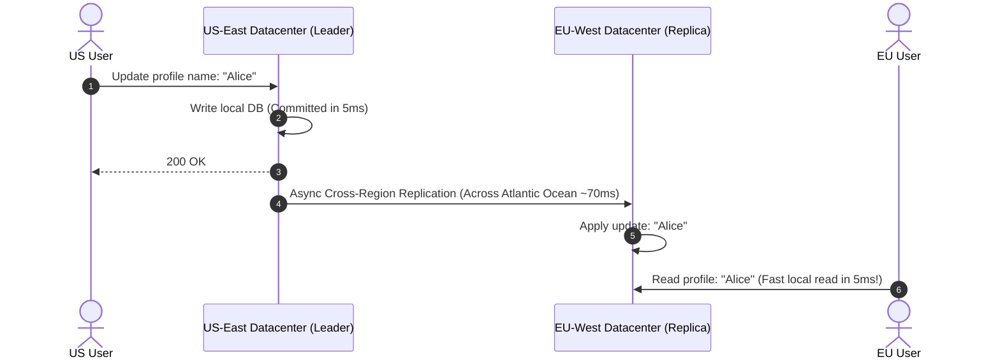

# HLD Chapter 11: Scenario-Based HLD Crisis Scenarios & Senior Staff Grills

> **Core Learning Objective:** Master real-world distributed systems outage scenarios and high-pressure interviewer follow-ups. Learn how to diagnose Cassandra zombie data resurrects, Redis 100% CPU lockouts, NTP clock drift in Snowflake IDs, and multi-region failover.

---

## 1. Production Crisis Scenarios

### Scenario 1: The Cassandra "Zombie Data" Resurrect Bug
**The Interviewer Asks:**  
> *"In our chat platform built on Apache Cassandra, a user deletes a message. Three weeks later, the deleted message mysteriously reappears in their chat history! What happened under the hood, and how do you prevent it?"*

**The Staff-Level Answer:**
* **Root Cause (Tombstone Eviction & Compaction Lag):**  
  * In Cassandra (LSM-Tree), a `DELETE` does not immediately erase data from disk; it writes a marker called a **Tombstone** with a deletion timestamp.
  * Cassandra keeps tombstones for a configurable window (`gc_grace_seconds`, default 10 days) to allow all replicas to receive the deletion.
  * If Replica Node 3 was offline for 12 days (exceeding `gc_grace_seconds`), Replicas 1 and 2 compacted and evicted the tombstone.
  * When Node 3 rejoined the cluster, its stale SSTables still held the original undeleted message! When a read request queries Node 3, Cassandra treats the older message as live data and "resurrects" it into the other replicas.
* **The Fix:**
  * Run **Incremental / Scheduled Repairs (`nodetool repair`)** frequently within the `gc_grace_seconds` window.
  * Never allow an offline node to rejoin the cluster if it has been down longer than `gc_grace_seconds`; decommission and re-bootstrap it with a clean snapshot.

---

### Scenario 2: Redis Cluster at 100% CPU Utilization
**The Interviewer Asks:**  
> *"Our primary Redis cluster CPU suddenly spikes to 100%, causing request timeouts across the entire platform. Redis is single-threaded for command execution. How do you diagnose and mitigate this live in production?"*

**The Staff-Level Answer:**
1. **Diagnosis:**
   * Run `redis-cli --bigkeys` and `redis-cli --hotkeys` to detect if a single key is consuming massive bandwidth or receiving 50,000 QPS.
   * Run `SLOWLOG GET 10` to check for $O(N)$ operations accidentally executed in production (e.g. `KEYS *` instead of `SCAN`, or massive `HGETALL` / `SMEMBERS` on sets with 100,000 elements).
2. **Mitigations:**
   * **Hot Key Partitioning (Key Sharding):** If `featured_products` is hammered by all users, replicate the key across $K$ sub-keys: `featured_products_1`, `featured_products_2`, ..., `featured_products_N`. Application servers pick a random sub-key, spreading read load evenly across Redis shards.
   * **Near-Cache (L1 In-Memory Cache):** Add a tiny in-process memory cache (e.g. `cachetools` or Go sync.Map with 10-second TTL) directly on the API Gateway instances, reducing Redis queries by 90%.

---

### Scenario 3: Clock Drift & Snowflake ID Collisions
**The Interviewer Asks:**  
> *"In our distributed Snowflake ID generator, a server's local clock synchronizes via NTP and jumps backward by 250 milliseconds. What happens to ID generation, and how do we prevent duplicate primary keys?"*

**The Staff-Level Answer:**
* **The Problem:**  
  Snowflake embeds a 41-bit millisecond timestamp into the ID. If the system clock jumps backward, the node risks generating duplicate IDs that were already issued during the prior physical milliseconds.
* **The Production Solution:**
  * Track the `last_timestamp` generated on each node.
  * If `current_timestamp < last_timestamp`:
    * If the drift is small ($< 10\text{ms}$): Sleep the thread until the clock catches up to `last_timestamp`.
    * If the drift is significant ($> 10\text{ms}$): Refuse to issue IDs, increment a clock drift failure metric, and failover ID generation to another healthy node.

---

## 2. Multi-Region Active-Active Replication

### Handling Multi-Region Conflicts (Active-Active)
If a user updates their profile in US-East while their automated bot updates it in EU-West simultaneously:
1. **Last-Write-Wins (LWW):** Uses NTP timestamp to pick the highest clock value (Danger: Clock skew can overwrite newer changes).
2. **Conflict-Free Replicated Data Types (CRDTs):** Mathematically convergent data structures that merge concurrent updates without centralized coordination.
