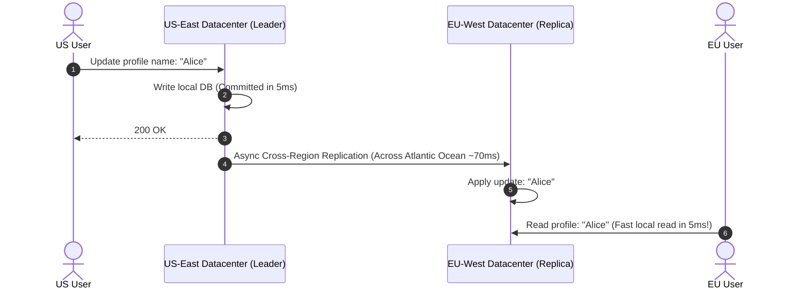

# HLD Chapter 11: Scenario-Based HLD Crisis Scenarios & Senior Staff Grills

> **Core Learning Objective:** Master real-world distributed systems outage scenarios and high-pressure interviewer follow-ups. Learn how to diagnose Cassandra zombie data resurrects, Redis 100% CPU lockouts, NTP clock drift in Snowflake IDs, and multi-region failover.

---

## 1. Production Crisis Scenarios

### Scenario 1: The Cassandra "Zombie Data" Resurrect Bug
**The Interviewer Asks:**  
> *"In our chat platform built on Apache Cassandra, a user deletes a message. Three weeks later, the deleted message mysteriously reappears in their chat history! What happened under the hood, and how do you prevent it?"*

**The Staff-Level Answer:**
* **Root Cause (Tombstone Eviction & Compaction Lag):**  
  * In Cassandra (LSM-Tree), a `DELETE` does not immediately erase data from disk; it writes a marker called a **Tombstone** with a deletion timestamp.
  * Cassandra keeps tombstones for a configurable window (`gc_grace_seconds`, default 10 days) to allow all replicas to receive the deletion.
  * If Replica Node 3 was offline for 12 days (exceeding `gc_grace_seconds`), Replicas 1 and 2 compacted and evicted the tombstone.
  * When Node 3 rejoined the cluster, its stale SSTables still held the original undeleted message! When a read request queries Node 3, Cassandra treats the older message as live data and "resurrects" it into the other replicas.
* **The Fix:**
  * Run **Incremental / Scheduled Repairs (`nodetool repair`)** frequently within the `gc_grace_seconds` window.
  * Never allow an offline node to rejoin the cluster if it has been down longer than `gc_grace_seconds`; decommission and re-bootstrap it with a clean snapshot.

---

### Scenario 2: Redis Cluster at 100% CPU Utilization
**The Interviewer Asks:**  
> *"Our primary Redis cluster CPU suddenly spikes to 100%, causing request timeouts across the entire platform. Redis is single-threaded for command execution. How do you diagnose and mitigate this live in production?"*

**The Staff-Level Answer:**
1. **Diagnosis:**
   * Run `redis-cli --bigkeys` and `redis-cli --hotkeys` to detect if a single key is consuming massive bandwidth or receiving 50,000 QPS.
   * Run `SLOWLOG GET 10` to check for $O(N)$ operations accidentally executed in production (e.g. `KEYS *` instead of `SCAN`, or massive `HGETALL` / `SMEMBERS` on sets with 100,000 elements).
2. **Mitigations:**
   * **Hot Key Partitioning (Key Sharding):** If `featured_products` is hammered by all users, replicate the key across $K$ sub-keys: `featured_products_1`, `featured_products_2`, ..., `featured_products_N`. Application servers pick a random sub-key, spreading read load evenly across Redis shards.
   * **Near-Cache (L1 In-Memory Cache):** Add a tiny in-process memory cache (e.g. `cachetools` or Go sync.Map with 10-second TTL) directly on the API Gateway instances, reducing Redis queries by 90%.

---

### Scenario 3: Clock Drift & Snowflake ID Collisions
**The Interviewer Asks:**  
> *"In our distributed Snowflake ID generator, a server's local clock synchronizes via NTP and jumps backward by 250 milliseconds. What happens to ID generation, and how do we prevent duplicate primary keys?"*

**The Staff-Level Answer:**
* **The Problem:**  
  Snowflake embeds a 41-bit millisecond timestamp into the ID. If the system clock jumps backward, the node risks generating duplicate IDs that were already issued during the prior physical milliseconds.
* **The Production Solution:**
  * Track the `last_timestamp` generated on each node.
  * If `current_timestamp < last_timestamp`:
    * If the drift is small ($< 10\text{ms}$): Sleep the thread until the clock catches up to `last_timestamp`.
    * If the drift is significant ($> 10\text{ms}$): Refuse to issue IDs, increment a clock drift failure metric, and failover ID generation to another healthy node.

---

## 2. Multi-Region Active-Active Replication

### Handling Multi-Region Conflicts (Active-Active)
If a user updates their profile in US-East while their automated bot updates it in EU-West simultaneously:
1. **Last-Write-Wins (LWW):** Uses NTP timestamp to pick the highest clock value (Danger: Clock skew can overwrite newer changes).
2. **Conflict-Free Replicated Data Types (CRDTs):** Mathematically convergent data structures that merge concurrent updates without centralized coordination.

## 2. More Defence Questions

### Question 5: "Your database is at 90% CPU. What do you do, in order?"

1. **Measure first:** find the top queries by total time (slow query log, `pg_stat_statements`); fix the worst one before adding hardware.
2. **Cheap wins:** missing index, N+1 queries, an unbounded `SELECT`, connection storms (add a pooler).
3. **Offload reads:** cache hot reads, then add read replicas (accept replication lag and route read-your-own-write traffic to the leader).
4. **Reduce work:** batch writes, move heavy analytics off the primary, precompute aggregates.
5. **Scale the data layer:** partition by a key with even access, only after the steps above, because sharding is permanent complexity.

### Question 6: "Two data centres disagree about the same record after a network partition. Who wins?"

State the choice before the mechanism. If correctness matters more than availability (money, inventory), block writes on the minority side (CP). If availability matters (shopping cart, likes), accept both writes and reconcile later (AP) using version vectors, last-write-wins with a known data-loss risk, or a mergeable type (CRDT). Then name what you do for the user-visible conflicts you cannot merge automatically.

### Question 7: "How would you roll out a risky change to a system serving a million requests per second?"

Use progressive delivery: ship behind a feature flag, release to internal users, then 1%, 10%, 50%, 100% of traffic while watching error rate, latency percentiles and a business metric; define the rollback trigger **before** starting, keep the old path alive until the new one is proven, and make schema changes backward compatible (expand, migrate, contract) so a rollback never needs a data repair.

### Question 8: "Your service calls three downstream services; one gets slow. What happens and how do you protect yourself?"

Without protection, request threads pile up waiting on the slow service, the pool exhausts, and the failure spreads upward (a cascading failure). Defences, in the order they bite: **timeouts** on every call, **retries with backoff and jitter** only for idempotent calls, a **circuit breaker** that fails fast while the dependency is unhealthy, **bulkheads** (separate pools so one slow dependency cannot take all threads), and **load shedding** or a **degraded response** (cached data, partial page) instead of an error.

### Question 9: "How do you make an API safe to retry?"

Make every unsafe operation idempotent: the client sends an idempotency key, the server stores the key with the result, and a repeated request returns the stored result instead of repeating the effect. Key points: scope the key to the caller, expire it after a bounded window, store the key and the effect in the same transaction, and return the same status code on replay.

---

## Further Reading

- [System Design Primer](https://github.com/donnemartin/system-design-primer)
- [Stripe: rate limiters](https://stripe.com/blog/rate-limiters)
- [AWS Builders' Library](https://aws.amazon.com/builders-library/)

---

## Check Yourself

Answer in your head or on paper first, then open each answer.

<strong>1.</strong> How do you start 'design a rate limiter'?

Clarify scope (per user/IP, where enforced, hard or soft limits), choose an algorithm (token bucket), then storage (Redis) and distribution.

<strong>2.</strong> Strong versus eventual consistency: how do you justify choosing?

Tie to the cost of staleness: money and inventory need strong; feeds and counters tolerate eventual.

<strong>3.</strong> How do you handle 'it must be highly available'?

Remove single points of failure, replicate across zones, use health checks and failover, and state RTO/RPO.

<strong>4.</strong> What closes a strong answer?

Bottlenecks identified, a scaling path, and the trade-offs you accepted.

