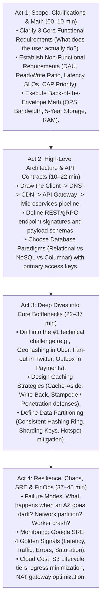

# Chapter 12: Track 3 Recap — The HLD & Distributed Systems Synthesis Playbook

> **Core Learning Objective:** Consolidate everything you have mastered across Track 3 into an executive, rapid-recall distributed architecture blueprint. This chapter provides a high-yield synthesis of the 45-minute HLD interview framework, back-of-the-envelope estimation rules of thumb, distributed database and caching trade-offs, consensus invariants, and an executive comparison of all 15 production core systems.

---

## 1. The 45-Minute HLD Interview Playbook (The 4-Act Play)

In Senior and Staff System Design interviews, interviewers evaluate your ability to drive technical ambiguity toward clear, scalable architecture. Follow this proven 4-act timeline:

---

## 2. Back-of-the-Envelope Estimation Rules of Thumb

Never get stuck doing long division in an interview. Use these 4 golden estimation multipliers:

### 1. The $10^5$ Daily Multiplier
There are 86,400 seconds in a day:
$$\text{Seconds in a day} \approx 10^5 \text{ seconds}$$
* **From Daily Queries to QPS:** $\frac{\text{Queries per Day}}{10^5} = \text{Average QPS}$.  
  *Example:* $100\text{ Million requests/day} \div 10^5 = \mathbf{1,000\text{ QPS}}$.
* **Peak QPS:** Assume a $2\times$ to $3\times$ peak multiplier: $\text{Peak QPS} \approx 2,000 \text{ to } 3,000\text{ QPS}$.

### 2. Storage Multiplier
$$\text{Payload Size} \times \text{Daily Writes} \times 365 \times 5 = \text{5-Year Storage Capacity}$$
* *Example:* $10\text{M writes/day} \times 2\text{ KB/write} = 20\text{ GB/day}$.
* In 1 year: $20\text{ GB} \times 365 \approx 7.3\text{ TB}$.
* In 5 years: $7.3\text{ TB} \times 5 \approx \mathbf{36.5\text{ TB}}$.

### 3. The 80/20 Memory Cache Sizing Rule
According to the Pareto Principle, $20\%$ of daily read content generates $80\%$ of traffic.
$$\text{RAM Required for Cache} = \text{Daily Read Volume} \times 0.20$$
* If daily reads generate $500\text{ GB}$ of data, you need $500 \times 0.20 = \mathbf{100\text{ GB of Redis RAM}}$ to satisfy $80\%$ of requests directly from memory!

### 4. Latency Numbers Every Staff Engineer Must Know
| Operation | Latency | Plain-English Comparison |
| :--- | :--- | :--- |
| **L1 CPU Cache Reference** | **1 ns** | 1 heart beat |
| **Main Memory (RAM) Access** | **100 ns** | 100 heart beats |
| **NVMe SSD Sequential Read** | **100 $\mu$s (0.1 ms)** | Walking down the street |
| **Same-Datacenter Network Round-Trip** | **500 $\mu$s (0.5 ms)** | Walking across town |
| **Mechanical HDD Seek** | **10 ms** | Taking a train ride |
| **Cross-Continent Trans-Atlantic RTT (NYC to London)** | **150 ms** | Flying across the ocean |

---

## 3. The Distributed Systems Tech Stack Decision Matrix

| Subsystem | Options | When to Choose | Invariant / Trade-off |
| :--- | :--- | :--- | :--- |
| **Storage: RDBMS** | PostgreSQL, MySQL | Financial ledgers, ACID transactions, complex relational joins. | Strong consistency ($C$), harder to horizontally shard. |
| **Storage: Key-Value** | Redis, DynamoDB | Session storage, caching, token buckets, quick user lookups. | Sub-millisecond latency; no relational joins. |
| **Storage: Wide-Column** | Apache Cassandra, ScyllaDB | High-volume append-only writes (chat messages, telemetry, sensor logs). | Tunable Quorum ($R + W > N$), AP availability over consistency. |
| **Storage: Search Index** | Elasticsearch, OpenSearch | Full-text search, fuzzy matching, auto-complete typeahead. | Inverted index + BM25 scoring; eventual consistency. |
| **Storage: Time-Series** | Prometheus, VictoriaMetrics | Server metrics, CPU utilization, financial ticker feeds. | Gorilla XOR float compression + Delta-of-delta timestamps. |
| **Transactions: Distributed** | Saga Orchestration | Long-running workflows across multiple microservices (Order $\to$ Payment $\to$ Stock). | Compensating transactions handle rollbacks; eventual consistency. |
| **Transactions: Dual Writes** | Transactional Outbox Pattern | Publishing events to Kafka while updating PostgreSQL database. | Guarantees atomic commit: zero lost messages, zero ghost messages. |
| **Caching: Write Policy** | Cache-Aside (Lazy) | High-read, low-update workloads; tolerant of initial cache miss. | Application code checks cache, falls back to DB, and populates cache. |
| **Caching: Write Policy** | Write-Back (Write-Behind) | Extreme write throughput (gaming leaderboards, analytics tracking). | Writes directly to cache; asynchronous worker flushes to DB in batches. |
| **Consensus Protocol** | Raft / Paxos | Distributed cluster leader election, state machine log replication. | Quorum majority ($\lfloor N/2 \rfloor + 1$); halts writes during split-brain partitions. |

---

## 4. The 15 Production Core Systems Architecture Synthesis

Every system you mastered in Track 3 solves a classic FAANG-scale distributed problem:

| System # | System Name | Primary Scaling Challenge | Core Architecture & Solution |
| :---: | :--- | :--- | :--- |
| **01** | **Messaging App (WhatsApp)** | 100M concurrent persistent WebSocket connections | L4 TCP Load Balancers + Epoll Gateway + Cassandra Chat Log. |
| **02** | **Ticketing (Ticketmaster)** | 1M users competing for 50k concert seats | Redis Redlock + Lua script atomic decrements + 10-minute seat holds. |
| **03** | **Photo Sharing (Instagram)** | Massive read-to-write ratio ($100:1$) + celebrity feeds | Hybrid Fan-Out (Push for regular users, Pull for celebrities) + CDN edges. |
| **04** | **Distributed Task Scheduler** | Millions of delayed tasks firing at exact seconds | Hashed Hierarchical Timing Wheel ($O(1)$) + Raft leader election. |
| **05** | **Video Streaming (YouTube)** | Uploading & streaming terabytes of multi-resolution video | Asynchronous Chunking DAG + Transcoding Workers + HLS Adaptive Bitrate CDN. |
| **06** | **E-Commerce Platform (Amazon)** | Zero inventory overselling across microservices | Saga Orchestrator + Two-Phase Inventory Hold + Transactional Outbox. |
| **07** | **Proximity Service (Yelp)** | Fast geographic spatial nearest-neighbor search | Uber H3 Hexagonal Spatial Indexing + Read-Replica Geohash caching. |
| **08** | **Mutual Matching (Tinder)** | Sub-10ms mutual right-swipe match detection | Redis Sorted Sets + Bidirectional Bitmaps + 2-Stage Recommendation engine. |
| **09** | **Real-Time Geospatial (Uber)** | 1.25M real-time driver GPS pings per second | Redis Geospatial H3 cells + Ring-Buffer memory cache + Dispatch engine. |
| **10** | **Social Network (Twitter)** | Celebrity tweet stampede (100M follower broadcast) | Snowflake 64-bit ID generation + Hybrid Fan-out Timeline Cache. |
| **11** | **Distributed Cache (Redis Cluster)** | Scaling memory beyond a single node | 16,384 Virtual Hash Slots + Consistent Hash Ring + Gossip Protocol. |
| **12** | **Distributed Search (Elasticsearch)** | Instant multi-keyword search over billions of documents | Inverted Index + BM25 relevance scoring + Sharded Trie Typeahead. |
| **13** | **Metrics TSDB (Prometheus)** | Storing millions of metric data points per second | Gorilla XOR Float Compression + Delta-of-delta timestamps ($1.37\text{ bytes/pt}$). |
| **14** | **Distributed Web Crawler** | Crawling billions of web pages politely & deduplicating | Mercator URL Frontier + Domain Delay Min-Heap + 64-bit SimHash. |
| **15** | **Payment Gateway & Ledger** | Financial accuracy, double-entry ledger & idempotency | Double-Entry Bookkeeping ($\sum \text{Debits} = \sum \text{Credits}$) + Client Idempotency Keys. |

---

## 5. The Junior vs. Senior Antipattern Graveyard

| # | The Junior Antipattern | What Goes Wrong in Production | The Senior / Staff Solution |
| :---: | :--- | :--- | :--- |
| **1** | Single Point of Failure (SPOF) (e.g. single database master, single API Gateway node). | Hardware failure or network hiccup takes down the entire company for hours. | Multi-AZ redundant deployment, automated health checks, and DNS Anycast failover. |
| **2** | Dual-Writes to Database and Message Queue (`db.save(); kafka.send()`). | If the process crashes after `db.save()`, the Kafka message is **never sent**. Data is now permanently out-of-sync! | Use the **Transactional Outbox Pattern**: write both the entity and outbox event into the DB within a single ACID transaction, then tail the WAL via Debezium. |
| **3** | Unbounded Fan-Out on Social Feeds (Writing a tweet to 100M user timeline caches). | A tweet from a celebrity takes 45 seconds to fan out, pegging Redis CPU at 100% and stalling the cluster. | **Hybrid Fan-Out**: push to followers for users with $<25\text{k}$ followers; pull on-demand from celebrity timelines at read time. |
| **4** | Relying on physical wall-clock time (`datetime.now()`) for distributed sequencing. | **NTP Clock Drift**: physical machine clocks drift by milliseconds, causing causality inversions where replies appear before questions! | Use **Twitter Snowflake IDs** (Epoch + Machine ID + Monotonic Sequence Counter) or **Vector Clocks / Lamport Timestamps**. |
| **5** | Naked Redis Cache without Stampede or Penetration Defense. | A celebrity profile expires: 50,000 requests hit the empty cache simultaneously and slam PostgreSQL, crashing the primary database (**Thundering Herd**). | Use **Cache Locking / XFetch probabilistic early refresh** for stampede defense, and **Bloom Filters** for non-existent key penetration defense. |

---

## 6. Track 3 Graduation Milestone Check

Before you proceed to **Track 4: Agentic AI Engineering**, ensure you can confidently answer these 4 mastery questions:
- [x] *Can you calculate QPS, bandwidth, and 5-year storage capacity from raw DAU numbers in under 3 minutes?*
- [x] *Can you design a distributed payment system with idempotency keys and double-entry bookkeeping?*
- [x] *Can you defend your choice between Cassandra (AP) and PostgreSQL (CP) under network partition constraints?*
- [x] *Can you explain how a Consistent Hash Ring ensures that adding or removing a node migrates only $1/N$ of keys?*

> [!TIP]
> **Next Stop: Track 4 (Agentic AI Engineering)!**
> You now command the architectural power to build systems scaling to hundreds of millions of users. Now it is time to master the frontier of software engineering: autonomous reasoning agents, RAG, vector databases, and multi-agent cognitive swarms! Proceed to [Track 4: Agentic AI Engineering](../04-Agentic-AI/01-LLM-Foundations-Tokenization-Inference.md)!

## Further Reading

- [System Design Primer](https://github.com/donnemartin/system-design-primer)
- [AWS Builders' Library](https://aws.amazon.com/builders-library/)
- [Google SRE book](https://sre.google/sre-book/table-of-contents/)

---

## Check Yourself

Answer in your head or on paper first, then open each answer.

<strong>1.</strong> Name the standard building blocks used in most HLD answers.

Load balancer, stateless services, cache, database with replication and sharding, queue, CDN, object storage.

<strong>2.</strong> Which two numbers frame most designs?

Peak QPS and storage growth.

<strong>3.</strong> When do you add a queue?

To decouple spikes, enable retries and run work asynchronously.

<strong>4.</strong> What is the most common mistake in HLD interviews?

Drawing boxes before clarifying requirements and estimating load.

