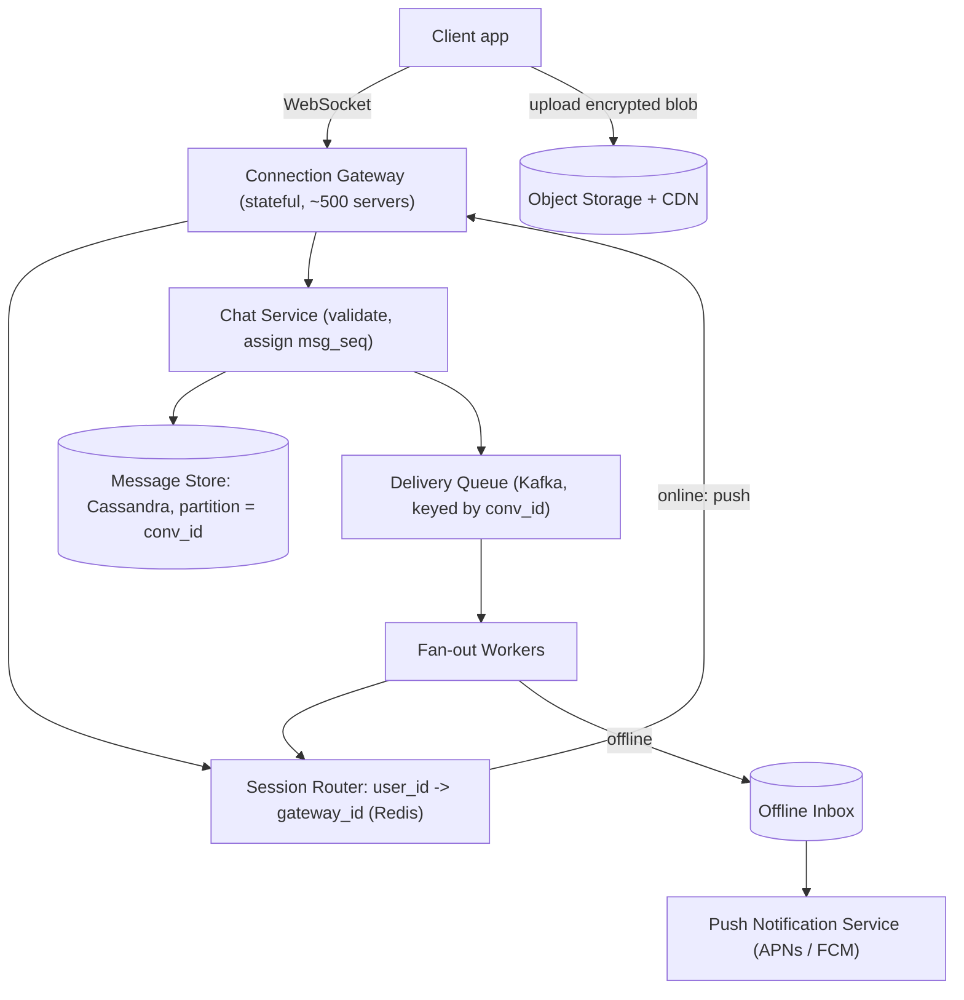

# HLD Case Study 1: Messaging App (WhatsApp / Messenger)

> **Key Focus Areas:** Persistent connections, per-conversation ordering, delivery receipts, offline delivery, fan-out for groups, and end-to-end encryption trade-offs.

---

## 1. Requirements and Scope

**Functional:** 1:1 and group chat (up to 1,000 members), delivery states (sent, delivered, read), offline delivery, media attachments, presence ("online/last seen"), multi-device sync.
**Non-functional:** message latency under 200 ms p99 when both users are online; messages are **never lost** once acknowledged; **per-conversation ordering**; availability over strict consistency for presence; 99.99% availability.
**Out of scope for this answer:** voice/video calls, payments, search over message content (it is encrypted).

## 2. Back-of-the-Envelope Estimates

Assume 500M daily active users sending 40 messages/day each, average 100 bytes of text, 5% of messages carry media (average 200 KB, stored in object storage).

```python
dau, msgs_per_user, msg_bytes = 500e6, 40, 100
msgs_per_day = dau * msgs_per_user                 # 2e10
avg_qps = msgs_per_day / 86400                      # ~231,000 msg/s
peak_qps = avg_qps * 3                              # ~694,000 msg/s at peak
text_per_day_tb = msgs_per_day * msg_bytes / 1e12   # 2 TB/day of text
media_per_day_tb = msgs_per_day * 0.05 * 200e3 / 1e12  # 200 TB/day of media
concurrent_conns = dau * 0.2                        # 20% online at once = 100M sockets
conns_per_server = 200_000                          # tuned epoll-based gateway
gateway_servers = concurrent_conns / conns_per_server  # ~500 servers
print(round(avg_qps), round(peak_qps), text_per_day_tb, media_per_day_tb, gateway_servers)
assert 230_000 < avg_qps < 232_000 and gateway_servers == 500
```

Takeaways: the system is **connection-bound** (100M sockets, about 500 gateway servers), media dominates storage (about 73 PB/year), and text storage (about 0.7 PB/year) is small enough to keep forever.

## 3. API Design

| Channel | Operation |
|---|---|
| WebSocket (or MQTT/XMPP over TCP) | `send {conv_id, client_msg_id, ciphertext, ts}`; server pushes `msg`, `ack`, `receipt {msg_id, state}`, `presence` |
| REST (HTTPS) | `POST /media` returns an upload URL and `media_id` (client uploads encrypted blob directly to object storage); `GET /conversations/{id}/messages?before=cursor&limit=50` for history sync |

`client_msg_id` (UUID generated on the device) makes `send` **idempotent**: a retry after a network drop must not create a duplicate.

## 4. Data Model

* **messages** (wide-column store such as Cassandra or ScyllaDB): partition key `conv_id`, clustering key `msg_seq` (monotonic per conversation), columns `sender_id, client_msg_id, ciphertext, type, created_at`. Reads are "latest N messages of a conversation", which is one partition range scan.
* **inbox/offline queue**: `(user_id, device_id) -> ordered list of undelivered msg ids`, deleted on device ack.
* **conversations / membership**: relational or KV (`conv_id -> members`, `user_id -> conv_ids`).
* **presence**: in-memory store (Redis) with TTL keys, `user_id -> {gateway_id, last_heartbeat}`.

## 5. Architecture



## 6. Deep Dive: Ordering, Delivery and Offline

**Ordering.** Messages in one conversation must appear in the same order for every member. Route all messages of a `conv_id` through the same Kafka partition (hash of `conv_id`) and a single consumer assigns the next `msg_seq`. Ordering across conversations is not needed, so throughput scales by partition count.

**Delivery pipeline.** (1) Sender gateway forwards `send` to Chat Service; (2) Chat Service **persists first**, then acks the sender ("sent", one tick); (3) the fan-out worker looks up each recipient device in the session router: if online, push through that gateway and wait for the device ack ("delivered"); if offline, append to the inbox and trigger a push notification; (4) when the recipient opens the chat, a "read" receipt flows back as a normal small message.

**At-least-once plus idempotency.** Every hop retries until acked, so duplicates are possible; devices de-duplicate by `msg_id`. This gives **effectively exactly-once** display.

**Groups.** Fan-out on write: one stored copy, one delivery task per member. For 1,000-member groups this is 1,000 deliveries per message, which is acceptable because groups are a small share of traffic; very large broadcast channels instead use fan-out on read (members pull).

## 7. Scaling and Bottlenecks

* **Gateways** scale horizontally; a user reconnects to any gateway and re-registers in the session router. Use consistent hashing or a registry so the router lookup stays O(1).
* **Hot conversations** (a viral group) concentrate load on one partition: cap group size, and shard fan-out work across workers while keeping only the `msg_seq` assignment serialized.
* **Thundering herd after an outage:** millions of clients reconnect at once. Use exponential backoff with jitter on clients and connection-admission limits on gateways.
* **History sync:** serve from the wide-column store with cursor pagination; cache the latest page of active conversations in Redis.

## 8. Failure Modes and Mitigations

| Failure | Effect | Mitigation |
|---|---|---|
| Gateway crash | 200K connections drop | clients auto-reconnect; undelivered messages still in inbox |
| Chat Service crash after persist, before ack | sender retries | idempotent `client_msg_id` dedupes |
| Kafka partition leader loss | brief ordering stall | replication factor 3, `acks=all`, leader election |
| Message store node loss | read/write errors | RF=3, quorum writes (`LOCAL_QUORUM`), hinted handoff |
| Push provider outage | offline users not notified | message stays in inbox; delivered on next connect |
| Split-brain presence | stale "online" | TTL heartbeats, presence is explicitly best-effort |

## 9. Trade-offs and Alternatives

* **Server-assigned sequence vs client timestamps:** timestamps are skewed and unordered; a server sequence per conversation gives a total order at the cost of a single-writer partition.
* **End-to-end encryption (Signal protocol):** the server stores only ciphertext, so it cannot search, moderate, or sync history to a new device without client help; backups need user-held keys. Trade privacy for server-side features.
* **WebSocket vs long polling vs MQTT:** WebSocket is lowest latency; MQTT is lighter on battery and mobile networks; long polling is a fallback behind restrictive proxies.
* **Fan-out on write vs read:** write is fast to read but expensive for huge groups; read is cheap to write but slower to load.
* **Wide-column vs relational store:** wide-column wins on write throughput and partition scans; relational wins on ad-hoc queries (not needed here).

## 10. Interview Timeline (45 minutes) and Follow-ups

| Minutes | Do |
|---|---|
| 0 to 5 | Clarify scope, scale, 1:1 vs groups, E2EE |
| 5 to 10 | Estimates (connections, QPS, storage) |
| 10 to 20 | API plus data model plus diagram |
| 20 to 35 | Deep dive: ordering, delivery states, offline |
| 35 to 45 | Failures, scaling, trade-offs, questions |

**Likely follow-ups:** How do you guarantee ordering in a group? (one partition per `conv_id`, server `msg_seq`). How do multi-device read states sync? (receipts are messages addressed to the user's other devices). How do you do "typing..." indicators? (ephemeral, not persisted, rate-limited, sent over the same socket). How would you add message search with E2EE? (client-side index on device).
