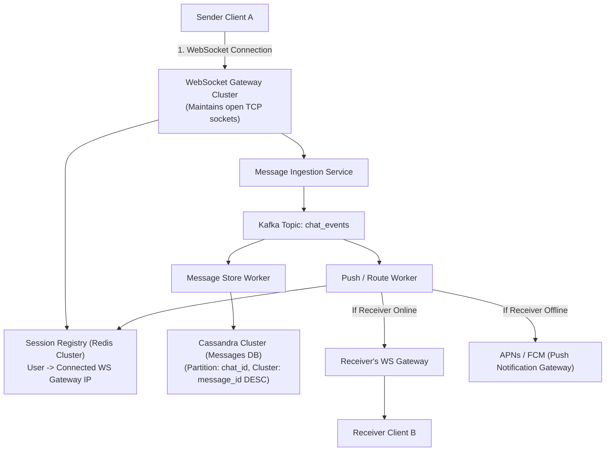
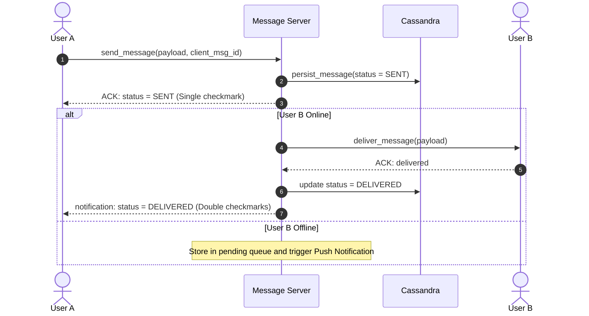

# HLD Case Study 1: Real-Time Messaging Platform (WhatsApp / Discord)

> **Key Focus Areas:** Real-time WebSockets, message delivery guarantees (sent, delivered, read), distributed connection servers, and offline message synchronization.

---

## 1. Problem Statement & Requirements

Design a global real-time chat platform supporting 1-on-1 and group messaging with delivery receipts.

### Functional Requirements:
1. Low-latency 1-on-1 and group messaging ($< 100\text{ms}$ delivery).
2. Message status tracking: `Sent` $\rightarrow$ `Delivered` $\rightarrow$ `Read`.
3. Support offline users (queue messages until user reconnects).
4. Media sharing (images/videos up to 100MB).

### Non-Functional Requirements:
1. High availability ($99.99\%$).
2. Low latency worldwide.
3. End-to-End Encryption (E2EE) support.

---

## 2. Back-of-the-Envelope Estimations

* **DAU:** $500 \text{ Million}$ active users.
* **Message Volume:** 40 messages per user/day $\rightarrow 20 \text{ Billion messages/day}$.
* **Write QPS:** $\frac{20 \times 10^9}{10^5} \approx \mathbf{200,000 \text{ QPS}}$ (Peak = $400,000\text{ QPS}$).
* **Storage per day:** Average message size $100 \text{ bytes} \rightarrow 20 \text{ Billion} \times 100 \text{ bytes} = \mathbf{2 \text{ TB/day}}$ text storage.
* **Concurrent Connections:** $\sim 50 \text{ Million}$ simultaneous WebSocket connections.

---

## 3. High-Level Architecture Diagram



---

## 4. Database Schema Design (Apache Cassandra)

Cassandra is selected because it excels at ultra-high write throughput (LSM-Tree) and sequential range queries by time:

```sql
CREATE TABLE messages (
    chat_id uuid,
    message_id timeuuid, -- Guarantees time-ordered monotonic sorting
    sender_id uuid,
    content text,
    media_url text,
    status text, -- SENT, DELIVERED, READ
    created_at timestamp,
    PRIMARY KEY ((chat_id), message_id)
) WITH CLUSTERING ORDER BY (message_id DESC);
```

---

## 5. Deep-Dive: Delivery Guarantees & Sync


