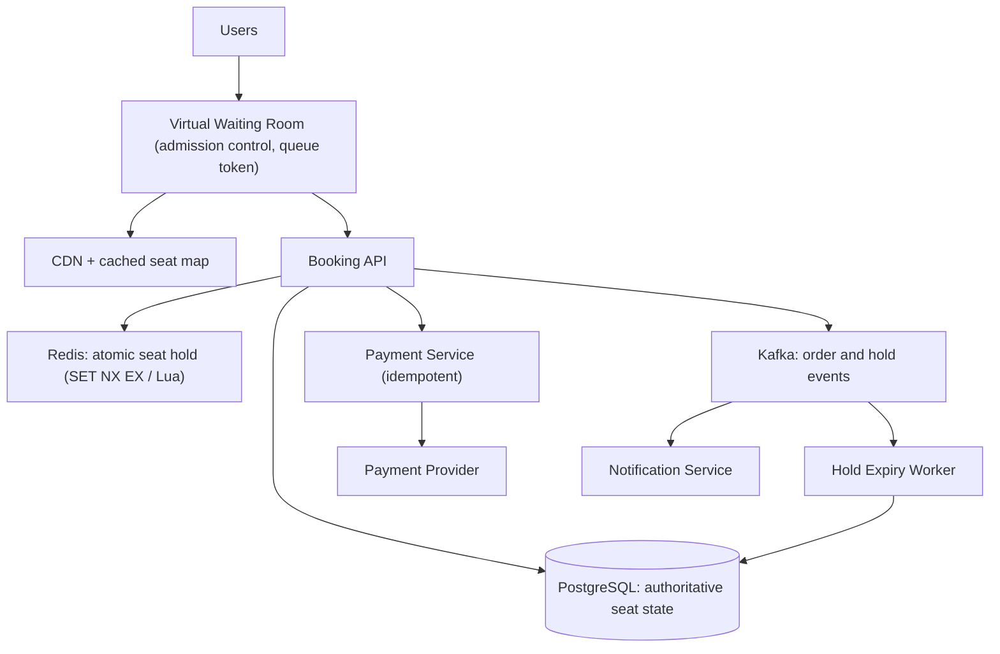

# HLD Case Study 2: Ticketing and Hotel Reservation (Ticketmaster / Booking.com)

> **Key Focus Areas:** Preventing double booking, temporary holds with expiry, flash-sale traffic spikes, inventory consistency, and payment integration.

---

## 1. Requirements and Scope

**Functional:** search events or hotels, view availability, select seats or room dates, **hold** inventory for a few minutes, pay, receive confirmation, cancel/refund.
**Non-functional:** **never sell the same seat or room-night twice** (strong consistency on inventory); browsing may be eventually consistent; survive a 100x spike when a popular event goes on sale; hold expiry must be reliable.
**Out of scope:** dynamic pricing algorithms, resale marketplace, recommendations.

## 2. Estimates

Assume a major on-sale: 50,000 seats, 2M users arriving in the first 10 minutes, each making about 20 requests (seat map refreshes, holds).

```python
users, reqs_each, window_s = 2_000_000, 20, 600
peak_qps = users * reqs_each / window_s            # ~66,667 req/s sustained
read_ratio = 0.95
write_qps = peak_qps * (1 - read_ratio)            # ~3,333 hold attempts/s
seats = 50_000
# worst-case contention: everyone wants the same ~5,000 best seats
contenders_per_seat = (users * 0.3) / 5_000        # 120 users chase each good seat
hold_ttl_s = 600
active_holds_max = seats                           # cannot exceed inventory
print(round(peak_qps), round(write_qps), contenders_per_seat)
assert round(peak_qps) == 66667 and contenders_per_seat == 120
```

The write path is small (about 3.3K/s) but **extremely contended**: 120 users compete for each good seat. The design goal is correct arbitration under contention, plus shielding the database from the read flood.

## 3. API Design

* `GET /events/{id}/seatmap` (cached, may be a few seconds stale)
* `POST /holds` body `{event_id, seat_ids[], idempotency_key}` returns `{hold_id, expires_at}` or `409 Conflict`
* `POST /orders` body `{hold_id, payment_token, idempotency_key}` returns `{order_id, status}`
* `DELETE /holds/{hold_id}` (user abandons)

## 4. Data Model

* **seat** (`event_id, seat_id, status: AVAILABLE|HELD|SOLD, hold_id, hold_expires_at, version`) in a relational database (PostgreSQL), partitioned by `event_id`.
* **hold** (`hold_id, user_id, seat_ids, expires_at`), **order** (`order_id, hold_id, amount, payment_status`).
* For hotels the unit is a **room-night**: `inventory(hotel_id, room_type, date, total, reserved)` with a check `reserved <= total`.

## 5. Architecture



## 6. Deep Dive: Preventing Double Booking

Three layers, increasing in cost:

1. **Fast arbitration in Redis.** `SET seat:{event}:{seat} {hold_id} NX EX 600` is atomic: exactly one caller gets `OK`. Losers get `409` immediately without touching the database. For multi-seat holds use a Lua script that acquires all seats or none.
2. **Authoritative write in the database.** On successful hold, persist with optimistic concurrency: `UPDATE seat SET status='HELD', hold_id=:h, hold_expires_at=:t, version=version+1 WHERE event_id=:e AND seat_id=:s AND status='AVAILABLE'` and check `rowcount == 1`. Redis is a performance layer; the DB row is the source of truth, so a Redis failure cannot cause double sale.
3. **Final purchase check.** On payment success, `UPDATE ... SET status='SOLD' WHERE hold_id=:h AND status='HELD' AND hold_expires_at > now()`. If zero rows, the hold expired: refund automatically.

**Hold expiry.** Redis TTL frees the fast lock; a worker also scans `hold_expires_at < now()` and resets stale `HELD` rows to `AVAILABLE` (idempotent, runs every few seconds). Never rely on a single mechanism.

**Waiting room.** Admit users at the rate the backend can serve (for example 1,000 per second) using signed queue tokens; everyone else sees a lightweight static page from the CDN. This turns an unbounded spike into a controlled flow.

**Hotels.** Decrement inventory per night in one transaction: `UPDATE inventory SET reserved = reserved + 1 WHERE hotel_id=:h AND room_type=:r AND date BETWEEN :in AND :out - 1 AND reserved < total`, and require rowcount equals number of nights, otherwise roll back. Overbooking is sometimes deliberate; model it as `total = physical * 1.05` per business policy.

## 7. Scaling and Bottlenecks

* **Reads:** cache seat maps at the CDN (1 to 5 s TTL) and show "likely available" rather than exact state.
* **Hot partition:** one blockbuster event is one hot key range. Shard by `(event_id, section)` so sections lock independently.
* **Database write contention:** the Redis gate keeps conflicting writers out of the DB, so only about one write per successful hold arrives.
* **Payment latency (seconds):** never hold a DB transaction open during payment; hold state is separate from the payment call.

## 8. Failure Modes and Mitigations

| Failure | Mitigation |
|---|---|
| Redis loses data | DB constraint still prevents double sale; rebuild holds from DB `HELD` rows |
| Payment succeeds but callback lost | idempotency key + reconciliation job against the PSP |
| User pays after hold expiry | conditional `UPDATE` fails, trigger refund |
| Duplicate submit (double click, retry) | `idempotency_key` returns the same result |
| Bots grabbing seats | waiting room, CAPTCHA, per-account and per-IP limits, signed tokens |
| Region outage | active-passive DB with synchronous replica for seat state |

## 9. Trade-offs

* **Pessimistic lock vs optimistic version check:** pessimistic (`SELECT ... FOR UPDATE`) is simple but blocks under contention; optimistic fails fast and retries, which suits "first wins" semantics.
* **Redis-first vs DB-only:** Redis cuts DB load by about 20x under contention but adds a second system; keep DB authoritative.
* **Strong vs eventual consistency:** strong for inventory, eventual for browse and search results.
* **Short vs long holds:** longer holds improve conversion but reduce inventory turnover; 5 to 10 minutes is typical.

## 10. Interview Timeline and Follow-ups

Spend 10 minutes on the double-booking argument: state the invariant ("a seat is SOLD at most once"), show the conditional update, then add Redis as an optimisation. **Follow-ups:** How do you handle best-available seating? (query candidates, try holds in order, release on partial failure). How do refunds restore inventory? (event-driven, idempotent). How would you add dynamic pricing? (pricing service reads demand metrics; price is snapshotted on the hold). What if the waiting room itself is attacked? (CDN rate limits, token signing, proof-of-work).
