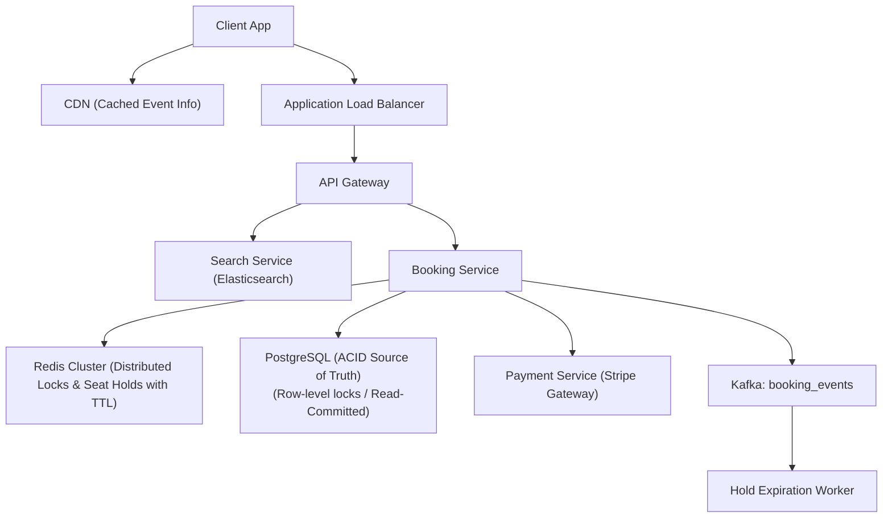
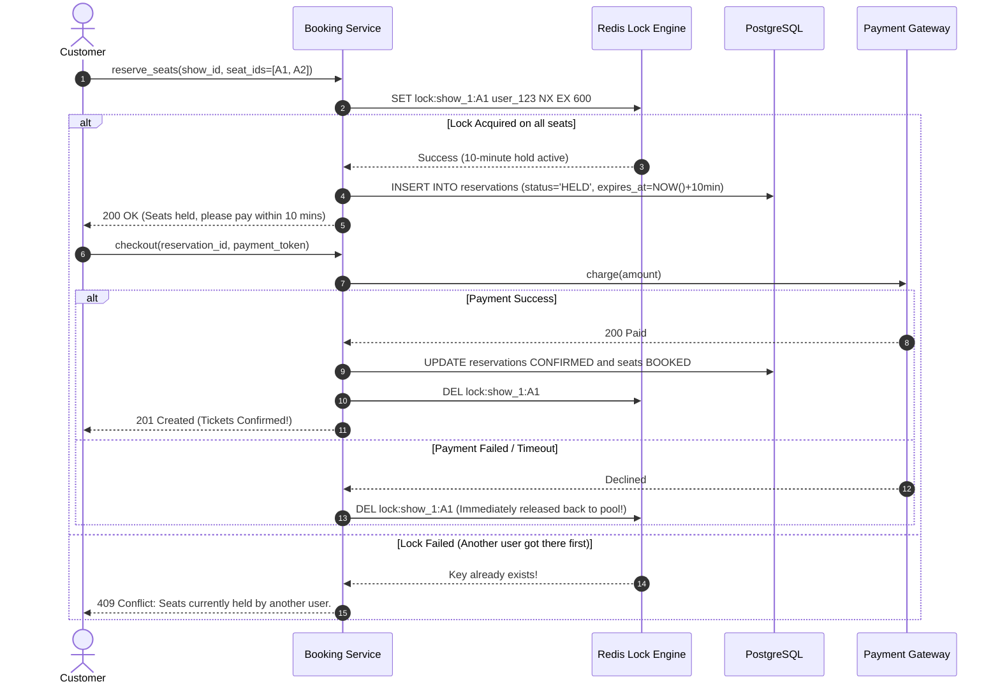

# HLD Case Study 2: Ticketing & Hotel Reservation System (Ticketmaster / Booking.com)

> **Key Focus Areas:** Concurrency control, distributed locking (Redis Redlock), preventing double-booking, idempotency, and temporary hold expiration.

---

## 1. Problem Statement & Requirements

Design a global ticketing platform for high-demand concerts where 50,000 seats sell out within seconds.

### Functional Requirements:
1. Search events, venues, and view available seats in real-time.
2. Select and temporarily hold seats for 10 minutes while user completes checkout.
3. Confirm booking upon successful payment capture.
4. Auto-release seats back to the public pool if payment times out.

### Non-Functional Requirements:
1. **Strict Zero Double-Booking:** Never sell the same seat to two customers under any failure scenario.
2. High availability for browsing; strong consistency for booking.

---

## 2. High-Level Architecture Diagram



---

## 3. Distributed Locking & The Seat Reservation Lifecycle



---

## 4. Database Schema (PostgreSQL with Optimistic Locking)

```sql
CREATE TABLE seats (
    seat_id UUID PRIMARY KEY,
    show_id UUID NOT NULL,
    seat_number VARCHAR(10) NOT NULL,
    status VARCHAR(20) NOT NULL, -- AVAILABLE, HELD, BOOKED
    version INT NOT NULL DEFAULT 1, -- Optimistic locking counter
    UNIQUE(show_id, seat_number)
);

-- Atomic SQL reservation query preventing race conditions:
UPDATE seats 
SET status = 'HELD', version = version + 1 
WHERE seat_id = 'c4b8-...' AND status = 'AVAILABLE' AND version = 1;
```
