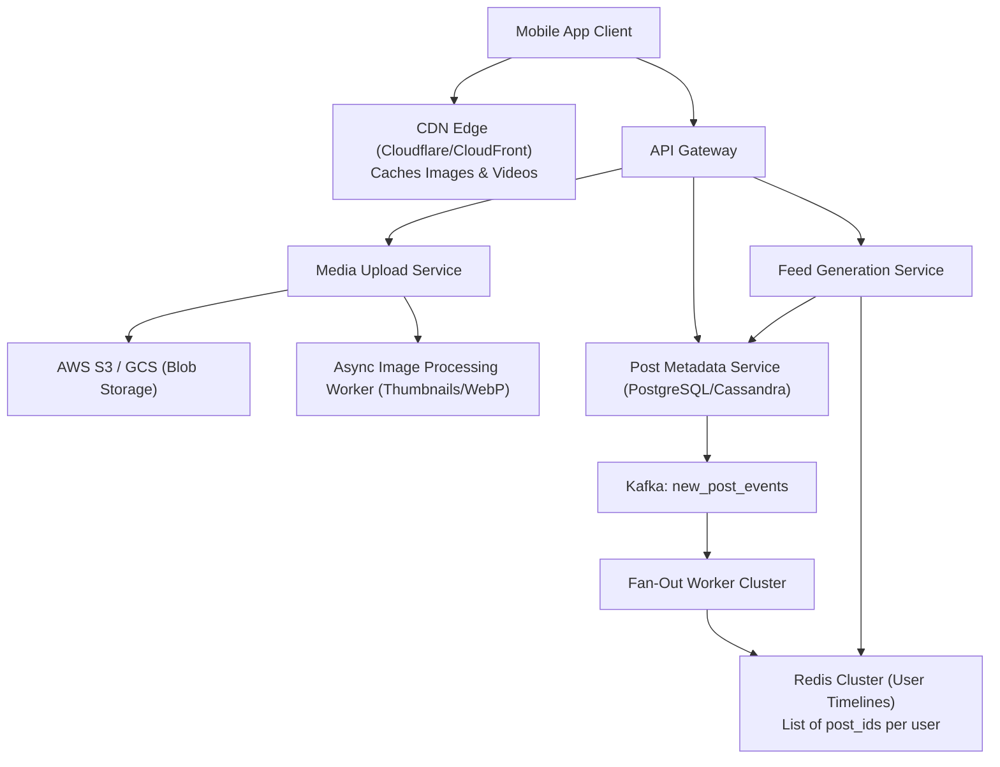
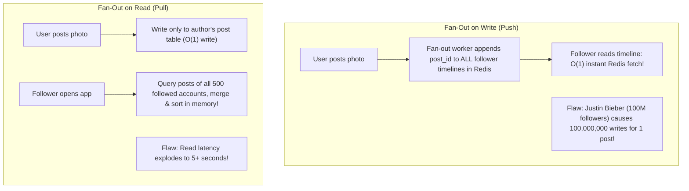

# HLD Case Study 3: Media Social Network (Instagram / Pinterest)

> **Key Focus Areas:** Fan-out on write vs fan-out on read, hybrid feed generation, media upload pipelines, and global CDN caching.

---

## 1. Problem Statement & Scale

Design a photo-sharing and personalized feed generation platform at planetary scale.

### Functional Requirements:
1. Users can upload photos with captions.
2. Users can follow/unfollow other users.
3. Users have a real-time **Home Timeline Feed** consisting of top posts from people they follow.
4. Fast search and explore grid.

### Estimations:
* **DAU:** $500 \text{ Million}$.
* **New Posts:** $100 \text{ Million}$ photos uploaded daily $\rightarrow \approx \mathbf{1,000 \text{ QPS}}$ write.
* **Feed Reads:** Each user refreshes feed 10 times daily $\rightarrow 5 \text{ Billion reads/day} \rightarrow \approx \mathbf{50,000 \text{ QPS}}$ read.
* **Read-to-Write Ratio:** $50 : 1$.

---

## 2. High-Level Architecture Diagram

---

## 3. The Feed Generation Deep Dive: Push vs Pull vs Hybrid

### The Production Solution: The Hybrid Model
* **For Standard Users ($< 25,000$ followers):** Use **Fan-out on Write (Push)**. When they post, append to their followers' Redis timeline cache.
* **For Celebrities / Influencers ($> 25,000$ followers):** Do **NOT** fan-out to followers. Keep their posts in an author timeline. When a normal user opens their feed, fetch their cached timeline and merge the few celebrity accounts they follow on the fly!
* This hybrid model provides $O(1)$ sub-50ms feed latency for 99.9% of users without database meltdown.
