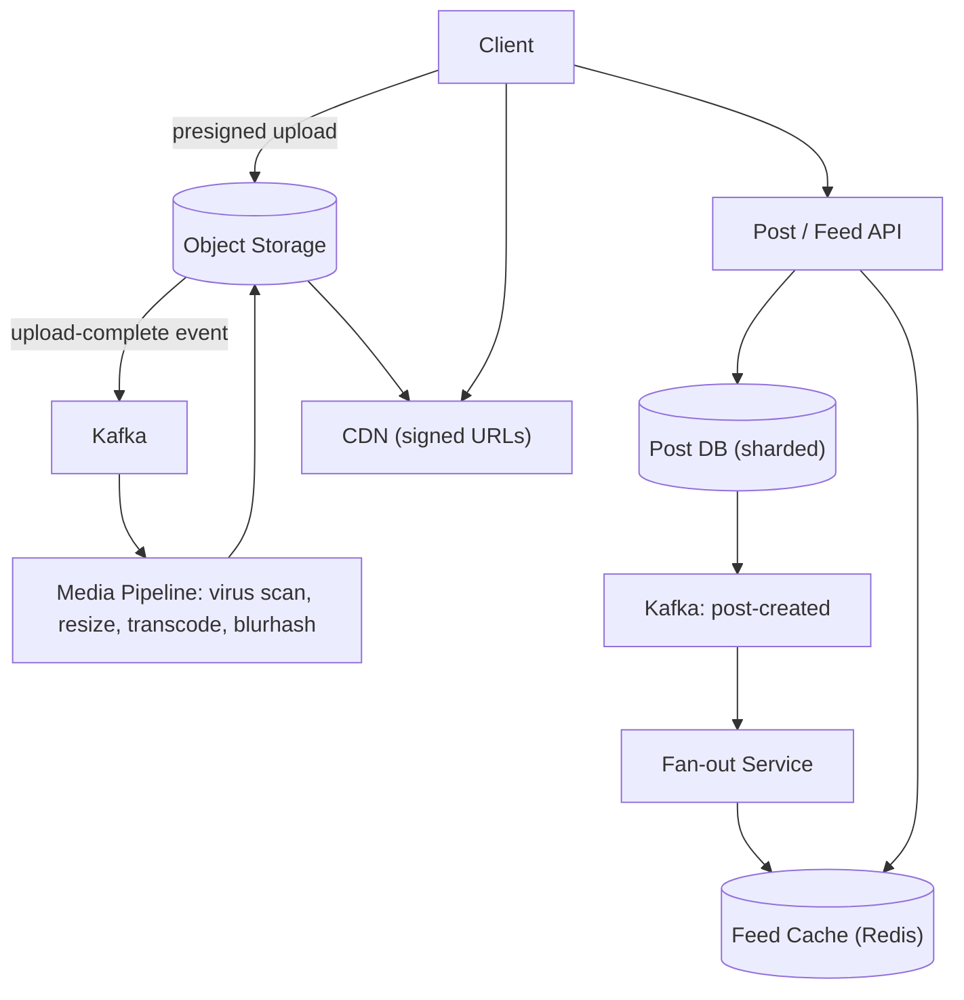

# HLD Case Study 3: Instagram (Photo Sharing and Feed)

> **Key Focus Areas:** Media upload and processing pipeline, feed generation (fan-out on write vs read), CDN delivery, and storage cost.

---

## 1. Requirements and Scope

**Functional:** upload photos/videos, follow users, home feed of followed users' posts, likes and comments, explore/search.
**Non-functional:** feed loads in under 500 ms p99; uploads never lose data; the feed may be seconds stale (eventual consistency); high availability; global low-latency media.
**Out of scope:** ads, stories expiry mechanics, ML ranking internals.

## 2. Estimates

Assume 1B MAU, 500M DAU, 100M new posts/day (average 2 MB original; derived renditions add about 1.5x), each DAU opens the feed 10 times/day.

```python
dau, posts_per_day, orig_mb = 500e6, 100e6, 2.0
upload_qps = posts_per_day / 86400                  # ~1,157 uploads/s
peak_upload = upload_qps * 3                        # ~3,500/s
feed_reads_qps = dau * 10 / 86400                   # ~57,870 feed loads/s
storage_per_day_tb = posts_per_day * orig_mb * 2.5 / 1e6   # originals + renditions: 500 TB/day
storage_per_year_pb = storage_per_day_tb * 365 / 1000      # ~182 PB/year
egress_gbps = feed_reads_qps * 20 * 0.2 * 8 / 1000  # 20 images/feed, 200 KB each, in Gbps (CDN-served)
print(round(upload_qps), round(feed_reads_qps), storage_per_day_tb, round(storage_per_year_pb), round(egress_gbps))
assert round(upload_qps) == 1157 and storage_per_day_tb == 500.0
```

Takeaways: reads outnumber writes by about 50:1 (cache and CDN everything); media storage is the dominant cost (about 182 PB/year), so use object storage with lifecycle tiering and image compression; egress from feed images alone is about 1.9 Tbps (the code above), and more with video, which only a CDN can serve.

## 3. API Design

* `POST /media/uploads` returns presigned URL(s) (multipart for large files) and `media_id`.
* `POST /posts` `{media_id, caption, idempotency_key}` creates the post after the upload completes.
* `GET /feed?cursor=&limit=20` returns post ids with metadata and signed CDN URLs.
* `POST /posts/{id}/like`, `POST /users/{id}/follow`.

## 4. Data Model

* **posts**: `post_id` (time-sortable id such as Snowflake), `author_id`, `media_keys`, `caption`, `created_at`; sharded by `author_id` or by `post_id` range.
* **follows**: `(follower_id, followee_id)` stored both directions for "who do I follow" and "who follows me" (graph store or sharded relational).
* **feed cache**: `feed:{user_id}` as a Redis sorted set of the latest 500 `post_id`s scored by time.
* **likes**: counters in Redis, periodically flushed; per-user like edge in a KV store.

## 5. Architecture



## 6. Deep Dive: Feed Generation

**Fan-out on write (push).** When a user posts, a worker prepends `post_id` to the feed cache of every follower. Reading the feed is a single Redis range read: very fast. Cost: a user with 50M followers causes 50M writes per post.
**Fan-out on read (pull).** At read time, fetch recent posts from each followee and merge. Cheap writes, slow reads for users who follow many accounts.
**Hybrid (what production systems do).** Push for normal users (under about 10K followers); **do not push for celebrities**. At read time, merge the user's precomputed feed with a live pull of recent posts from the celebrities they follow. Then apply ranking (affinity, recency, engagement) on about 500 candidates.

**Media pipeline.** Upload goes straight to object storage via presigned URLs (the API tier never carries bytes). An event triggers asynchronous workers that scan, strip EXIF, generate renditions (for example 150, 320, 640, 1080 px) plus WebP/AVIF, and extract a blur placeholder. The post becomes visible only when processing marks it `READY`.

## 7. Scaling and Bottlenecks

* **Celebrity hot keys:** hybrid fan-out; cache hot posts and counters with request coalescing.
* **Fan-out lag:** use a queue with worker autoscaling; accept seconds of staleness; prioritise active users first.
* **Storage cost:** tier old media to infrequent-access classes, store only needed renditions, deduplicate identical uploads by content hash.
* **Like counters:** write to Redis `INCR`, batch to the database; counts are approximate for display.
* **Cold start feed:** if the cache is empty (new device or evicted), rebuild by pulling and merging, then repopulate.

## 8. Failure Modes and Mitigations

| Failure | Mitigation |
|---|---|
| Upload interrupted | resumable multipart upload; `idempotency_key` on post creation |
| Media worker crash | queue redelivery; processing is idempotent keyed by `media_id` |
| Feed cache loss | rebuild from DB via pull; feeds are derived data |
| CDN regional failure | multi-CDN or origin fallback |
| Poison media (corrupt file) | dead-letter queue, mark post failed, notify user |

## 9. Trade-offs

* Push gives O(1) reads but write amplification; pull gives O(1) writes but expensive reads; hybrid bounds both.
* Strong consistency for follows/posts is unnecessary; eventual consistency keeps latency low.
* Precompute renditions (storage cost) vs on-the-fly resizing at the edge (CPU cost and latency).
* Chronological vs ranked feed: ranking raises engagement but needs features, models and explainability.

## 10. Interview Timeline and Follow-ups

Lead with the read:write ratio, then the fan-out decision, then the celebrity edge case. **Follow-ups:** How do you delete a post everywhere? (tombstone, async removal from caches and CDN purge). How do you implement "Explore"? (offline candidate generation plus an ANN index, course 10). How do you shard posts? (by `author_id` keeps profile pages local; by `post_id` spreads writes evenly). How would you support stories that expire in 24 h? (TTL in storage and cache, lifecycle policy).
