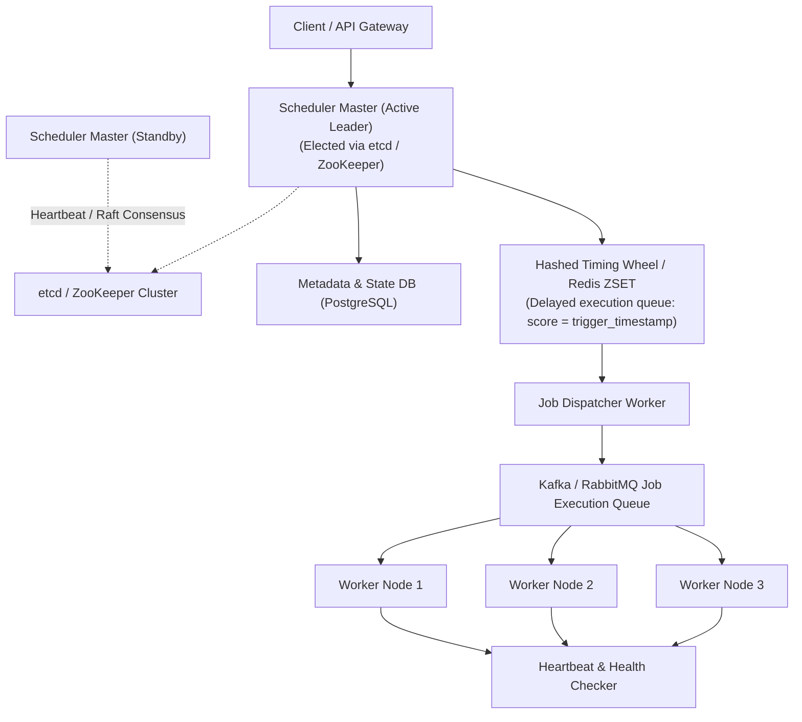

# HLD Case Study 4: Distributed Task Scheduler (Apache Airflow / Temporal)

> **Key Focus Areas:** Distributed scheduling, two-level dispatching, leader election via Raft/ZooKeeper, heartbeat failure detection, and exactly-once vs. at-least-once execution guarantees.

---

## 1. Problem Statement & Functional Requirements

Design a planetary-scale distributed task scheduler executing millions of recurring (cron) and ad-hoc jobs per minute across thousands of heterogeneous worker nodes.

### Requirements:
1. Schedule jobs to run at specific timestamps or periodic intervals (cron).
2. Support task dependencies represented as a **Directed Acyclic Graph (DAG)**.
3. Automatically handle worker node crashes without losing or corrupting tasks.
4. Provide **At-Least-Once execution** (with idempotency for critical tasks).

---

## 2. High-Level Architecture Diagram

---

## 3. Deep Dive: The High-Performance Timing Wheel

Querying a SQL database every second with `SELECT * FROM tasks WHERE trigger_at <= NOW()` causes database collapse at scale.

### The Hashed Timing Wheel (O(1) Scheduling)
* A circular array of buckets where each slot represents a time slice (e.g. 1 second per tick).
* When a job is scheduled for $T + 45$ seconds, calculate:
$$\text{bucket} = (\text{current\_tick} + 45) \pmod{\text{total\_buckets}}$$
* The scheduler pointer simply advances one slot every tick and dispatches all jobs linked to that bucket in **$O(1)$ time complexity**!

---

## 4. Fault Tolerance & Exactly-Once Semantics

In distributed computing, true "exactly-once" delivery over a network is mathematically impossible (The Two Generals' Problem).
Production task schedulers achieve **effective exactly-once execution** via:
1. **At-Least-Once Delivery:** Tasks are requeued if a worker fails to send a heartbeat within 30 seconds.
2. **Idempotency Keys:** Every task payload contains a unique `task_execution_id`. The worker writes this ID to an atomic deduplication store before running business logic, guaranteeing zero duplicate executions.
