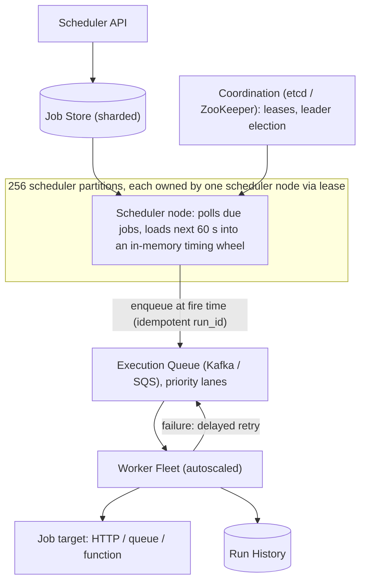

# HLD Case Study 4: Distributed Task Scheduler (Cron at Scale)

> **Key Focus Areas:** Timing wheels and delayed queues, exactly-once vs at-least-once execution, leader election, partitioned scheduling, retries and backpressure.

---

## 1. Requirements and Scope

**Functional:** schedule one-off and recurring jobs (cron expressions), cancel/update, retries with backoff, job status and history, priorities.
**Non-functional:** a job fires within about 1 second of its scheduled time; **no job is silently lost**; execution is **at-least-once** with idempotent handlers (exactly-once is built on top); survives node failures without duplicate storms; scales to billions of scheduled jobs.
**Out of scope:** the business logic of jobs, workflow DAG orchestration (mention as an extension).

## 2. Estimates

Assume 1B scheduled jobs, 100M executions/day, bursts at minute boundaries (for example 00:00 daily jobs), average job payload 1 KB.

```python
jobs, runs_per_day, payload = 1e9, 100e6, 1_000
avg_qps = runs_per_day / 86400                     # ~1,157 executions/s
burst_factor = 50                                  # minute-boundary spikes
peak_qps = avg_qps * burst_factor                  # ~57,870/s
storage_tb = jobs * payload / 1e12                 # 1 TB of job definitions
partitions = 256
jobs_per_partition = jobs / partitions             # ~3.9M each
print(round(avg_qps), round(peak_qps), storage_tb, round(jobs_per_partition))
assert storage_tb == 1.0 and round(avg_qps) == 1157
```

Takeaways: storage is modest (1 TB, shardable), the challenge is **bursty, time-aligned load** and **correctness under failure**, not raw volume.

## 3. API Design

* `POST /jobs` `{job_id (client-chosen), schedule: {type: once|cron, at|expr, tz}, target: {http|queue|function}, payload, retry: {max, backoff}, idempotency_key}`
* `GET /jobs/{id}`, `DELETE /jobs/{id}`, `PATCH /jobs/{id}` (pause/resume)
* `GET /jobs/{id}/runs` (history)

## 4. Data Model

* **jobs** (sharded by `job_id` hash): definition, `next_run_at`, `status`.
* **schedule index**: for each partition, an index on `(next_run_at, job_id)` so "what is due in the next N seconds" is a range scan (a time-bucketed table or sorted set).
* **runs**: `(job_id, run_id, scheduled_for, started_at, finished_at, status, attempt)`; `run_id = hash(job_id, scheduled_for)` makes the same fire time map to one run.
* **leases**: `(partition_id -> owner, lease_expires_at)` in a coordination store.

## 5. Architecture



## 6. Deep Dive: Firing on Time Without Duplicates

**Finding due jobs.** Each partition owner periodically (every second) queries `WHERE partition=p AND next_run_at <= now()+60s AND status='ACTIVE'` and loads results into a **timing wheel** (a circular array of buckets, for example 60 buckets of 1 second each; insertion and expiry are O(1)). A hierarchical wheel (seconds, minutes, hours) handles long delays without scanning.

**Preventing double execution.** A partition has exactly one active owner at a time, enforced by a **lease with a fencing token** in etcd/ZooKeeper. If the owner stalls and loses its lease, a new owner takes over; the old owner's writes are rejected because its fencing token is stale. When a job fires, the scheduler does a conditional update `UPDATE jobs SET next_run_at = :next WHERE job_id=:j AND next_run_at = :scheduled` and enqueues only if exactly one row changed. Combined with `run_id = hash(job_id, scheduled_for)`, even a replayed enqueue is de-duplicated by the queue or the worker.

**At-least-once plus idempotency.** A worker takes a message, executes, then acks. If it crashes before the ack, the message is redelivered. Therefore job handlers must be idempotent (use `run_id` as the idempotency key against downstream systems). "Exactly-once" is achieved effectively, not magically.

**Recurring jobs.** After each fire, compute the next occurrence from the cron expression and the job's timezone (careful with DST: skip or repeat per policy) and store it as `next_run_at`.

**Retries.** Exponential backoff with jitter: `delay = min(cap, base * 2^attempt) * random(0.5, 1)`; after `max` attempts move to a dead-letter queue and alert.

## 7. Scaling and Bottlenecks

* **Minute-boundary spikes:** randomise or spread "midnight" jobs (jitter within a configured window), pre-load the next minute, and autoscale workers on queue depth.
* **Hot partitions:** hash `job_id` (not time) to spread load; rebalance partitions across scheduler nodes on membership change.
* **Slow jobs blocking workers:** per-job timeouts, separate queues by priority and tenant, concurrency limits per tenant to prevent noisy neighbours.
* **Large fan-out:** a job that spawns 1M tasks should enqueue in batches with rate limiting.

## 8. Failure Modes and Mitigations

| Failure | Effect | Mitigation |
|---|---|---|
| Scheduler node dies | its partitions stop firing | lease expires (about 10 s), another node acquires and catches up using `next_run_at <= now()` |
| Clock skew | early or late fire | use server-side time from one source (NTP-synced), tolerate small skew, never rely on client clocks |
| Missed window after outage | jobs overdue | on takeover, run missed jobs per policy: fire-once, fire-all, or skip |
| Queue outage | enqueue fails | do not advance `next_run_at` until enqueue succeeds (outbox pattern) |
| Worker crash mid-job | duplicate execution after redelivery | idempotent handlers, visibility timeout longer than expected runtime |
| Split brain | two owners | fencing tokens reject stale owner |

## 9. Trade-offs

* **DB-polling vs in-memory timing wheel vs delay queues (SQS delay, Redis ZSET):** polling is simple but adds latency; wheels give O(1) precision; ZSET plus a poller is easy for smaller scale.
* **At-least-once vs at-most-once:** losing a job is usually worse than running it twice; choose at-least-once and make handlers idempotent.
* **Central scheduler vs partitioned:** a single leader is simple but caps scale; partitioned owners scale linearly with more coordination logic.
* **Push (scheduler enqueues) vs pull (workers poll DB):** push decouples timing from execution capacity.

## 10. Interview Timeline and Follow-ups

Start with the single-node design (sorted set of `(time, job)`), then evolve: partition, lease/fencing, queue, retries. **Follow-ups:** How do you guarantee a daily job runs once even if two schedulers race? (conditional update on `next_run_at` plus deterministic `run_id`). How do you support DAG dependencies? (a workflow layer that schedules child jobs on parent completion events). How do you throttle a tenant? (token bucket per tenant at enqueue). How would you test it? (fake clock, chaos kill of owners, duplicate-run detector).
