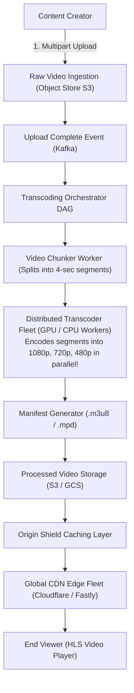
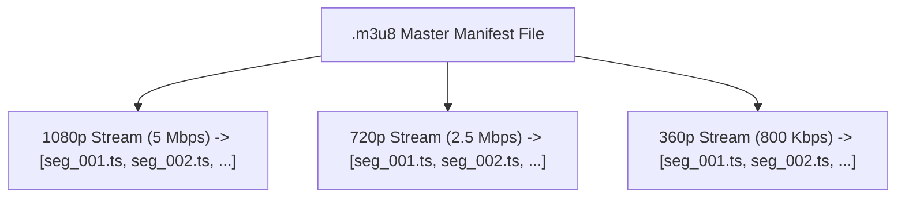

# HLD Case Study 5: Planetary Video Streaming (YouTube / Netflix)

> **Key Focus Areas:** Video transcoding pipelines, chunking DAGs, Adaptive Bitrate Streaming (HLS/DASH), and geo-distributed CDN edge distribution.

---

## 1. Problem Statement & Functional Requirements

Design a global video streaming platform capable of ingesting raw uploads and streaming ultra-low latency video to billions of concurrent viewers across variable mobile networks.

### Requirements:
1. Fast video uploads supporting large files ($> 10 \text{ GB}$).
2. Automated transcoding into multiple resolutions ($360p, 720p, 1080p, 4K$) and codecs (H.264, VP9, AV1).
3. **Adaptive Bitrate Streaming (ABS):** Dynamic quality adjustment based on client's instantaneous network bandwidth.
4. Fast global video playback with sub-second buffer times.

---

## 2. High-Level Architecture Diagram

---

## 3. Deep Dive: Adaptive Bitrate Streaming (HLS / MPEG-DASH)

Instead of streaming one giant $2\text{ GB}$ MP4 file, modern streaming engines slice video into **short segments (2 to 6 seconds each)**:

### The Client Feedback Loop:
1. The video player continuously monitors network download speed of recent chunks.
2. If network throughput drops (e.g. user enters an elevator), the player automatically requests the next 4-second chunk from the **480p track** instead of 1080p.
3. When network conditions recover, it seamlessly switches back up to **1080p**, completely preventing buffering pauses!
