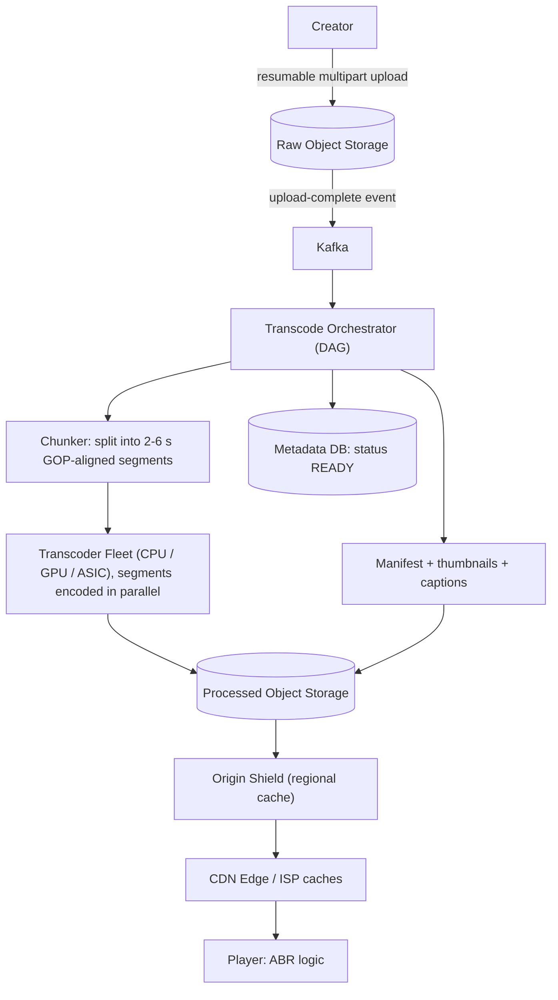

# HLD Case Study 5: Planetary Video Streaming (YouTube / Netflix)

> **Key Focus Areas:** Upload and transcoding pipelines, chunking DAGs, Adaptive Bitrate Streaming (HLS/DASH), CDN and origin shielding, storage and egress cost.

---

## 1. Requirements and Scope

**Functional:** upload large videos, process into multiple resolutions and codecs, stream with adaptive quality, search/metadata, view counts, resumable playback.
**Non-functional:** start playback in under 2 seconds p95; no rebuffering on normal networks; uploads are durable and resumable; processed video available within minutes for typical files; very high read-to-write ratio.
**Out of scope:** recommendations, live streaming (mention differences), DRM details, ads.

## 2. Estimates

Assume 2B MAU, 800M daily viewers, average 40 minutes watched/day, 5 Mbps average delivered bitrate; 500 hours of video uploaded per minute (YouTube-like).

```python
viewers, watch_min, avg_mbps = 800e6, 40, 5
egress_pb_per_day = viewers * watch_min * 60 * avg_mbps / 8 / 1e9   # PB/day (MB/s * s / 1e9)
peak_concurrent = viewers * 0.15                                     # 15% watching at once
peak_egress_tbps = peak_concurrent * avg_mbps / 1e6                  # Tbps
upload_hours_min = 500
raw_gb_per_hour = 2.0                                                # average source file, GB/hour
ingest_tb_per_day = upload_hours_min * 60 * 24 * raw_gb_per_hour / 1000
renditions_multiplier = 3.0                                          # all ladder rungs + codecs vs source
stored_pb_per_year = ingest_tb_per_day * renditions_multiplier * 365 / 1000
print(round(egress_pb_per_day), round(peak_egress_tbps), round(ingest_tb_per_day), round(stored_pb_per_year))
assert round(peak_egress_tbps) == 600
```

Takeaways: delivery is **hundreds of Tbps at peak**, so the architecture is a CDN problem, not an application-server problem; ingest is about 1.4 PB/day of raw video, and transcoding CPU/GPU cost dominates the write path.

## 3. API Design

* `POST /uploads` returns a resumable upload session (chunked, e.g. 8 MB parts); `PUT` parts to object storage via presigned URLs; `POST /uploads/{id}/complete`.
* `GET /videos/{id}` returns metadata and the **manifest URL** (`.m3u8` for HLS or `.mpd` for DASH).
* `GET /videos/{id}/segments/...` is served by the CDN, not the API.
* `POST /videos/{id}/view` (batched, eventually consistent counters).

## 4. Data Model

* **videos** (metadata DB, sharded by `video_id`): owner, title, status `UPLOADING|PROCESSING|READY|FAILED`, duration, renditions list.
* **object storage layout**: `raw/{video_id}/source`, `proc/{video_id}/{rendition}/seg_00001.m4s`, `manifest.m3u8`.
* **view counts**: counters in Redis/streaming aggregation (Kafka to Flink) flushed to a store; counts are approximate in real time.

## 5. Architecture



## 6. Deep Dive: Transcoding and Adaptive Bitrate

**Chunked parallel transcoding.** A 2-hour movie encoded sequentially takes hours. Instead, split at keyframe (GOP) boundaries into segments, encode all segments of all renditions in parallel across a fleet, then assemble manifests. A DAG orchestrator tracks per-segment tasks with retries; a failed segment is re-encoded alone.

**Bitrate ladder.** Example rungs: 240p at 0.4 Mbps, 360p at 0.8, 480p at 1.5, 720p at 3, 1080p at 5.5, 4K at 16. Modern services use **per-title encoding**: simple animation needs fewer bits than a sports match at the same resolution, so the ladder is tuned per video to save bandwidth at equal quality. Codecs: H.264 (universal), VP9/AV1 (30 to 50% fewer bits, costlier to encode, encode only popular videos in AV1).

**Adaptive bitrate (ABR).** The player downloads the manifest, picks a rendition based on measured throughput and buffer level, and re-evaluates before **each segment**. If throughput drops it steps down; when the buffer is healthy it steps up. Segment length is a trade-off: short segments (2 s) adapt faster but add request overhead; long (6 s) are efficient but slow to react.

**CDN and origin shield.** Edge caches serve the hot head; misses go to a regional **origin shield** which collapses duplicate misses before they reach object storage. Because video is immutable and segments are static files, cache hit ratios above 95% are achievable. Long-tail videos (rarely watched) are served from shield/origin and **not pre-encoded in every codec** (encode lazily on demand to save storage).

## 7. Scaling and Bottlenecks

* **Egress bandwidth:** peering and ISP-embedded caches (Netflix Open Connect style) move bytes close to users and cut transit cost.
* **Transcoding cost:** priority queues (new popular channels first), spot/preemptible compute for non-urgent work, hardware encoders for high-volume codecs.
* **Viral video:** pre-warm CDN for videos with fast-growing views; request coalescing at the shield.
* **Storage:** hot/warm/cold tiers; delete unused renditions after a period; deduplicate re-uploads by content hash.
* **View counting:** do not write per view; buffer in stream processing, dedupe by (user, video, window).

## 8. Failure Modes and Mitigations

| Failure | Mitigation |
|---|---|
| Upload interrupted | resumable parts with checksums; client resumes from last part |
| Transcoder crash | per-segment retries; DAG state persisted; idempotent output paths |
| Corrupt source | validation step, mark `FAILED` with reason |
| CDN POP outage | DNS/Anycast steers to next POP; player retries another CDN |
| Origin overload on a cold cache | origin shield + request coalescing + rate limits |
| Partial manifest (some renditions missing) | publish manifest only after the minimum ladder is complete; add higher rungs later |

## 9. Trade-offs

* **Pre-transcode all vs on-demand:** pre-transcoding costs storage and compute for videos nobody watches; on-demand adds first-view latency. Mixed: pre-encode a base ladder, add expensive codecs after popularity crosses a threshold.
* **HLS vs DASH:** HLS has universal Apple support; DASH is codec-flexible. CMAF fragments let both share the same media files.
* **Segment size:** latency vs overhead, as above.
* **Client-side ABR vs server-side:** client ABR scales for free; server control gives better fairness but adds state.

## 10. Interview Timeline and Follow-ups

Spend most time on the upload to transcode to CDN pipeline and ABR; mention cost levers last. **Follow-ups:** How would live streaming differ? (low-latency ingest via RTMP/WebRTC, 1 to 2 s segments or chunked CMAF, no pre-encoding, shorter caches). How do you resume playback across devices? (store last position per user in a KV store, updated every N seconds). How do you handle copyrighted content? (fingerprinting at ingest). How do you reduce start-up delay? (fetch a low first rung, prefetch next segments, connection reuse/HTTP/3).
