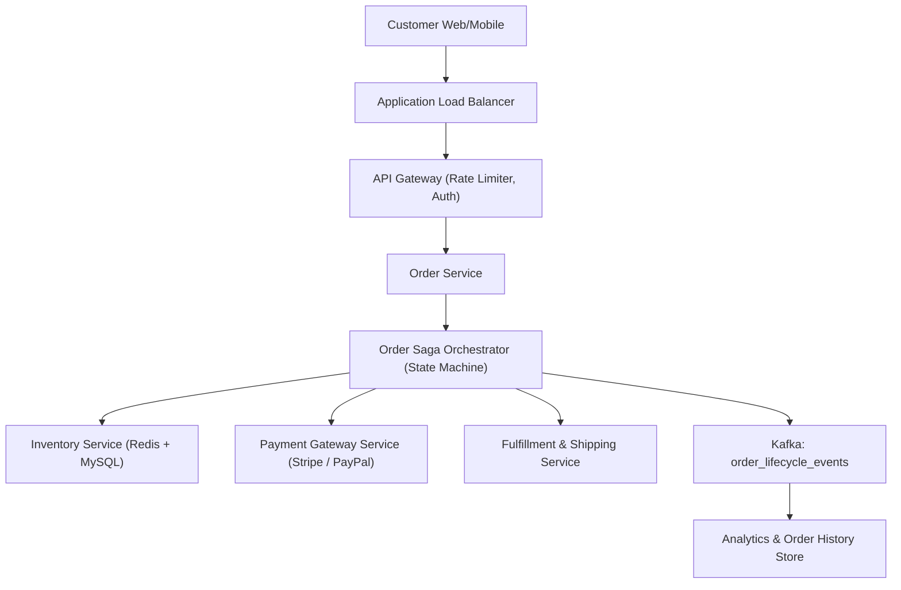
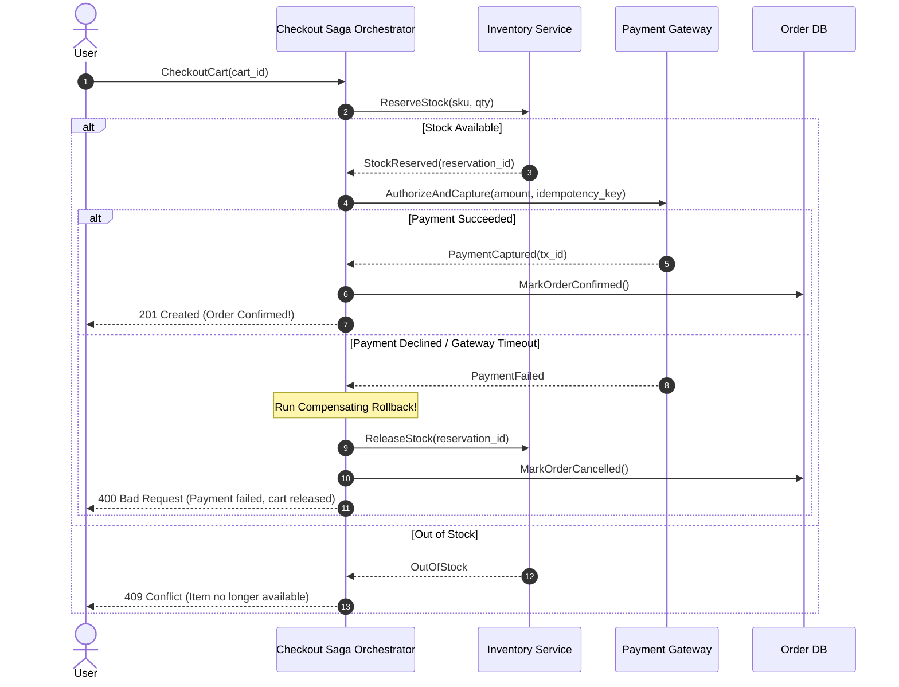

# HLD Case Study 6: Distributed E-Commerce Platform (Amazon / Shopify)

> **Key Focus Areas:** Distributed transactions, Saga Orchestration, high-concurrency inventory reservation, idempotency, and payment reconciliation.

---

## 1. Problem Statement & Functional Requirements

Design the checkout and order fulfillment pipeline for an e-commerce platform processing millions of flash-sale purchases per minute.

### Requirements:
1. Product search and browsing with real-time stock levels.
2. High-speed cart checkout with temporary inventory reservation.
3. Multi-stage distributed transaction: Inventory $\rightarrow$ Payment $\rightarrow$ Shipping.
4. Guaranteed zero overselling and automated order rollback on failure.

---

## 2. High-Level Architecture Diagram



---

## 3. High-Concurrency Flash Sale Inventory Reservation

During a flash sale (e.g. 5,000 gaming consoles sold to 200,000 buyers in 10 seconds), traditional SQL transactions (`SELECT FOR UPDATE`) cause severe database lock contention and database timeouts.

### The In-Memory Atomic Lua Script Solution (Redis)
All flash sale inventory is preloaded into a **Redis Cluster**. Stock reservation is executed in **$O(1)$ microseconds** via an atomic Redis Lua script:

```lua
-- Atomic Lua Script executed on Redis cluster:
local sku = KEYS[1]
local quantity = tonumber(ARGV[1])
local current_stock = tonumber(redis.call('GET', sku) or "0")

if current_stock >= quantity then
    redis.call('DECRBY', sku, quantity)
    return 1 -- Success: Reserved!
else
    return 0 -- Out of stock!
end
```
*Because Redis executes Lua scripts as a single atomic operation without interleaving, race conditions and overselling are physically impossible, and throughput exceeds **100,000+ operations/second**!*

---

## 4. The Complete Checkout Saga Orchestration


