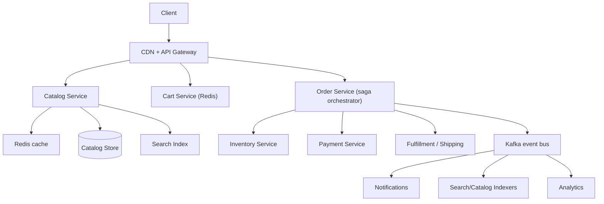

# HLD Case Study 6: E-Commerce Platform (Amazon-style)

> **Key Focus Areas:** Catalog and search, cart and checkout, inventory reservation, order saga across services, idempotent payments, and peak-event (Black Friday) scaling.

---

## 1. Requirements and Scope

**Functional:** browse and search products, product detail pages, cart, checkout with payment, order tracking, inventory management, seller listings.
**Non-functional:** catalog reads very fast and highly available (eventual consistency is fine); **checkout must be correct** (no oversell, no double charge); handle 10x spikes on sale days; 99.99% availability for browse, strong guarantees for orders.
**Out of scope:** recommendations, returns logistics, seller payouts.

## 2. Estimates

Assume 300M MAU, 50M DAU, 20 page views per session, conversion 3%, 1.5M orders/day, Black Friday peak 10x.

```python
dau, pv_per_session, conversion = 50e6, 20, 0.03
page_views = dau * pv_per_session                    # 1e9/day
avg_read_qps = page_views / 86400                    # ~11,574 req/s
peak_read_qps = avg_read_qps * 10                    # ~115,740 req/s on sale days
orders_day = dau * conversion                        # 1.5M
avg_order_qps = orders_day / 86400                   # ~17/s
peak_order_qps = avg_order_qps * 10 * 5              # 10x event, 5x within-hour burst => ~870/s
catalog_items, bytes_item = 500e6, 5_000
catalog_gb = catalog_items * bytes_item / 1e9        # 2,500 GB metadata
print(round(avg_read_qps), round(peak_read_qps), orders_day, round(peak_order_qps), catalog_gb)
assert orders_day == 1.5e6 and round(avg_read_qps) == 11574
```

Takeaways: reads dwarf orders (about 670:1), so the catalog is cached and replicated aggressively; the order path is low volume but needs transactions and sagas.

## 3. API Design

* `GET /products/{id}`, `GET /search?q=&filters=&cursor=`
* `PUT /cart/items` `{sku, qty}`, `GET /cart`
* `POST /checkout` `{cart_id, address_id, payment_method, idempotency_key}` returns `{order_id, status}`
* `GET /orders/{id}` (status stream)

## 4. Data Model and Service Boundaries

| Service | Store | Notes |
|---|---|---|
| Catalog | document store + search index (Elasticsearch/OpenSearch) | read-heavy, denormalised, cached in CDN/Redis |
| Cart | Redis or DynamoDB keyed by `user_id` | expires, easy to lose-and-rebuild |
| Inventory | relational (partitioned by `sku`) | strong consistency, `available`, `reserved` |
| Order | relational, sharded by `user_id` | state machine `PENDING, PAID, SHIPPED, DELIVERED, CANCELLED` |
| Payment | relational + external PSP | idempotent, append-only ledger |

## 5. Architecture



## 6. Deep Dive: Checkout as a Saga

A single ACID transaction cannot span inventory, payment and order services (separate databases). Use an **orchestrated saga** with compensations:

1. **Create order** `PENDING` (idempotent on `idempotency_key`).
2. **Reserve inventory:** `UPDATE inventory SET available = available - :q, reserved = reserved + :q WHERE sku=:s AND available >= :q`; rowcount 0 means out of stock, abort.
3. **Charge payment** with the same idempotency key passed to the PSP.
4. On success: mark order `PAID`, convert reservation to committed, emit `OrderPaid` event for fulfillment.
5. On payment failure: **compensate** by releasing the reservation and marking the order `CANCELLED`.

Each step is retried with backoff; the orchestrator persists saga state so it can resume after a crash. The transactional outbox pattern (write the event and state change in one local transaction, publish asynchronously) prevents "state changed but event lost".

**Overselling control.** The conditional decrement above is the guard. For flash-sale SKUs, shard the counter (for example 16 sub-counters each holding a slice of stock) so a hot SKU is not one hot row; reserve from a random sub-counter and fall back to others.

**Catalog freshness.** The source of truth is the seller/catalog DB; changes publish events that update the search index and invalidate caches. Price and stock shown on a product page can be a few seconds stale; the **checkout re-validates** price and availability.

## 7. Scaling and Bottlenecks

* **Reads:** CDN for images and static content; Redis for hot product JSON; read replicas; search index for listing pages.
* **Hot SKUs (flash deals):** pre-warm caches, sharded stock counters, queue the "buy" requests (waiting room) to smooth load.
* **Search:** index sharded by product id, replicas for QPS, query cache, typo tolerance and facets precomputed.
* **Order DB:** shard by `user_id`; orders are rarely joined across users.
* **Black Friday:** scale out in advance, load test at 2x expected peak (course 03 HLD chapter 09), degrade gracefully (disable recommendations first).

## 8. Failure Modes and Mitigations

| Failure | Mitigation |
|---|---|
| Payment timeout (unknown outcome) | query PSP by idempotency key before retry; reconcile nightly |
| Inventory service down | fail checkout fast with a clear message; browse still works |
| Duplicate checkout click | idempotency key returns the first result |
| Reservation leaks (user abandons) | reservation TTL plus a sweeper that releases expired holds |
| Event lost | outbox pattern guarantees publish |
| Cache stampede on a hot product | request coalescing, jittered TTLs |

## 9. Trade-offs

* **Orchestration vs choreography saga:** orchestration is easier to reason about and monitor; choreography reduces central coupling but is harder to trace.
* **Reserve at add-to-cart vs at checkout:** reserving early hurts availability (carts abandon); reserve at checkout start with a short TTL.
* **Strong consistency vs availability:** CP for inventory and orders, AP for catalog and carts.
* **Monolith vs microservices:** microservices let teams scale independently but introduce sagas and distributed debugging; a modular monolith is a valid starting point.

## 10. Interview Timeline and Follow-ups

Cover catalog read path (5 min), cart (3), checkout saga (12), scaling and failure (10). **Follow-ups:** How do you prevent a double charge? (idempotency key end-to-end, ledger uniqueness). How do you do global inventory across warehouses? (inventory per fulfilment center, allocate nearest). How do you handle price changes during checkout? (price snapshot on cart add with expiry, re-validate at pay). How would you implement search ranking? (BM25 plus behavioural signals, course 10).
