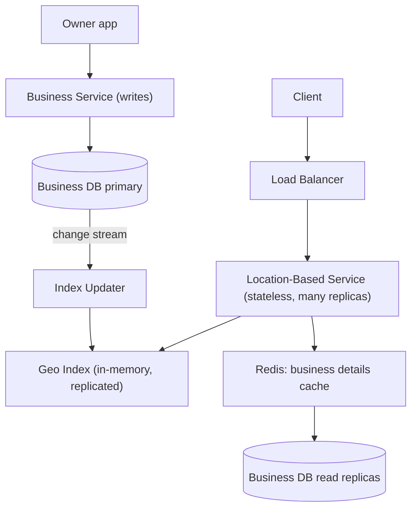

# HLD Case Study 7: Proximity Service (Yelp / Nearby Places)

> **Key Focus Areas:** Geospatial indexing (geohash, quadtree, S2/H3), radius search with ranking, read-heavy scaling, and eventual-consistency updates.

---

## 1. Requirements and Scope

**Functional:** search businesses within a radius of a location (with category and rating filters), view details, owners add/update/delete businesses, reviews.
**Non-functional:** search p99 under 200 ms; read-heavy (100:1 vs writes); business updates may take minutes to appear (eventual consistency is acceptable); high availability; global scale.
**Out of scope:** reviews moderation, maps rendering, turn-by-turn routing.

## 2. Estimates

Assume 200M businesses, 100M DAU, 5 searches per user per day, a business record of 1 KB.

```python
businesses, dau, searches = 200e6, 100e6, 5
qps = dau * searches / 86400                          # ~5,787 searches/s
peak_qps = qps * 5                                    # ~28,935/s
storage_gb = businesses * 1_000 / 1e9                 # 200 GB of business data (fits in memory across a few nodes)
geohash_precision = 6                                 # ~1.2 km x 0.6 km cells
index_entries = businesses                            # one (geohash, business_id) row each
index_gb = index_entries * (6 + 8) / 1e9              # 6 B geohash + 8 B id = 2.8 GB
print(round(qps), round(peak_qps), storage_gb, index_gb)
assert round(qps) == 5787 and storage_gb == 200.0 and index_gb == 2.8
```

Takeaways: the **whole spatial index (about 2.8 GB) fits in RAM**, so sharding is for QPS and availability, not capacity. This is a read-scaling problem solved with replicas and caching.

## 3. API Design

* `GET /search/nearby?lat=&lng=&radius_km=&category=&min_rating=&cursor=` returns ranked business summaries (id, name, location, rating, distance).
* `GET /businesses/{id}`; `POST/PUT/DELETE /businesses` (owner flow, authenticated).

## 4. Data Model

* **business** (relational or document DB; sharded by `business_id`): id, name, address, `lat`, `lng`, category, rating, hours.
* **geo index**: `geohash -> [business_id]` (in memory, e.g. Redis sets keyed by geohash prefix or a purpose-built quadtree), rebuilt or updated asynchronously from the DB.
* **read replicas** of both, in each region.

## 5. Architecture



## 6. Deep Dive: Geospatial Indexing

**Why not `WHERE lat BETWEEN ... AND lng BETWEEN ...`?** Two independent range predicates on separate indexes cannot be satisfied efficiently, and results form a square, not a circle. We need a structure that maps 2D location to 1D keys that preserve locality.

**Geohash.** Interleave bits of latitude and longitude into a base-32 string; a longer prefix means a smaller cell and **nearby points usually share a prefix**. Precision 5 is about 4.9 km x 4.9 km, 6 about 1.2 km x 0.6 km, 7 about 153 m x 153 m. To search a radius: choose the precision whose cell size is close to the radius, compute the user's cell **and its 8 neighbours** (because points near a cell edge have neighbours with different prefixes), fetch candidates from those 9 cells, then filter by exact great-circle (haversine) distance and sort. Weakness: cells distort near the poles and the prefix-locality is imperfect at some boundaries (hence the neighbour lookup).

**Quadtree.** Recursively split a region into 4 quadrants until each leaf holds at most about 100 businesses. Dense cities get deep trees, sparse areas shallow. Search: find the leaf containing the user, expand to neighbouring leaves until enough results or radius covered. Adapts to density (geohash does not), costs more to update and keep in memory (a small tree of leaf nodes holds only ids).

**S2 / H3.** Google's S2 (square cells on a sphere, Hilbert curve ordering) and Uber's H3 (hexagons, uniform neighbour distance) are production-grade cell systems with region-covering functions. Use them when accuracy near poles/boundaries and uniform neighbour logic matter.

**Search flow.** (1) Convert radius to cell level, (2) compute covering cells, (3) read candidate ids from the in-memory index, (4) load details from cache/DB, (5) filter by exact distance, category, rating, open hours, (6) rank (distance, rating, popularity) and paginate. If too few results, widen the radius and repeat (adaptive search).

## 7. Scaling and Bottlenecks

* **Reads dominate:** replicate the index to every service instance (2.8 GB) or to a regional cache tier; no need to shard for capacity, shard/replicate for QPS and regional latency.
* **Hotspots:** dense areas (Manhattan) have many businesses per cell; cap results and use a finer precision there, or the quadtree.
* **Updates:** business changes are rare; apply them to the index asynchronously from the change stream (delay of minutes is acceptable). Rebuild the full index nightly as a consistency check.
* **Caching:** cache by `(cell, filters)` for popular queries and business details by id.
* **Global:** deploy per region with region-local replicas, route by user location.

## 8. Failure Modes and Mitigations

| Failure | Mitigation |
|---|---|
| Index node lost | stateless service, any replica can answer; rebuild from DB snapshot in minutes |
| Stale index (closed business shown) | change-stream lag alert; details call re-checks `status`; nightly rebuild |
| DB primary down | failover to replica; reads unaffected (served from replicas and cache) |
| Cache stampede on a popular cell | request coalescing, jittered TTL |
| Bad coordinates | validate ranges, reject (0,0) "null island" |

## 9. Trade-offs

* **Geohash vs quadtree vs S2/H3:** geohash is trivial and DB-friendly (prefix queries); quadtree adapts to density; S2/H3 give the best geometry at the cost of a library dependency.
* **Index in DB vs in memory:** DB-resident (`LIKE 'dr5ru%'`) is simpler and consistent; in-memory is faster and easily replicated at this scale.
* **Strong vs eventual consistency:** eventual for search, strong for the owner's own writes (read-your-writes on the owner view).
* **Radius vs bounding box:** the box is cheap, the circle needs a post-filter; always post-filter by true distance.

## 10. Interview Timeline and Follow-ups

Go quickly through estimates (the index fits in RAM is the punchline), spend 15 minutes on indexing choices, 5 on updates and replication. **Follow-ups:** How do you handle the antimeridian and poles? (S2/H3 or special-case wrap-around). How do you add "open now"? (precomputed hours bitmap, filter after candidate fetch). How would you do moving objects (drivers)? (that is the Uber case, in-memory index with frequent updates, next chapter). How would you rank by personalisation? (re-rank top 100 with a model after the geo filter).
