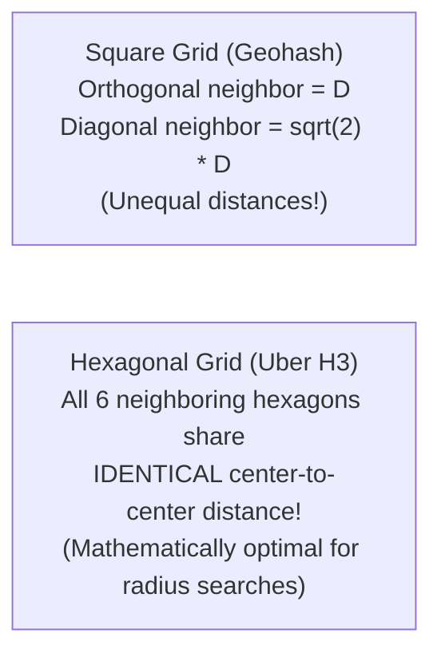
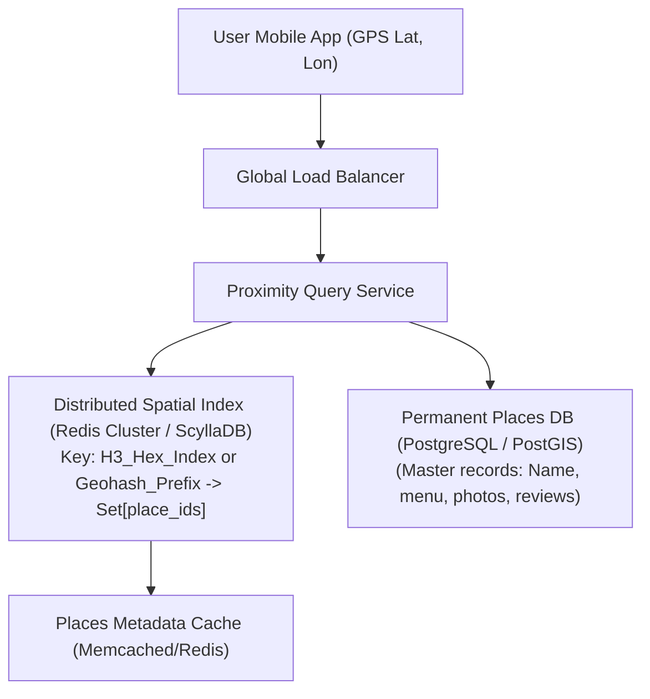
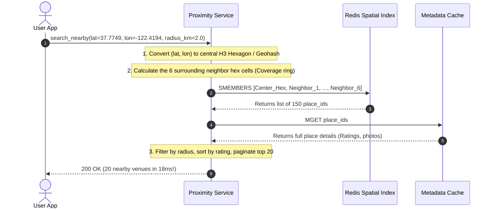

# HLD Case Study 7: Proximity Service (Yelp / Google Maps Places)

> **Key Focus Areas:** Geospatial indexing algorithms, Geohash vs Google S2 vs Uber H3, Quadtrees, and low-latency nearest-neighbor search.

---

## 1. Problem Statement & Functional Requirements

Design a global proximity service capable of answering spatial queries like *"Find the top-rated 20 restaurants within 5 km of my current GPS location"* in under 50 milliseconds.

### Requirements:
1. Fast nearest-neighbor query by radius ($R \text{ km}$) and category.
2. Business owners can add or update location metadata and operating hours.
3. Scale to 500 million active users and 100 million places worldwide.
4. Support rapid geographic panning and zoom levels on mobile maps.

---

## 2. Geospatial Indexing: Why Standard Databases Fail

A standard SQL query attempting to find locations within a radius:
```sql
SELECT * FROM places 
WHERE latitude BETWEEN 37.70 AND 37.80 
  AND longitude BETWEEN -122.50 AND -122.40;
```
Even with a 2D composite index `(latitude, longitude)`, B-Trees can only effectively filter on **one dimension at a time**. The database scans millions of candidate rows along the latitude slice and filters longitude manually in memory, causing severe latency degradation.

---

## 3. Spatial Indexing Algorithms Compared

| Algorithm | Representation | Neighbor Distance | Edge Artifacts | Industry Adoption |
| :--- | :--- | :--- | :--- | :--- |
| **Geohash** | Rectangular base32 grid strings | Unequal (orthogonal vs diagonal neighbors) | Boundary discontinuity issues | Redis GEO, DynamoDB, MongoDB |
| **QuadTree** | Hierarchical 4-way tree in memory | Variable | Memory fragmentation across node splits | In-memory spatial caches |
| **Google S2** | Hilbert curve on projected cube | Uniform Hilbert distance | Minimal distortion at poles | Google Maps, Foursquare |
| **Uber H3** | **Hexagonal Hierarchical Grid** | **Identical (All 6 neighbors are strictly equidistant!)** | Zero diagonal distortion | Uber, Lyft, DoorDash |



---

## 4. High-Level Architecture Diagram



---

## 5. The Geohash / H3 Query Walkthrough


