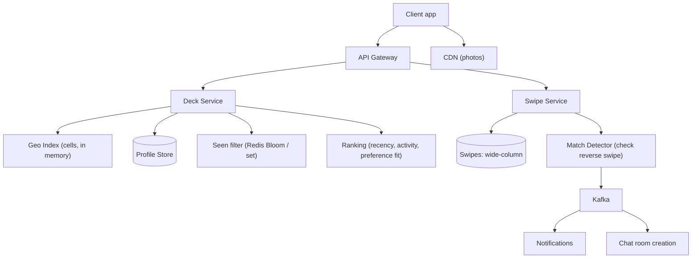

# HLD Case Study 8: Tinder (Recommendation Deck and Matching)

> **Key Focus Areas:** Geo-and-preference candidate generation, deck prefetching, swipe write volume, mutual-match detection, and avoiding repeated profiles.

---

## 1. Requirements and Scope

**Functional:** profiles with photos, a swipe deck of nearby candidates matching preferences (age, gender, distance), swipe left/right, a **match** when both swipe right, then chat (see the messaging case study).
**Non-functional:** next profile appears instantly (under 100 ms); a user never sees the same profile twice; match notification within seconds; massive swipe write volume; privacy of location (fuzzed distance).
**Out of scope:** payments, moderation ML, the chat system.

## 2. Estimates

Assume 75M MAU, 25M DAU, 100 swipes per user per day, 1.5 photos shown per card at 150 KB.

```python
dau, swipes_per_user = 25e6, 100
swipes_per_day = dau * swipes_per_user                # 2.5e9
swipe_qps = swipes_per_day / 86400                    # ~28,935 writes/s
peak_swipe_qps = swipe_qps * 3                        # ~86,800/s
swipe_record_bytes = 24                               # user, target, direction, time
swipe_gb_per_day = swipes_per_day * swipe_record_bytes / 1e9   # 60 GB/day
swipe_tb_per_year = swipe_gb_per_day * 365 / 1000     # ~22 TB/year
photo_egress_gbps = swipe_qps * 1.5 * 0.15 * 8 / 1000 # ~52 Gbps behind CDN
print(round(swipe_qps), round(peak_swipe_qps), swipe_gb_per_day, round(swipe_tb_per_year), round(photo_egress_gbps))
assert round(swipe_qps) == 28935 and swipe_gb_per_day == 60.0
```

Takeaways: swipes are a **write-heavy, append-only, high-volume** stream (about 29K/s average, 87K/s peak) with tiny records; photos are served by a CDN; the hard parts are the deck algorithm and the "already seen" filter.

## 3. API Design

* `GET /deck?limit=20` returns candidate profiles (batched; the client prefetches the next batch when 5 remain).
* `POST /swipes` `{target_id, direction, idempotency_key}` returns `{matched: bool, match_id?}`.
* `GET /matches`, `PUT /profile`, `PUT /location`.

## 4. Data Model

* **profiles** (sharded by `user_id`): attributes, preferences, photos (object keys), `geo_cell`, `last_active`.
* **swipes** (wide-column store, partition key `swiper_id`, clustering `target_id`): the authoritative "who I have swiped on". Used for "already seen" and mutual-match checks.
* **likes_inbox** (partition `target_id`): list of users who liked me, for the reciprocal check and a "Likes you" feature.
* **geo index**: users in an in-memory cell index (`geo_cell -> user_ids`) updated on location/active changes.
* **seen filter**: per-user Bloom filter (or a compact bitmap/ID set) of seen profiles, cached in Redis.

## 5. Architecture



## 6. Deep Dive: Deck Generation and Matching

**Candidate generation.** (1) Find nearby users via the cell index (reuse the geohash/S2 idea from the proximity case) within the user's radius; (2) filter by mutual preferences (their age/gender preferences must include me), (3) remove users already swiped (seen filter), blocked, or inactive; (4) rank by an engagement-aware score (recent activity, profile completeness, how likely they are to like me); (5) store the ordered batch.

**Precompute and prefetch.** Generating a deck on every request is expensive. A background job builds a deck of about 200 candidates per active user and caches it (Redis list). `GET /deck` pops 20 and triggers a refill when low. Clients also prefetch images for the next 3 cards so swiping feels instant.

**Never repeat a profile.** The swipes table is authoritative; the Redis Bloom filter makes the check O(1) per candidate. A Bloom filter may rarely say "seen" for an unseen profile (a harmless false positive: it just gets skipped) but never the reverse. Persist and periodically rebuild it from the swipes table.

**Mutual match detection.** On a right-swipe from A to B: write `swipes[A,B]=like`; then read `swipes[B,A]`. If it is a like, create the match (idempotent on the pair key `min(A,B):max(A,B)`) and emit events. To avoid a race where A and B swipe simultaneously and both reads miss the other's write, **write first, then read**: at least one of the two reads is guaranteed to see the other's write, and the unique match key de-duplicates if both do.

**Pre-swipe shortcut ("likes you").** Because `likes_inbox[B]` holds users who liked B, B's deck can put those candidates first, so a right-swipe immediately completes a match.

## 7. Scaling and Bottlenecks

* **Swipe writes:** partition by `swiper_id`; batch writes through Kafka for the analytics path but keep the match check synchronous for fast feedback.
* **Hot cities:** a dense city has many candidates per cell: cap candidate sets, sample by freshness. Sparse regions: widen radius adaptively.
* **Location updates:** frequent movers cause index churn; update the cell index only when the user moves to a new cell or every few minutes.
* **Cold start:** new users get a boosted exposure so they receive early swipes (explicit product rule).
* **Photo delivery:** multiple resized renditions on a CDN; progressive/blur placeholders.

## 8. Failure Modes and Mitigations

| Failure | Mitigation |
|---|---|
| Deck cache lost | rebuild on demand from the index; degrade to a smaller batch |
| Duplicate swipe (retry) | idempotent write keyed by `(swiper, target)` |
| Match detector down | swipes still stored; replay missed reciprocal checks from the log |
| Stale location | TTL on last-known location, show "recently active" cues |
| Abuse (bots, spam swiping) | per-user swipe rate limits, device attestation, shadow throttling |

## 9. Trade-offs

* **Precomputed deck vs real-time:** precompute is fast but slightly stale (a user who just went inactive may appear); real-time is fresh but slow. Prefetch plus an activity re-check at serve time.
* **Bloom filter vs exact set:** Bloom saves memory (about 1.2 bytes per item at 1% FP) but has false positives and no deletes; an exact set is accurate but large for heavy swipers.
* **Strong vs eventual consistency:** a match should not be missed, but the deck can lag.
* **Privacy:** return distance rounded and only after the match; never expose raw coordinates.

## 10. Interview Timeline and Follow-ups

Spend time on deck generation, the seen filter and the match race condition. **Follow-ups:** How do you avoid showing profiles that already liked someone else exclusively? (not needed; ranking only). How do you rank fairly so popular users do not absorb all likes? (cap daily exposure, diversity re-ranking). How do you detect fake profiles? (graph and behavioural signals, course 12 style evaluation). How do you scale reciprocal likes to billions of rows? (partition by user, TTL old swipes after N months, keep only likes in the inbox).
