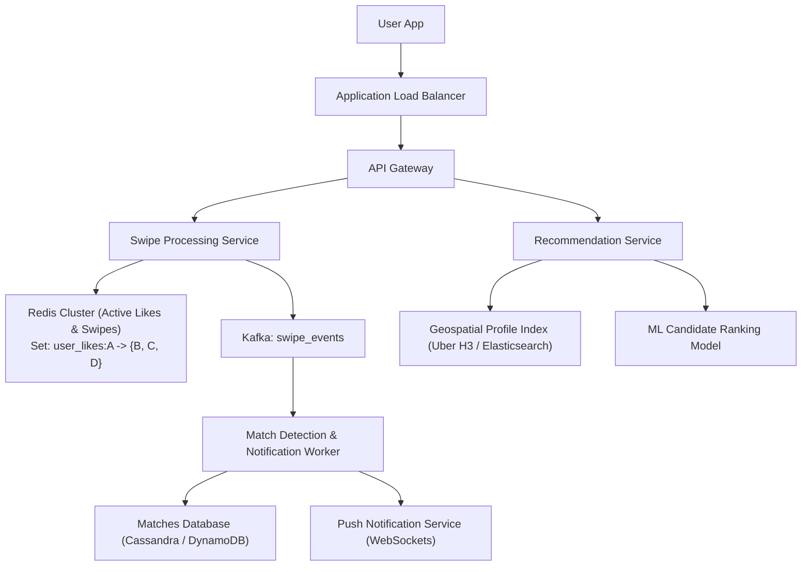
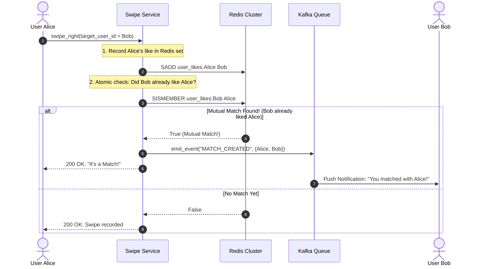
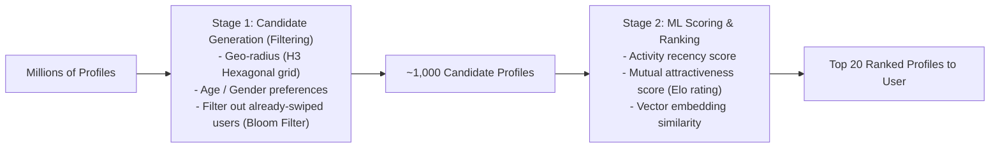

# HLD Case Study 8: Real-Time Matching & Recommendation (Tinder)

> **Key Focus Areas:** Bidirectional mutual matching, real-time swipe ingestion, two-stage recommendation ranking, geospatial bucketing, and match notifications.

---

## 1. Problem Statement & Functional Requirements

Design the core discovery and mutual matching engine for a mobile dating application.

### Requirements:
1. **Swipe Ingestion:** Users swipe Right (Like) or Left (Pass) at massive throughput ($> 50,000 \text{ swipes/second}$).
2. **Mutual Match Detection:** If both users swipe Right on each other, trigger a real-time **Mutual Match** event immediately.
3. **Recommendation Feed:** Provide users with an endless stream of active, nearby profiles matching their preferences.

---

## 2. High-Level Architecture Diagram

---

## 3. Real-Time Mutual Match Detection Pipeline

How do we check if a swipe produces a mutual match in under 10 milliseconds without querying heavy relational databases?

---

## 4. The 2-Stage Recommendation Engine

Delivering a fresh deck of 20 profiles to a user involves two distinct stages:

