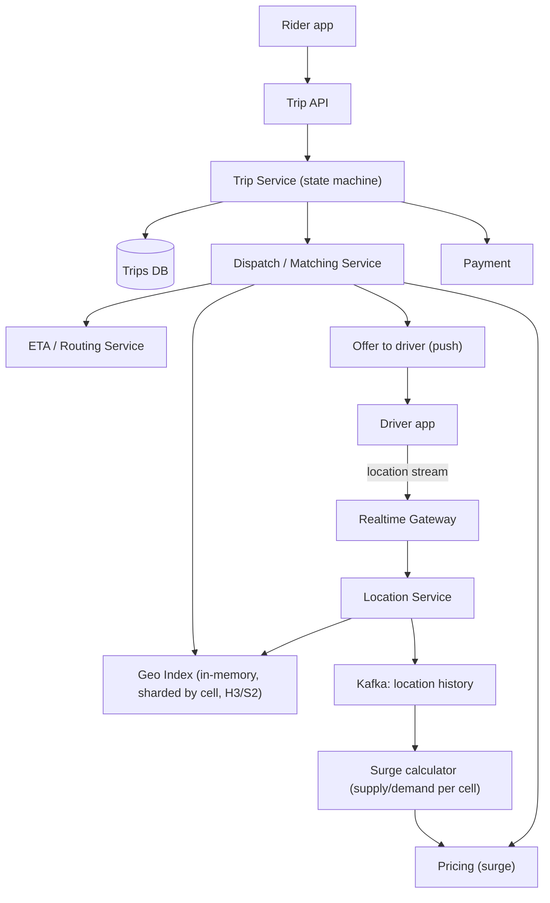

# HLD Case Study 9: Uber / Lyft (Ride Hailing and Dispatch)

> **Key Focus Areas:** Real-time driver location ingestion, geospatial matching, trip state machine, surge pricing, ETA, and consistent driver assignment.

---

## 1. Requirements and Scope

**Functional:** riders request a trip, nearby available drivers are matched, drivers accept, live tracking, fare calculation, payment, ratings.
**Non-functional:** match within a few seconds; location updates are high volume but **loss-tolerant**; **a driver is assigned to at most one trip** (strong consistency for assignment); trips survive service failures; low-latency ETA.
**Out of scope:** routing engine internals, fraud, driver onboarding.

## 2. Estimates

Assume 5M concurrent online drivers worldwide at peak, GPS update every 4 seconds, 20M trips/day, 100 bytes per update.

```python
drivers, interval_s, bytes_update = 5_000_000, 4, 100
loc_qps = drivers / interval_s                         # 1.25M updates/s
loc_mb_per_s = loc_qps * bytes_update / 1e6            # 125 MB/s ingest
loc_tb_per_day = loc_qps * bytes_update * 86400 / 1e12 # ~10.8 TB/day if all were persisted
trips_day = 20e6
trip_qps = trips_day / 86400                           # ~231 trips/s average
peak_trip_qps = trip_qps * 5                           # ~1,157/s
live_index_gb = drivers * 64 / 1e9                     # in-memory index: id, cell, lat/lng, status = 0.32 GB
print(loc_qps, loc_mb_per_s, round(loc_tb_per_day, 1), round(trip_qps), round(peak_trip_qps), live_index_gb)
assert loc_qps == 1_250_000 and round(trip_qps) == 231
```

Takeaways: the system is dominated by **location write throughput** (1.25M/s), but the data is ephemeral (only the latest position matters), so keep it **in memory**, not in a disk database; trips themselves are modest (hundreds per second).

## 3. API Design

* Driver: `POST /driver/location` (batched/streamed over WebSocket or MQTT), `POST /driver/status`, `POST /trips/{id}/accept`.
* Rider: `POST /trips` `{pickup, dropoff, product, idempotency_key}`, `GET /trips/{id}` (or stream), `DELETE /trips/{id}`.
* `GET /eta?from=&to=`; `GET /pricing/estimate`.

## 4. Data Model

* **live driver index** (in-memory, partitioned by geography cell): `cell -> {driver_id: (lat, lng, heading, status, ts)}`, TTL on stale drivers.
* **trips** (sharded relational DB by `trip_id`): rider, driver, state, pickup/dropoff, fare, timestamps; **trip state machine** `REQUESTED -> MATCHING -> DRIVER_ASSIGNED -> EN_ROUTE -> ARRIVED -> IN_PROGRESS -> COMPLETED | CANCELLED`.
* **location history** (append-only, Kafka to object storage/time-series) only for trip replay, safety, analytics.
* **driver assignment lock**: per-driver conditional state (`AVAILABLE -> OFFERED -> ON_TRIP`).

## 5. Architecture



## 6. Deep Dive: Matching and Assignment

**Finding candidates.** Map the pickup location to a cell (H3 resolution 8 to 9 is about 0.1 to 0.7 km^2), read drivers in that cell and its **k-ring neighbours**, discard unavailable ones, then compute **road-network ETA** for the top candidates (straight-line distance is only a pre-filter). Rank by ETA, rating, acceptance history. Expand the ring if there are too few drivers.

**Offering and acceptance.** Send the offer to the best driver; they have about 10 seconds. If declined or timed out, offer the next one. To guarantee one trip per driver, transition the driver `AVAILABLE -> OFFERED` with a compare-and-set (in the index owner or a store such as Redis with a Lua script); only the dispatcher that wins the CAS may send the offer. On accept, `OFFERED -> ON_TRIP` and write `DRIVER_ASSIGNED` to the trips DB. If the same driver is considered by two concurrent requests, the CAS lets exactly one proceed.

**Batching ("matching windows").** Instead of greedily matching each request on arrival, collect requests for about 2 seconds per area and solve a small assignment problem (minimise total pickup ETA, Hungarian/greedy hybrid). This reduces global wait time versus first-come matching.

**Surge pricing.** For each cell, compute `demand / supply` over a sliding window (requests vs available drivers). Map the ratio to a multiplier with smoothing and caps; apply per-cell and publish with the fare estimate. The fare is **locked at request time** so the price does not change while the rider confirms.

**Location pipeline.** Drivers stream updates; the gateway fans them to the owner of the driver's cell. Only the latest value is kept in memory; the stream is also written to Kafka for history. Because updates are frequent, losing a few is harmless.

## 7. Scaling and Bottlenecks

* **Shard by geography** (city or H3 parent cell) so a request touches one or a few shards; split hot cities into sub-cells.
* **Hot events** (a concert ending) create demand spikes in a few cells: pre-scale, use batching and surge to rebalance supply.
* **ETA computation** is expensive: cache road-segment travel times, precompute with contraction hierarchies, ETA service autoscaled.
* **Driver moving across shards:** hand off ownership when the cell changes; dual-write briefly.
* **Gateway connections:** millions of persistent sockets, the same scaling pattern as the messaging case.

## 8. Failure Modes and Mitigations

| Failure | Mitigation |
|---|---|
| Location shard lost | rebuild from drivers' next updates (4 s) since state is ephemeral |
| Dispatcher crash mid-match | trip state persisted; a new dispatcher resumes from `MATCHING` |
| Driver app offline after accepting | heartbeat timeout reassigns the trip and penalises |
| Duplicate trip request | idempotency key per rider request |
| Payment failure after trip | trip completes; payment retried and debt recorded (do not strand the rider) |
| Clock/GPS errors | smooth with map-matching and sanity checks (speed limits) |

## 9. Trade-offs

* **In-memory index vs database:** memory for write throughput and latency; persistence only for history. Cost: rebuild after failure.
* **Greedy vs batched matching:** greedy is lowest latency; batching improves global efficiency at the cost of a short delay.
* **Straight-line vs road ETA:** straight-line is cheap and wrong in cities; road ETA is accurate and expensive, so use it on a short list.
* **Consistency:** strong (CAS) for assignment; eventual for locations and surge.

## 10. Interview Timeline and Follow-ups

Lead with the location write rate and why it stays in memory, then the match and assignment race. **Follow-ups:** How do you handle pooled rides (UberPool)? (matching on route overlap with detour constraints, a harder assignment problem). How do you ensure fairness to drivers? (dispatch fairness policies, tracked acceptance). How do you test surge? (replay recorded location and request streams offline). How do you add scheduled rides? (a delayed job, see the task scheduler case, plus pre-reservation of supply).
