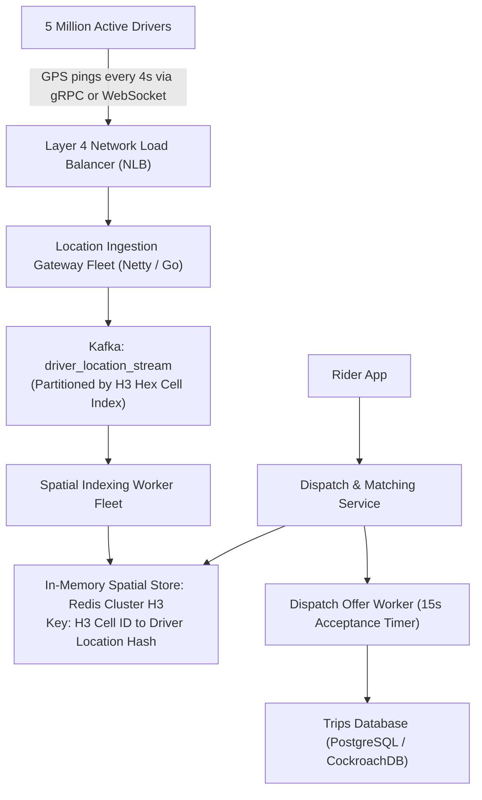
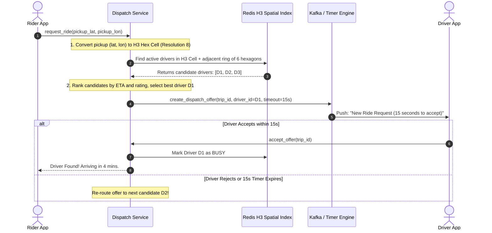

# HLD Case Study 9: Real-Time Ride Dispatch Platform (Uber / Lyft)

> **Key Focus Areas:** Real-time location tracking at massive ingestion volume (1M+ writes/sec), Uber H3 hexagonal spatial indexing, dispatch matching state machines, and dynamic surge pricing.

---

## 1. Problem Statement & Functional Requirements

Design the real-time location streaming and driver dispatch architecture for a global ride-hailing platform.

### Requirements:
1. **High-Frequency Location Tracking:** 5 Million active drivers streaming GPS coordinates every 4 seconds.
2. **Nearest Driver Dispatch:** Match riders with optimal nearby drivers within 5 seconds.
3. **Trip State Machine:** Manage the trip lifecycle from `Requested` $\rightarrow$ `Dispatched` $\rightarrow$ `Arrived` $\rightarrow$ `In-Trip` $\rightarrow$ `Completed`.
4. **Dynamic Surge Pricing:** Adjust fares based on regional supply/demand imbalances.

---

## 2. Ingestion Scale & Estimations

* **Active Drivers:** $5 \text{ Million}$ concurrent vehicles worldwide.
* **Ping Frequency:** 1 ping every 4 seconds.
* **Location Ingestion QPS:** $\frac{5,000,000}{4} = \mathbf{1,250,000 \text{ Writes/Second!}}$
* **Storage Consideration:** A relational database would crash immediately under $1.25 \text{M QPS}$ of writes. Location pings are **ephemeral**; we only need the latest driver position in RAM!

---

## 3. High-Level Architecture Diagram

---

## 4. The Dispatch & Matching Sequence

