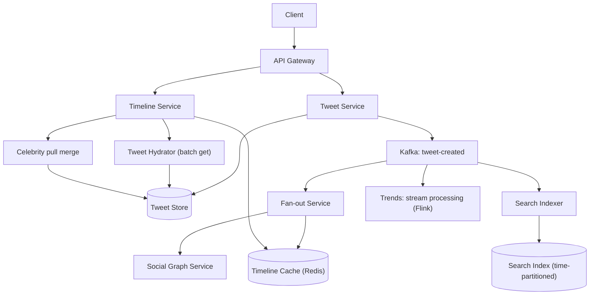

# HLD Case Study 10: Twitter / X (Timeline, Tweets and Trends)

> **Key Focus Areas:** Home timeline fan-out, the celebrity problem, search and trending topics, time-sortable IDs, counters and eventual consistency.

---

## 1. Requirements and Scope

**Functional:** post tweets (text up to 280 chars, media), follow users, home timeline, user timeline, like/retweet/reply, search, trending topics, notifications.
**Non-functional:** timeline loads in under 300 ms p99; a new tweet reaches followers within seconds (not necessarily instantly); extremely read-heavy; availability over consistency (a few seconds of staleness is fine); celebrity accounts with 100M+ followers must not break the system.
**Out of scope:** ads, DMs (messaging case), recommendation model internals.

## 2. Estimates

Assume 400M MAU, 200M DAU, 100M tweets/day, each user views the timeline 20 times/day, average follower count 200, tweet record 300 bytes.

```python
dau, tweets_day, views_per_user = 200e6, 100e6, 20
write_qps = tweets_day / 86400                        # ~1,157 tweets/s
peak_write_qps = write_qps * 3                        # ~3,472/s
timeline_reads_qps = dau * views_per_user / 86400     # ~46,296 reads/s
avg_followers = 200
fanout_writes_qps = write_qps * avg_followers         # ~231,000 cache inserts/s
tweet_storage_gb_day = tweets_day * 300 / 1e9         # 30 GB/day of text
tweet_storage_tb_year = tweet_storage_gb_day * 365 / 1000   # ~11 TB/year
timeline_cache_gb = dau * 800 * 8 / 1e9               # 800 tweet ids x 8 B for each active user = 1,280 GB
print(round(write_qps), round(timeline_reads_qps), round(fanout_writes_qps), tweet_storage_gb_day, round(tweet_storage_tb_year), timeline_cache_gb)
assert round(write_qps) == 1157 and tweet_storage_gb_day == 30.0 and timeline_cache_gb == 1280.0
```

Takeaways: reads exceed writes by about 40:1; a push model turns 1.2K tweets/s into about 231K cache writes/s (fine); the timeline cache (about 1.3 TB of ids across a Redis cluster) is affordable because it stores **ids, not tweet bodies**.

## 3. API Design

* `POST /tweets` `{text, media_ids[], reply_to?, idempotency_key}`
* `GET /timeline/home?cursor=&limit=` (ids hydrated into tweets); `GET /users/{id}/tweets`
* `POST /follow/{user_id}`, `POST /tweets/{id}/like`, `POST /tweets/{id}/retweet`
* `GET /search?q=`, `GET /trends?woeid=`

## 4. Data Model

* **tweets**: `tweet_id` (Snowflake: 41-bit timestamp + machine id + sequence, so ids sort by time without a central counter), `author_id`, `text`, `media`, `created_at`; sharded by `tweet_id`.
* **social graph**: `follows(follower_id, followee_id)` in both directions, sharded by user id (a graph or wide-column store).
* **home timeline cache**: Redis list/sorted set `timeline:{user_id}` of recent tweet ids.
* **counters** (likes, retweets): Redis `INCR`, flushed to the database in batches; displayed counts are approximate.
* **search index**: inverted index (Lucene/Earlybird style), time-partitioned so recent tweets are in a hot in-memory tier.

## 5. Architecture



## 6. Deep Dive: Timeline and the Celebrity Problem

**Fan-out on write.** When user U tweets, the fan-out service fetches U's followers and `LPUSH`es the tweet id onto each follower's timeline cache (trimmed to about 800). Reading is one Redis read plus a batch hydration of tweet bodies. Cost: write amplification equals the follower count.

**The celebrity problem.** An account with 100M followers would trigger 100M cache writes per tweet, delaying delivery by minutes and creating a write storm. Solution: **hybrid**. Accounts above a threshold (for example 100K followers) are **not fanned out**; their tweets live only in the author's own timeline. When a user reads their home timeline, the service merges: (a) the precomputed timeline from the cache and (b) a live fetch of recent tweets from the (few) celebrities they follow. Merge by `tweet_id` (time-sortable) and apply ranking.

**Inactive users.** Do not maintain timelines for users who have not logged in for 30 days; rebuild on demand when they return.

**Hydration.** Timelines store ids; the hydrator batch-fetches tweets, author profiles, counters and media metadata (cache-first), then applies visibility rules (blocks, mutes, deleted tweets).

**Search.** Index each tweet within seconds into a time-sliced inverted index: recent slices in memory, older slices on disk, queries scatter-gather across slices ordered newest first. Ranking blends recency, engagement and author quality.

**Trending topics.** A stream job counts hashtags/phrases per sliding window per region and compares with a baseline (velocity, not raw volume): `score = (count_now - expected) / sqrt(expected)`; exclude spam and apply moderation lists. Results are updated every minute and cached.

**Counters.** Likes are the hottest keys (a viral tweet gets thousands per second). Sharded counters (split a key into N sub-counters, sum on read), batched flush, approximate display.

## 7. Scaling and Bottlenecks

* **Timeline cache** sharded by `user_id`; replicas for availability; pipeline Redis writes in batches from fan-out workers.
* **Hot tweets** (viral): cache tweet bodies at the edge and in Redis with request coalescing.
* **Fan-out lag:** prioritise active followers first; accept seconds of delay; monitor queue depth.
* **Social graph reads** are a hot path: cache follower lists, paginate for big accounts.
* **Hot partitions in the tweet store:** time-sortable ids concentrate recent writes on the newest range; add a shard prefix (hash of machine id) to spread.

## 8. Failure Modes and Mitigations

| Failure | Mitigation |
|---|---|
| Timeline cache node lost | rebuild lazily from the graph (pull) on next read |
| Fan-out worker crash | Kafka redelivery; inserts are idempotent (tweet id is the key) |
| Tweet deleted after fan-out | tombstone; hydrator filters it; background cleanup |
| Celebrity tweet storm | pull-merge path rate-limited and cached for seconds |
| Duplicate tweet submit | idempotency key |
| Search index lag | acceptable; alert beyond a few seconds |

## 9. Trade-offs

* **Push vs pull vs hybrid:** push gives the cheapest reads but expensive writes for big accounts; pull inverts that; hybrid bounds both.
* **IDs in cache vs full tweets:** ids are compact and keep one source of truth, at the cost of a hydration hop.
* **Strong vs eventual consistency:** eventual consistency for timelines and counters; strict for the follow action and for deletes (privacy).
* **Chronological vs ranked timeline:** ranking improves engagement but needs a feature store and model serving, and hurts predictability.

## 10. Interview Timeline and Follow-ups

Start with the read/write ratio, present push, expose the celebrity flaw yourself, then fix it with the hybrid. **Follow-ups:** How do you implement retweets? (a new tweet record referencing the original, fan-out the same way). How do you unfollow cleanly? (remove the user's tweets from your cached timeline lazily on read). How do you make ids sortable across machines? (Snowflake). How do you detect trending hashtags without counting every one exactly? (Count-Min Sketch plus a heap of top-K, see the probabilistic data structures chapter).
