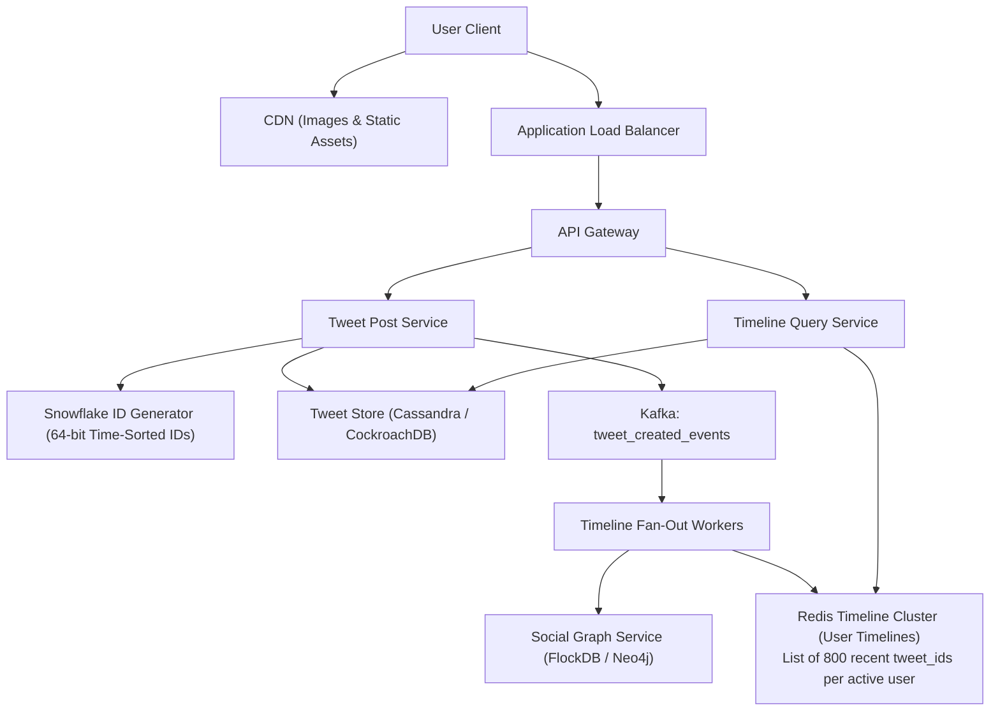
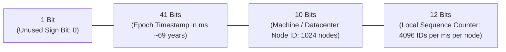
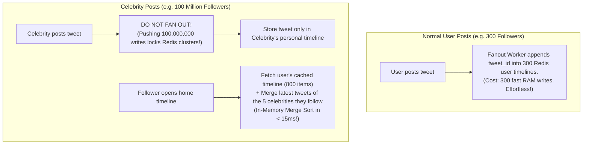

# HLD Case Study 10: Microblogging Platform (Twitter / X)

> **Key Focus Areas:** Massive fan-out write amplification, hot partition elimination, the Celebrity / Influencer problem, Twitter Snowflake 64-bit ID generation, and timeline caching.

---

## 1. Problem Statement & Functional Requirements

Design a microblogging platform where users publish short tweets, follow accounts, and consume a real-time home timeline.

### Requirements:
1. Post tweets ($< 280$ characters, optional media).
2. Follow and unfollow users.
3. High-speed home timeline generation ($< 50\text{ms}$ latency).
4. Scale to 400 million DAU, 600 million tweets/day, and 6 billion timeline views/day.

---

## 2. High-Level Architecture Diagram

---

## 3. The 64-Bit Snowflake ID Generation Algorithm

Standard auto-incrementing database IDs do not work across sharded databases, and UUIDv4 strings are 128 bits, non-indexable, and unordered.
Twitter created **Snowflake**: a 64-bit globally unique, time-ordered integer:

### Why Snowflake is Superior:
1. **Naturally Time-Ordered:** Sorting by Snowflake ID is identical to sorting by creation time.
2. **Decentralized:** Independent machines generate unique IDs without inter-server network coordination!
3. **High Throughput:** Each node can generate $4,096,000 \text{ IDs per second}$.

---

## 4. Solving the Celebrity / Hot Partition Problem

*This hybrid push-pull design eliminates write amplification while preserving sub-50ms read latency across the entire platform.*
