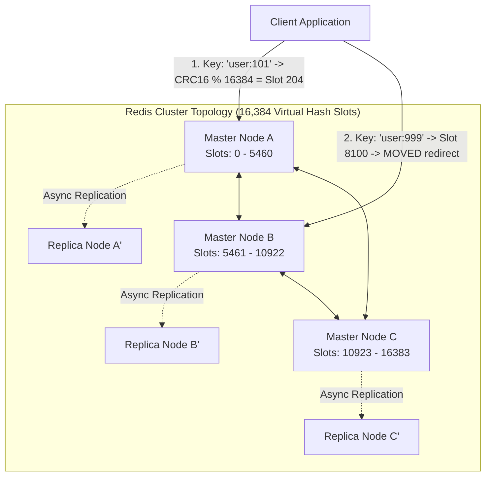
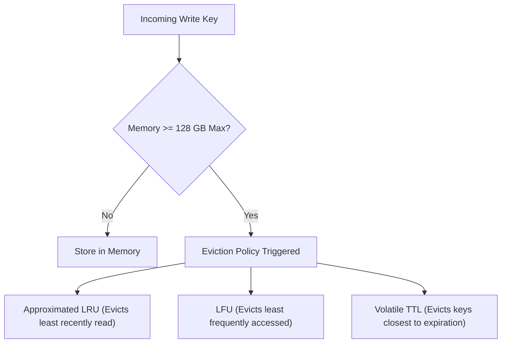

# System 11: Distributed Cache (Redis Cluster Architecture)

> **Zero-Prerequisite Intuition: The "Sticky Note on the Monitor" Metaphor**
> What is a cache, and why do we distribute it?
> Imagine you work as an accountant. Every time a client asks for their tax ID, you have to stand up, walk 50 meters down a long hallway, unlock a giant iron fireproof vault, search through 10,000 paper folders, find the document, walk 50 meters back, and tell the client.
> That long walk to the vault takes **5 minutes**. That is your **Database**.
> 
> If 500 clients call you in one hour, you will spend your entire day running up and down the hallway until you collapse from exhaustion.
> 
> What do you do instead? The first time a client asks for their tax ID, you write it on a small **Sticky Note** and slap it right onto the bezel of your computer monitor.
> The next 499 times that client asks, you don't walk down the hallway—you glance at the sticky note in **0.1 seconds**. That is a **Cache**.
> 
> But what happens when you have 10 million clients? You cannot fit 10 million sticky notes on one monitor! You need an entire room of accountants, each holding a fraction of the sticky notes.
> That is a **Distributed Cache**.

---

## 1. System Scale & Capacity Estimation

Let's design a distributed cache capable of supporting Twitter/Meta-scale read traffic:
* **Total In-Memory Data:** 10 Terabytes of active keys.
* **Read Throughput:** 1,000,000 Queries Per Second (QPS).
* **Write Throughput:** 100,000 QPS.
* **Target Latency:** $p99 < 1.0\text{ millisecond}$.

### Hardware Cluster Sizing:
* High-memory cloud instances (e.g. AWS `r6i.4xlarge`): 128 GB RAM per instance.
* To safely store 10 TB with a 30% headroom buffer for key fragmentation and replication:
  $$\text{RAM Needed} = 10\text{ TB} \times 1.30 = 13\text{ TB}$$
  $$\text{Nodes Required} = \frac{13,000\text{ GB}}{128\text{ GB/node}} \approx 102\text{ Master Nodes}$$
* With 1 Replica per Master for High Availability: **204 total nodes**.

---

## 2. Distributed Architecture: Hash Slots & Gossip Protocol

How do 102 independent Redis nodes decide which server holds which sticky note without a centralized master bottleneck?

### The 16,384 Hash Slot Algorithm
Redis Cluster does not use simple modulo (`hash(key) % N`) because adding or removing a node would invalidate 99% of all cached keys! Instead, it divides the universe into **16,384 virtual Hash Slots**:

$$\text{Slot} = \text{CRC16}(\text{key}) \pmod{16384}$$



1. **Node A** is assigned slots `0` to `5460`.
2. **Node B** is assigned slots `5461` to `10922`.
3. **Node C** is assigned slots `10923` to `16383`.
4. When a new node joins, slots are migrated incrementally without taking the cluster offline!

### Smart Clients & The `MOVED` Redirect
Redis clients cache a local routing table of which node owns which slot. 
If a client mistakenly sends a query for Slot 8100 to Node A:
* Node A does not proxy the query (proxying adds latency).
* Node A returns an instant error: `-MOVED 8100 10.0.0.2:6379`.
* The client updates its local slot cache and queries Node B directly!

---

## 3. Node Failure & Consensus via Gossip Protocol

Every node connects to every other node via a secondary **Cluster Bus port** (standard port + 10,000, e.g., 16379).
* Nodes exchange **PING / PONG heartbeat packets** using a decentralized **Gossip Protocol**.
* If Node A stops responding to Node B for `cluster-node-timeout` (e.g. 5 seconds), Node B flags Node A as `PFAIL` (Possible Failure).
* Once a majority of master nodes agree that Node A is unreachable, `PFAIL` transitions to `FAIL`.
* The replica node of Node A initiates an automated election, promotes itself to Master, and claims the hash slots without downtime!

---

## 4. Cache Invalidation & Eviction Algorithms

When the 128 GB RAM on a node fills up completely, what happens when new data arrives?



### Approximated LRU vs True LRU
A true Least-Recently-Used (LRU) cache requires maintaining a doubly-linked list of every key in memory. In a 10 TB cluster, the pointers alone would waste 2 TB of RAM!
* **Redis Solution:** Redis samples 5 random keys at random and evicts the one with the oldest access time (`lru_clock`). This statistical approximation achieves 99% of true LRU efficiency with **zero memory overhead**!

---

## 5. Summary Architecture Blueprint

| Component | Technology / Strategy | Production Decision Justification |
| :--- | :--- | :--- |
| **Partitioning Scheme** | 16,384 Hash Slots with CRC16 | Minimizes re-sharding data movement when adding/removing cluster nodes |
| **Failover Mechanism** | Raft-like Quorum Voting over Gossip | Eliminates single-point-of-failure centralized coordinators (like ZooKeeper) |
| **Replication** | Asynchronous Master-to-Replica | Guarantees sub-millisecond write latency ($p99 < 1\text{ms}$) by not waiting for cross-network replica acks |
| **Eviction Policy** | `allkeys-lru` (Approximated 5-sample) | Protects RAM from unbounded growth while prioritizing popular hot items |


---

## 5. Runnable Model: Hash Slots, Hash Tags and Resharding

Redis Cluster does not hash keys onto a ring. It maps every key to one of **16,384 slots** with `CRC16(key) mod 16384`, and assigns slots to nodes. Moving data is moving whole slots.

```python
def crc16_xmodem(data: bytes) -> int:
    crc = 0
    for byte in data:
        crc ^= byte << 8
        for _ in range(8):
            crc = ((crc << 1) ^ 0x1021) & 0xFFFF if crc & 0x8000 else (crc << 1) & 0xFFFF
    return crc

def key_slot(key: str) -> int:
    start = key.find("{")
    if start != -1:
        end = key.find("}", start + 1)
        if end != -1 and end != start + 1:           # a non-empty {tag}: only the tag is hashed
            key = key[start + 1:end]
    return crc16_xmodem(key.encode()) % 16384

assert crc16_xmodem(b"123456789") == 0x31C3              # the standard CRC-16/XMODEM check value
assert key_slot("foo") == 12182                          # the slot Redis reports for CLUSTER KEYSLOT foo
assert key_slot("user:{42}:profile") == key_slot("user:{42}:cart") == key_slot("42")   # hash tags co-locate related keys
assert key_slot("a{}b") == crc16_xmodem(b"a{}b") % 16384                                # an empty tag is ignored

def assign(nodes, slots=16384):
    per = slots // len(nodes)
    owner = {}
    for i, n in enumerate(nodes):
        lo, hi = i * per, slots if i == len(nodes) - 1 else (i + 1) * per
        for s in range(lo, hi):
            owner[s] = n
    return owner

before = assign(["A", "B", "C"])
counts = {n: list(before.values()).count(n) for n in "ABC"}
assert sum(counts.values()) == 16384 and max(counts.values()) - min(counts.values()) <= 2

# Resharding: add node D by moving about a quarter of the slots, a few at a time, from the existing nodes
after = dict(before)
target = 16384 // 4
moved = 0
for slot in range(16384):
    if moved == target:
        break
    if slot % 4 == 0:                                    # take every 4th slot from the current owners
        after[slot] = "D"
        moved += 1
assert list(after.values()).count("D") == 4096
unchanged = sum(before[s] == after[s] for s in range(16384)) / 16384
assert unchanged == 0.75                                  # only the migrated slots changed owner
```

The design consequences interviewers want you to state:

1. **Rebalancing is slot migration**, a key-by-key transfer with a `MIGRATING` and `IMPORTING` state, so clients are redirected (`MOVED` and `ASK`) while data moves and the cluster stays online.
2. **Multi-key operations only work within one slot.** Use hash tags (`{user:42}`) deliberately to keep related keys together, and accept that a hot tag makes a hot slot.
3. **Failure handling** uses replicas: each master has one or more replicas, and when a majority of masters agree a master is unreachable, a replica is promoted.

---

## 6. Failure Modes and Mitigations

| Failure | Effect | Mitigation |
| :--- | :--- | :--- |
| Master fails | Its slots are unavailable until failover | Replica promotion after a timeout; tune the node timeout against false positives |
| Network partition | Minority side cannot accept writes safely | Majority-of-masters rule; clients on the minority side get errors rather than divergent data |
| Replication is asynchronous | A promoted replica may miss the last acknowledged writes | Accept it for caches; use `WAIT` or a durable store for data that cannot be lost |
| Hot key | One node saturates | Local in-process cache, key replication with suffixes, or splitting the key |
| Big key (a multi-megabyte value) | Latency spikes for everyone on that node | Break it up, avoid `KEYS`, use `SCAN`, set size limits |
| Memory full | Evictions or write errors | Choose an eviction policy (`allkeys-lru` for pure caches), alert at 80%, keep headroom |

## 7. Trade-offs and Alternatives

- **Client-side sharding versus proxy versus cluster mode:** client-side hashing is simple and breaks on resharding; a proxy hides topology and adds a hop; cluster mode puts topology in the protocol and needs a cluster-aware client.
- **Consistent hashing ring versus fixed slots:** a ring is elegant; fixed slots make migration an explicit, resumable operation and make the key-to-node mapping easy to inspect.
- **Persistence:** RDB snapshots are compact and risk losing minutes; the append-only file loses seconds at some throughput cost; a pure cache can turn both off.
- **Cache versus primary store:** treat the cache as disposable unless you have designed durability for it.

## 8. Interview Timeline (45 minutes) and Follow-ups

| Minutes | Do |
| :--- | :--- |
| 0 to 5 | Use case: cache or primary store, data size, QPS, consistency needs |
| 5 to 10 | Estimates: memory, shards, replicas |
| 10 to 20 | Partitioning: hash slots, node assignment, client routing |
| 20 to 30 | Replication, failover, and what is lost during failover |
| 30 to 40 | Hot keys, big keys, eviction, resharding |
| 40 to 45 | Monitoring and failure modes |

**Follow-ups to prepare:** How do you add a node without downtime? Why can a cluster lose acknowledged writes? How do you keep related keys on one node? How do you detect and handle a hot key?
