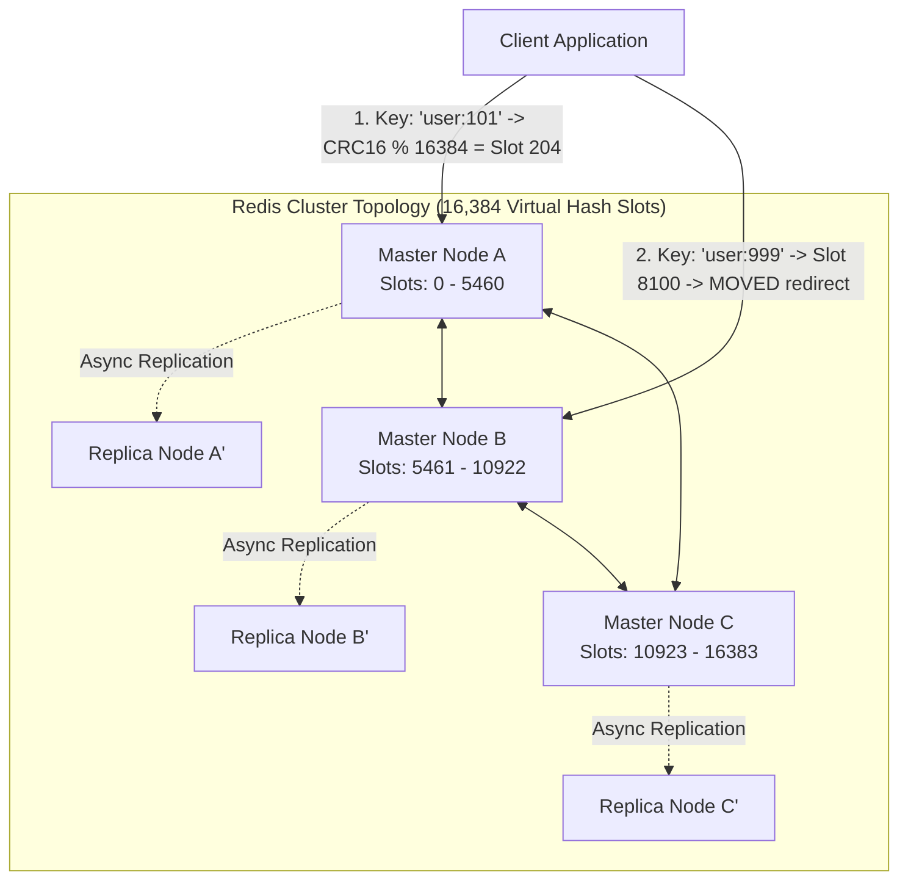
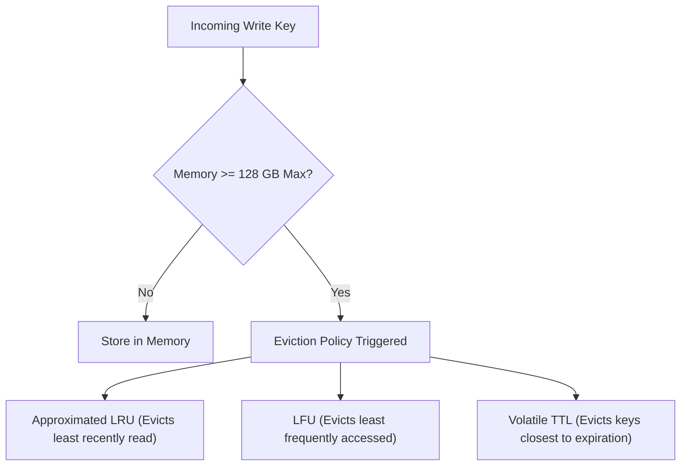

# System 11: Distributed Cache (Redis Cluster Architecture)

> **Zero-Prerequisite Intuition: The "Sticky Note on the Monitor" Metaphor**
> What is a cache, and why do we distribute it?
> Imagine you work as an accountant. Every time a client asks for their tax ID, you have to stand up, walk 50 meters down a long hallway, unlock a giant iron fireproof vault, search through 10,000 paper folders, find the document, walk 50 meters back, and tell the client.
> That long walk to the vault takes **5 minutes**. That is your **Database**.
> 
> If 500 clients call you in one hour, you will spend your entire day running up and down the hallway until you collapse from exhaustion.
> 
> What do you do instead? The first time a client asks for their tax ID, you write it on a small **Sticky Note** and slap it right onto the bezel of your computer monitor.
> The next 499 times that client asks, you don't walk down the hallway—you glance at the sticky note in **0.1 seconds**. That is a **Cache**.
> 
> But what happens when you have 10 million clients? You cannot fit 10 million sticky notes on one monitor! You need an entire room of accountants, each holding a fraction of the sticky notes.
> That is a **Distributed Cache**.

---

## 1. System Scale & Capacity Estimation

Let's design a distributed cache capable of supporting Twitter/Meta-scale read traffic:
* **Total In-Memory Data:** 10 Terabytes of active keys.
* **Read Throughput:** 1,000,000 Queries Per Second (QPS).
* **Write Throughput:** 100,000 QPS.
* **Target Latency:** $p99 < 1.0\text{ millisecond}$.

### Hardware Cluster Sizing:
* High-memory cloud instances (e.g. AWS `r6i.4xlarge`): 128 GB RAM per instance.
* To safely store 10 TB with a 30% headroom buffer for key fragmentation and replication:
  $$\text{RAM Needed} = 10\text{ TB} \times 1.30 = 13\text{ TB}$$
  $$\text{Nodes Required} = \frac{13,000\text{ GB}}{128\text{ GB/node}} \approx 102\text{ Master Nodes}$$
* With 1 Replica per Master for High Availability: **204 total nodes**.

---

## 2. Distributed Architecture: Hash Slots & Gossip Protocol

How do 102 independent Redis nodes decide which server holds which sticky note without a centralized master bottleneck?

### The 16,384 Hash Slot Algorithm
Redis Cluster does not use simple modulo (`hash(key) % N`) because adding or removing a node would invalidate 99% of all cached keys! Instead, it divides the universe into **16,384 virtual Hash Slots**:

$$\text{Slot} = \text{CRC16}(\text{key}) \pmod{16384}$$

1. **Node A** is assigned slots `0` to `5460`.
2. **Node B** is assigned slots `5461` to `10922`.
3. **Node C** is assigned slots `10923` to `16383`.
4. When a new node joins, slots are migrated incrementally without taking the cluster offline!

### Smart Clients & The `MOVED` Redirect
Redis clients cache a local routing table of which node owns which slot. 
If a client mistakenly sends a query for Slot 8100 to Node A:
* Node A does not proxy the query (proxying adds latency).
* Node A returns an instant error: `-MOVED 8100 10.0.0.2:6379`.
* The client updates its local slot cache and queries Node B directly!

---

## 3. Node Failure & Consensus via Gossip Protocol

Every node connects to every other node via a secondary **Cluster Bus port** (standard port + 10,000, e.g., 16379).
* Nodes exchange **PING / PONG heartbeat packets** using a decentralized **Gossip Protocol**.
* If Node A stops responding to Node B for `cluster-node-timeout` (e.g. 5 seconds), Node B flags Node A as `PFAIL` (Possible Failure).
* Once a majority of master nodes agree that Node A is unreachable, `PFAIL` transitions to `FAIL`.
* The replica node of Node A initiates an automated election, promotes itself to Master, and claims the hash slots without downtime!

---

## 4. Cache Invalidation & Eviction Algorithms

When the 128 GB RAM on a node fills up completely, what happens when new data arrives?

### Approximated LRU vs True LRU
A true Least-Recently-Used (LRU) cache requires maintaining a doubly-linked list of every key in memory. In a 10 TB cluster, the pointers alone would waste 2 TB of RAM!
* **Redis Solution:** Redis samples 5 random keys at random and evicts the one with the oldest access time (`lru_clock`). This statistical approximation achieves 99% of true LRU efficiency with **zero memory overhead**!

---

## 5. Summary Architecture Blueprint

| Component | Technology / Strategy | Production Decision Justification |
| :--- | :--- | :--- |
| **Partitioning Scheme** | 16,384 Hash Slots with CRC16 | Minimizes re-sharding data movement when adding/removing cluster nodes |
| **Failover Mechanism** | Raft-like Quorum Voting over Gossip | Eliminates single-point-of-failure centralized coordinators (like ZooKeeper) |
| **Replication** | Asynchronous Master-to-Replica | Guarantees sub-millisecond write latency ($p99 < 1\text{ms}$) by not waiting for cross-network replica acks |
| **Eviction Policy** | `allkeys-lru` (Approximated 5-sample) | Protects RAM from unbounded growth while prioritizing popular hot items |
