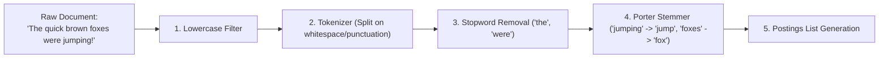
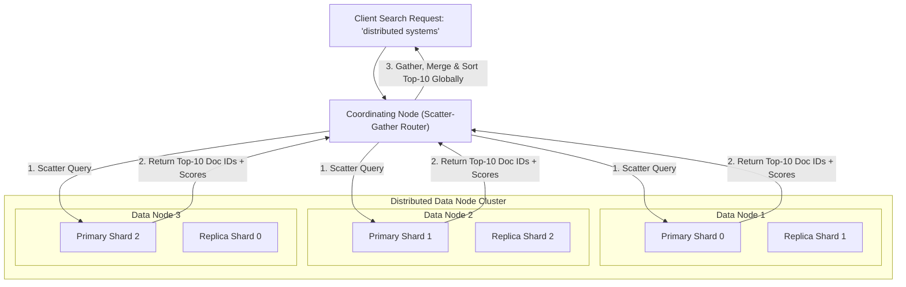
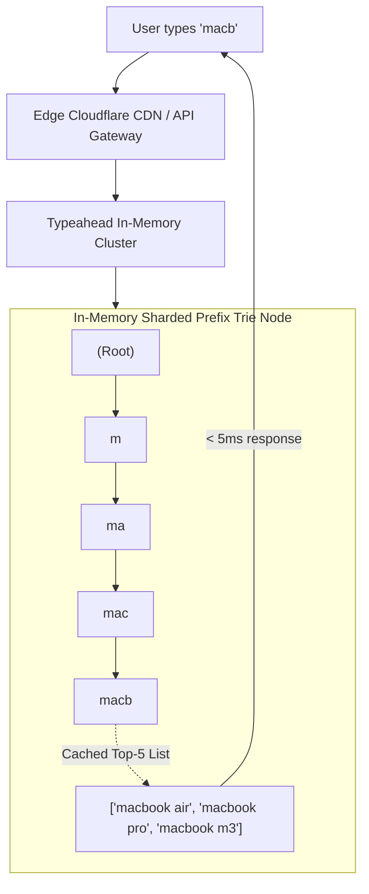

# System 12: Distributed Search Engine & Real-Time Typeahead (Elasticsearch Architecture)

> **Zero-Prerequisite Intuition: The "Index at the Back of the Book" Metaphor**
> Why can't a normal SQL database handle text search?
> Imagine you have a 1,000-page textbook on Medicine, and you want to find every page that mentions the word *"Penicillin"*.
> If you use a standard SQL database query:
> ```sql
> SELECT * FROM pages WHERE content LIKE '%penicillin%';
> ```
> The database has to read word #1 on page 1, word #2 on page 1, all the way through page 1,000. That is a **Sequential Table Scan**, and on 100 million documents it takes **45 seconds**!
> 
> What do human readers do instead? 
> You flip to the **very back of the book** to the alphabetical **Index section**. You look up the letter **P**, find *"Penicillin"*, and see: `[Page 42, Page 108, Page 780]`.
> You found all three occurrences in **2 seconds**!
> 
> In computer science, this is called an **Inverted Index**. Instead of mapping `Document -> Words`, it maps `Word -> List of Document IDs`.
> 
> This chapter covers how distributed search engines (Elasticsearch, Apache Lucene) build, compress, shard, and query inverted indexes at scale, and how to build sub-10ms **Real-Time Typeahead / Autocomplete**.

---

## 1. The Anatomy of an Inverted Index

When a new document arrives, it passes through an **Analysis & Tokenization Pipeline**:



### The Postings List
The core data structure is the **Term Dictionary** paired with **Postings Lists**:

| Term (Token) | Document Frequency | Postings List (Doc IDs & Term Frequency) |
| :--- | :--- | :--- |
| **`brown`** | 2 | `[Doc 1 (pos 2), Doc 8 (pos 14)]` |
| **`fox`** | 3 | `[Doc 1 (pos 3), Doc 4 (pos 1), Doc 9 (pos 5)]` |
| **`jump`** | 2 | `[Doc 1 (pos 5), Doc 4 (pos 2)]` |

When a user searches for `"brown AND jump"`, the search engine doesn't scan text—it performs an ultra-fast **Bitwise Intersection** of the two sorted postings lists:
$$\text{Postings(brown)} \cap \text{Postings(jump)} = [1, 8] \cap [1, 4] = \mathbf{[Doc\ 1]}$$

---

## 2. Distributed Elasticsearch Architecture



### The Scatter-Gather Query Protocol:
1. **Query Phase:** The Coordinating Node hashes or broadcasts the query to one replica of every primary shard. Each shard searches its local Lucene inverted index and computes BM25 relevance scores, returning only its **Top-10 Document IDs**.
2. **Fetch Phase:** The Coordinating Node merges the results from all shards, sorts them to pick the true global Top-10, and issues direct document retrieval requests (`GET /doc/{id}`) to fetch the full JSON bodies.

---

## 3. Real-Time Typeahead / Autocomplete Architecture

How does Google or Amazon suggest results within **8 milliseconds** as you type each letter into the search bar?



### The Prefix Trie with Pre-Computed Top-K Heaps
Traversing a trie on every keystroke to find all matching children is too slow under 500,000 QPS.
* **The Optimization:** Every node in the Prefix Trie **pre-computes and caches the Top-5 most popular search terms** that pass through it!
* When the user types `m-a-c-b`, the algorithm does not search deeper—it immediately reads the cached Top-5 array stored directly on node `macb` in **$O(L)$ time** (where $L$ is the length of the prefix, e.g., 4 operations)!

---

## 4. Relevance Scoring: The BM25 Formula

Modern search uses **Okapi BM25**, which balances Term Frequency (TF) against Inverse Document Frequency (IDF):

$$\text{Score}(D, Q) = \sum_{i=1}^{N} \text{IDF}(q_i) \cdot \frac{f(q_i, D) \cdot (k_1 + 1)}{f(q_i, D) + k_1 \cdot \left(1 - b + b \cdot \frac{|D|}{\text{avgdl}}\right)}$$

* **Term Frequency Saturation ($k_1$):** If a document mentions "python" 50 times, it is not 50x more relevant than a document mentioning it 5 times. BM25 flattens the curve.
* **Document Length Normalization ($b$):** Prevents long 500-page documents from dominating short 1-page articles simply because they have more total words.
