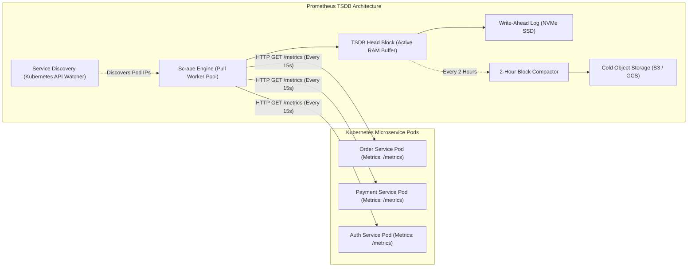
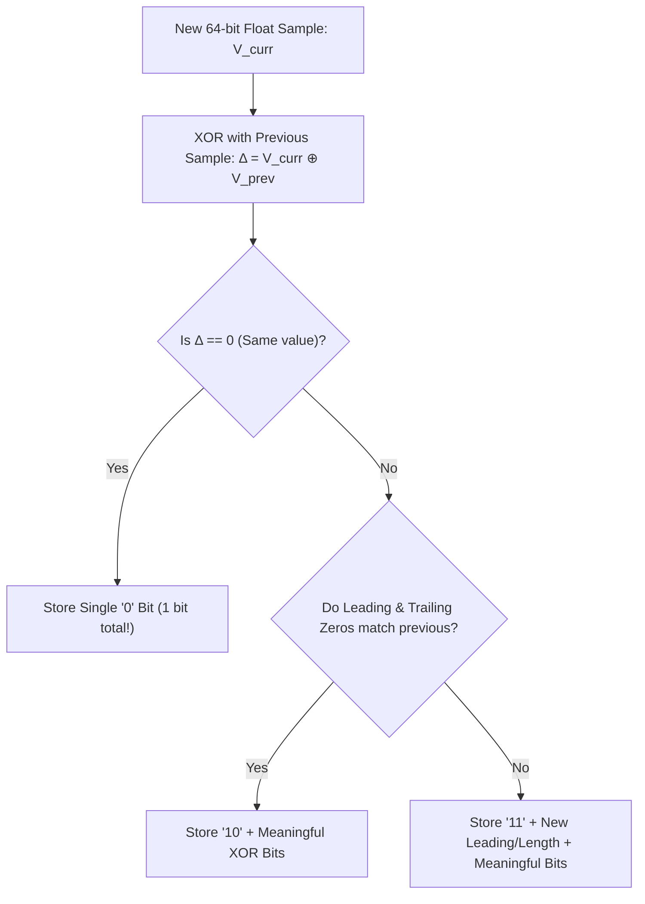
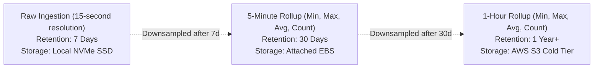

# System 13: Time-Series Metrics & Monitoring (Prometheus / Datadog Scale)

> **Zero-Prerequisite Intuition: The "Hospital ICU Heart Monitor" Metaphor**
> What is a Time-Series Database (TSDB), and why can't we just use PostgreSQL?
> Imagine an Intensive Care Unit (ICU) in a hospital. Every patient has sensors glued to their chest measuring heart rate, oxygen levels, and blood pressure. Every single second, the sensor emits a number: `(09:00:01, 72 bpm)`, `(09:00:02, 73 bpm)`, `(09:00:03, 72 bpm)`.
> 
> If you have 500 patients emitting 10 sensor readings every second, you generate **5,000 new rows every second**.
> In a standard SQL database, every row requires updating B-tree indexes, writing to disk, and managing table locks. In less than 3 days, your database runs out of disk space and crashes!
> 
> Furthermore, nobody cares what a patient's exact heart rate was at 03:14:22 AM six months ago. You only care about the **aggregate trend**: *"What was the average heart rate during that hour?"*
> 
> A **Time-Series Database (TSDB)** is built specifically for this. It uses specialized **Floating-Point Compression (Gorilla Algorithm)** and **Downsampling Rollups** to compress billions of continuous metrics into tiny chunks of memory.

---

## 1. System Scale & Capacity Estimation

Let's design a monitoring infrastructure for an enterprise cloud fleet:
* **Microservices & Hosts:** 10,000 Kubernetes Pods.
* **Metrics per Pod:** 50 distinct metrics (CPU, RAM, HTTP request count, latency percentiles).
* **Total Time-Series Streams:** $10,000 \times 50 = \mathbf{500,000\text{ active time series}}$.
* **Scrape Interval:** Every 15 seconds.
* **Data Point Ingestion Rate:**
  $$\text{Points / Second} = \frac{500,000}{15} \approx \mathbf{33,333\text{ samples/sec}}$$

---

## 2. Distributed Architecture: Pull vs. Push Ingestion

### The Architectural Debate: Pull vs. Push
* **Pull Model (Prometheus):** The central monitoring server initiates an HTTP `GET /metrics` pull from target pods.
  * *Advantage:* The monitoring server controls its own ingestion rate (protects itself from getting overwhelmed); immediately detects when a service is dead if the health scrape times out.
* **Push Model (StatsD / Datadog):** The microservice sends UDP packets outwards to a collection agent.
  * *Advantage:* Ideal for short-lived ephemeral batch jobs (AWS Lambda) that terminate before a pull scraper can reach them.

---

## 3. Storage Optimization: The Gorilla Compression Algorithm

Standard 64-bit IEEE-754 floating-point numbers require **8 bytes** each. Storing 33,000 points/sec for a year requires **8.4 Terabytes** of raw numbers.
Facebook engineers published the **Gorilla TSDB paper**, demonstrating how to compress 8-byte floats down to an astonishing **1.37 bytes per sample** (83% compression ratio!).

### 1. Delta-of-Delta Timestamp Compression
Timestamps arrive in predictable 15-second increments ($T_0=0, T_1=15, T_2=30$).
Instead of storing the full 64-bit timestamp, compute the **Delta-of-Delta**:
$$D = (T_{\text{curr}} - T_{\text{prev}}) - (T_{\text{prev}} - T_{\text{prev2}})$$
If the scrape interval is constant (e.g. exactly 15 seconds), $D = 0$, which is encoded as a **single `0` bit**!

### 2. XOR Floating-Point Value Compression
Most server metrics change very little from second to second (e.g., CPU is 42.1%, then 42.2%).
When two similar floats are XORed, the resulting bit sequence contains a huge string of leading and trailing zeros. Gorilla discards all leading and trailing zeros and writes only the meaningful middle bits.

---

## 4. Multi-Tier Retention & Downsampling

Nobody needs 15-second resolution data for an outage that happened 8 months ago. We implement automated downsampling rollups:

This multi-tier lifecycle allows dashboards to query 1-year historical trends in under 500ms while slashing long-term storage costs by over **95%**.
