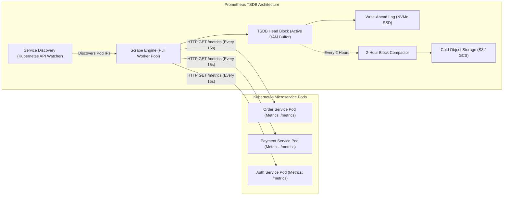
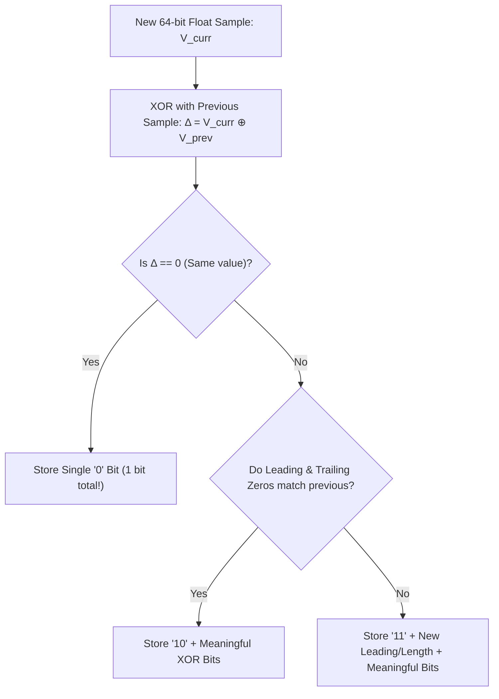
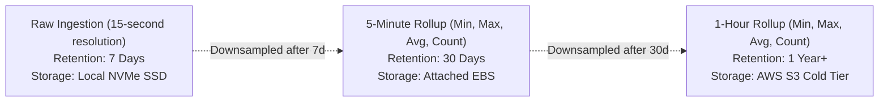

# System 13: Time-Series Metrics & Monitoring (Prometheus / Datadog Scale)

> **Zero-Prerequisite Intuition: The "Hospital ICU Heart Monitor" Metaphor**
> What is a Time-Series Database (TSDB), and why can't we just use PostgreSQL?
> Imagine an Intensive Care Unit (ICU) in a hospital. Every patient has sensors glued to their chest measuring heart rate, oxygen levels, and blood pressure. Every single second, the sensor emits a number: `(09:00:01, 72 bpm)`, `(09:00:02, 73 bpm)`, `(09:00:03, 72 bpm)`.
> 
> If you have 500 patients emitting 10 sensor readings every second, you generate **5,000 new rows every second**.
> In a standard SQL database, every row requires updating B-tree indexes, writing to disk, and managing table locks. In less than 3 days, your database runs out of disk space and crashes!
> 
> Furthermore, nobody cares what a patient's exact heart rate was at 03:14:22 AM six months ago. You only care about the **aggregate trend**: *"What was the average heart rate during that hour?"*
> 
> A **Time-Series Database (TSDB)** is built specifically for this. It uses specialized **Floating-Point Compression (Gorilla Algorithm)** and **Downsampling Rollups** to compress billions of continuous metrics into tiny chunks of memory.

---

## 1. System Scale & Capacity Estimation

Let's design a monitoring infrastructure for an enterprise cloud fleet:
* **Microservices & Hosts:** 10,000 Kubernetes Pods.
* **Metrics per Pod:** 50 distinct metrics (CPU, RAM, HTTP request count, latency percentiles).
* **Total Time-Series Streams:** $10,000 \times 50 = \mathbf{500,000\text{ active time series}}$.
* **Scrape Interval:** Every 15 seconds.
* **Data Point Ingestion Rate:**
  $$\text{Points / Second} = \frac{500,000}{15} \approx \mathbf{33,333\text{ samples/sec}}$$

---

## 2. Distributed Architecture: Pull vs. Push Ingestion



### The Architectural Debate: Pull vs. Push
* **Pull Model (Prometheus):** The central monitoring server initiates an HTTP `GET /metrics` pull from target pods.
  * *Advantage:* The monitoring server controls its own ingestion rate (protects itself from getting overwhelmed); immediately detects when a service is dead if the health scrape times out.
* **Push Model (StatsD / Datadog):** The microservice sends UDP packets outwards to a collection agent.
  * *Advantage:* Ideal for short-lived ephemeral batch jobs (AWS Lambda) that terminate before a pull scraper can reach them.

---

## 3. Storage Optimization: The Gorilla Compression Algorithm

Standard 64-bit IEEE-754 floating-point numbers require **8 bytes** each. Storing 33,000 points/sec for a year requires **8.4 Terabytes** of raw numbers.
Facebook engineers published the **Gorilla TSDB paper**, demonstrating how to compress 8-byte floats down to an astonishing **1.37 bytes per sample** (83% compression ratio!).



### 1. Delta-of-Delta Timestamp Compression
Timestamps arrive in predictable 15-second increments ($T_0=0, T_1=15, T_2=30$).
Instead of storing the full 64-bit timestamp, compute the **Delta-of-Delta**:
$$D = (T_{\text{curr}} - T_{\text{prev}}) - (T_{\text{prev}} - T_{\text{prev2}})$$
If the scrape interval is constant (e.g. exactly 15 seconds), $D = 0$, which is encoded as a **single `0` bit**!

### 2. XOR Floating-Point Value Compression
Most server metrics change very little from second to second (e.g., CPU is 42.1%, then 42.2%).
When two similar floats are XORed, the resulting bit sequence contains a huge string of leading and trailing zeros. Gorilla discards all leading and trailing zeros and writes only the meaningful middle bits.

---

## 4. Multi-Tier Retention & Downsampling

Nobody needs 15-second resolution data for an outage that happened 8 months ago. We implement automated downsampling rollups:



This multi-tier lifecycle allows dashboards to query 1-year historical trends in under 500ms while slashing long-term storage costs by over **95%**.


---

## 5. Runnable Model: Why Time-Series Data Compresses So Well

Metrics arrive at regular intervals and change slowly, which is why Gorilla-style compression reaches roughly a byte or two per sample. Two small experiments show both halves.

```python
import random
import struct

# 1. Timestamps: a scrape every 15 seconds. Store the delta of deltas, which is almost always zero.
ts = [1_700_000_000 + 15 * i for i in range(1000)]
ts[500:] = [t + 1 for t in ts[500:]]                    # a single one-second scrape delay at i = 500
deltas = [b - a for a, b in zip(ts, ts[1:])]
dod = [b - a for a, b in zip(deltas, deltas[1:])]
assert sum(1 for x in dod if x == 0) >= 996            # 996 of 998 delta-of-deltas are zero: 1 bit each when encoded
assert sorted(set(dod)) == [-1, 0, 1]                  # the delay shows up as +1 then -1

# 2. Values: XOR with the previous value; identical or similar floats leave long runs of zero bits.
def bits(x: float) -> int:
    return struct.unpack(">Q", struct.pack(">d", x))[0]

def xor_cost(values):
    """Approximate bits needed to store each value: 1 if unchanged, else the span between the first and last differing bit."""
    out = []
    for prev, cur in zip(values, values[1:]):
        x = bits(prev) ^ bits(cur)
        out.append(1 if x == 0 else x.bit_length() - (x & -x).bit_length() + 1)
    return out

rng = random.Random(2)
steady = [100.0] * 500                                  # a gauge that does not change (for example, replica count)
noisy = [rng.random() * 1e6 for _ in range(500)]        # unrelated random floats
assert sum(xor_cost(steady)) == 499                     # 1 bit per sample
assert sum(xor_cost(noisy)) > 20 * sum(xor_cost(steady))

raw_bits = 64 * 2                                       # a plain (timestamp, value) pair
steady_bits = 1 + 1                                     # delta-of-delta zero plus XOR zero
assert raw_bits / steady_bits == 64                     # up to 64x on perfectly steady series; real data lands near 10x
```

Real-world compression is closer to 10 to 12 times (about 1.37 bytes per sample in the Gorilla paper) because values are not constant. The principle for the interview: **exploit regular timestamps and slowly changing values, store in columnar blocks per series, and compress each block**.

---

## 6. Failure Modes and Mitigations

| Failure | Effect | Mitigation |
| :--- | :--- | :--- |
| Scraper or collector down | Gap in data | Run collectors in redundant pairs; deduplicate by series and timestamp |
| High-cardinality label (user id as a label) | Series count explodes, memory exhausted | Enforce a series limit per tenant, reject or drop unbounded labels, review label design |
| Ingestion spike | Write path overloaded | Buffer in a log (Kafka), shed load by dropping low-priority series, backpressure on clients |
| Query of a huge time range | Slow dashboards, memory spikes | Query the downsampled tier for long ranges; cap points per query; cache dashboard queries |
| Clock skew between hosts | Out-of-order or future timestamps | Accept a bounded out-of-order window; stamp at the collector, not at the source |
| Alert pipeline failure | Silent outage | A watchdog alert that should always fire; if it stops, a separate system pages you |

## 7. Trade-offs and Alternatives

- **Pull versus push:** pull gives central control and easy health checking ("target down" is an observation); push suits short-lived jobs and firewalled sources. Many deployments use pull with a push gateway for batch jobs.
- **Local disk versus remote object storage:** local TSDB blocks are fast and simple; long retention moves compacted blocks to object storage with a query layer on top.
- **Precision versus cost:** downsample old data (1-minute then 1-hour rollups) and keep min, max, sum and count so averages and percentiles stay computable; raw data for 15 days, rollups for years is typical.
- **Percentiles do not average:** store histogram buckets (or sketches) and aggregate those; averaging per-host p99 values gives a wrong answer.

## 8. Interview Timeline (45 minutes) and Follow-ups

| Minutes | Do |
| :--- | :--- |
| 0 to 5 | Scale: series count, scrape interval, retention, query patterns |
| 5 to 10 | Estimates: samples per second, bytes per sample, daily storage |
| 10 to 20 | Ingestion (pull versus push), write path with a buffer |
| 20 to 30 | Storage format: blocks, compression, indexes on labels |
| 30 to 40 | Querying, downsampling, retention tiers, alerting |
| 40 to 45 | High cardinality, failure modes, multi-tenant limits |

**Follow-ups to prepare:** What happens when a developer adds a label with unbounded values? How do you compute p99 across a thousand hosts? How do you keep alerts reliable when the monitoring system itself fails? How would you downsample without losing spikes?
