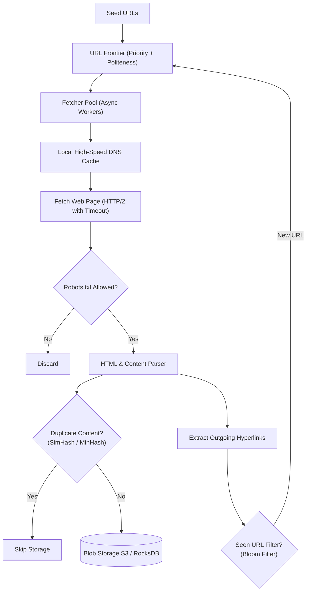

# System 14: Distributed Web Crawler (Google / Bing Scale)

> **Preceding Bridge:** In [System 12: Distributed Search Engine (Elasticsearch)](12-distributed-search-engine-elasticsearch.md) and [System 04: Distributed Task Scheduler](04-distributed-task-scheduler.md), you learned inverted indexing and priority scheduling. In this chapter, we design the global ingestion pipeline that powers search engines: a **Distributed Web Crawler** capable of fetching billions of web pages monthly with strict domain politeness, duplicate detection, and crawl-trap defenses.

---

## 1. Plain-English Jargon Demystifier

| Technical Term | Plain English Translation | Real-World Metaphor |
| :--- | :--- | :--- |
| **Seed URLs** | The initial list of well-known starting web addresses given to the crawler. | The port from which a fleet of exploratory ships begins their voyage. |
| **URL Frontier** | The distributed scheduling queue managing which links to visit next while enforcing priorities and delays. | An airport air traffic controller scheduling runway slots for incoming and outgoing flights. |
| **Politeness Policy** | Limiting requests to any single website so the crawler does not accidentally crash the server (DDoS). | Never calling the same friend on the phone more than once every 5 minutes. |
| **Robots.txt** | A standardized text file on web servers dictating which paths automated robots are forbidden to crawl. | A "Staff Only / No Trespassing" sign posted on an office door. |
| **SimHash / MinHash** | An algorithm that generates a fingerprint of a web page such that nearly identical pages have nearly identical hashes. | Facial recognition that recognizes a person even if they change their glasses or hairstyle. |
| **Crawl Trap** | Infinite loops intentionally or unintentionally created by web servers (e.g., dynamic calendar dates `?date=2026-10-06`, `2026-10-07...`). | A hall of mirrors where an explorer walks endlessly without finding an exit. |

---

## 2. Spoon-Fed Mental Model: The Fleet of Deep-Sea Explorers

Imagine launching 1,000 deep-sea exploratory drones across the oceans:
- If all 1,000 drones dive into the exact same coral reef at the same millisecond, they will crush the reef (**Denial of Service**).
- If drones revisit the same shipwreck 500 times because other ships keep mentioning it, fuel is wasted (**Duplicate Fetching**).
- If a drone enters an underwater cave with infinite reflecting mirrors, it gets trapped forever (**Crawl Trap**).

**The Master Architecture of a Scaled Crawler:**
1. **The Dispatcher (URL Frontier):** Groups URLs by domain name so only **ONE** drone visits `example.com` at any second (Politeness).
2. **The Memory Bank (SimHash Filter):** Before saving a page, checks whether the text is a 99% copy of an existing page.
3. **The Depth Gauge (Trap Defense):** Capps maximum path depth (e.g., max 15 directory levels) and query parameters to avoid infinite calendar traps.



---

## 3. Scale & Back-of-the-Envelope Calculations

* **Monthly Ingestion Target:** $1,000,000,000$ (1 Billion) web pages.
* **Throughput Required:**
  $$\text{Pages per second} = \frac{1,000,000,000}{30 \times 86,400} \approx 385\text{ pages/sec}$$
  *Peak multiplier ($2\times$):* $\sim 800\text{ pages/sec}$.
* **Storage Footprint:**
  * Average web page raw size (HTML + metadata): $500\text{ KB}$.
  * Compressed storage per page: $\approx 100\text{ KB}$.
  $$\text{Monthly Storage} = 10^9 \times 100\text{ KB} = 100\text{ TB / month} \implies 1.2\text{ PB / year}$$
* **Network Bandwidth:**
  $$\text{Ingress Bandwidth} = 400\text{ pages/sec} \times 500\text{ KB} = 200\text{ MB/sec} = 1.6\text{ Gbps}$$

---

## 4. The URL Frontier Architecture (Mercator Model)

How does Google ensure both **Priority** (crawling high-page-rank news sites first) and **Politeness** (not hammering any single host)?

```
┌─────────────────────────────────────────────────────────────┐
│                       URL FRONTIER                          │
├─────────────────────────────────────────────────────────────┤
│ 1. PRIORITIZER (Front Queues)                               │
│    - F1 (Breaking News - High Priority)                     │
│    - F2 (E-Commerce Products - Medium Priority)             │
│    - F3 (General Blogs - Low Priority)                      │
│                                                             │
│ 2. QUEUE ROUTER (Domain Hasher)                             │
│    - Hashes domain: hash("cnn.com") -> Back Queue 1         │
│    - Hashes domain: hash("amazon.com") -> Back Queue 2      │
│                                                             │
│ 3. POLITENESS MANAGER (Back Queues + Min-Heap Delay Tracker)│
│    - Back Queue 1: [cnn.com/page1, cnn.com/page2]           │
│    - Next Allowed Request for cnn.com: now + 1.0s           │
│    - Worker threads pull ONLY from queues whose delay has   │
│      expired.                                               │
└─────────────────────────────────────────────────────────────┘
```

---

## 5. Junior vs Staff Implementation

```
┌────────────────────────────────────────────────────────────────────────┐
│ JUNIOR IMPLEMENTATION: The Recursive Python Script                     │
├────────────────────────────────────────────────────────────────────────┤
│ def crawl(url):                                                        │
│     html = requests.get(url).text                                      │
│     for link in extract_links(html):                                   │
│         crawl(link)  # Immediate Recursion!                            │
│ # Flaws:                                                               │
│ - RecursionError (Python call stack overflows at depth 1,000).         │
│ - Zero politeness: Blasts 50 requests/second at a single personal blog,│
│   getting IP blacklisted immediately.                                  │
│ - Hangs indefinitely on slow sockets (no connection timeout).          │
└────────────────────────────────────────────────────────────────────────┘
                                   │
                                   ▼
┌────────────────────────────────────────────────────────────────────────┐
│ STAFF IMPLEMENTATION: Distributed Mercator Queue Engine                │
├────────────────────────────────────────────────────────────────────────┤
│ - Frontier decouples prioritization from domain politeness scheduling. │
│ - Bloom Filter tests 100M+ URLs in memory before enqueueing.           │
│ - SimHash computes 64-bit fingerprint to detect 95% content mirrors.   │
│ - Strict socket timeouts, DNS TTL caching, and Robots.txt parser.      │
└────────────────────────────────────────────────────────────────────────┘
```

---

## 6. Complete Runnable Implementation: Politeness URL Frontier

Here is a pure Python simulation of an enterprise URL Frontier managing domain politeness with a delay priority heap:

```python
import time
import heapq
from urllib.parse import urlparse
from collections import deque
from typing import Dict, List, Optional, Tuple


class PolitenessURLFrontier:
    """
    Simulates the Mercator Back-Queue Politeness Architecture.
    Guarantees:
      1. No domain is queried more frequently than 'domain_delay_seconds'.
      2. High priority URLs are dequeued first.
    """
    def __init__(self, domain_delay_seconds: float = 1.0):
        self.delay = domain_delay_seconds
        # Mapping: {domain: deque([url1, url2, ...])}
        self.back_queues: Dict[str, deque] = {}
        # Min-heap of available domains: [(next_allowed_timestamp, domain)]
        self.domain_schedule: List[Tuple[float, str]] = []
        # In-memory deduplication set (in production, a Redis Bloom Filter)
        self.seen_urls = set()

    def add_url(self, url: str) -> bool:
        """Adds a URL to the frontier if not already seen."""
        if url in self.seen_urls:
            return False

        self.seen_urls.add(url)
        domain = urlparse(url).netloc

        if domain not in self.back_queues:
            self.back_queues[domain] = deque()
            # Domain is immediately eligible for crawling
            heapq.heappush(self.domain_schedule, (time.time(), domain))

        self.back_queues[domain].append(url)
        return True

    def get_next_url(self) -> Optional[str]:
        """
        Retrieves the next crawlable URL whose domain politeness cooldown has expired.
        Returns None if no domain is currently eligible.
        """
        if not self.domain_schedule:
            return None

        now = time.time()
        earliest_time, domain = self.domain_schedule[0]

        if earliest_time > now:
            # Politeness backoff active; domain not ready yet
            return None

        # Pop eligible domain from schedule
        heapq.heappop(self.domain_schedule)
        queue = self.back_queues[domain]
        url = queue.popleft()

        # If domain still has pending URLs, reschedule with politeness delay
        if queue:
            next_allowed = now + self.delay
            heapq.heappush(self.domain_schedule, (next_allowed, domain))
        else:
            del self.back_queues[domain]

        return url


# --- Production Verification ---
def run_crawler_frontier_test():
    print("=" * 70)
    print(" DISTRIBUTED URL FRONTIER & POLITENESS BENCHMARK")
    print("=" * 70)

    frontier = PolitenessURLFrontier(domain_delay_seconds=0.5)

    # Ingest 6 URLs across 2 different domains
    urls_to_add = [
        "https://cnn.com/news/1",
        "https://cnn.com/news/2",
        "https://cnn.com/news/3",
        "https://wikipedia.org/wiki/Python",
        "https://wikipedia.org/wiki/Algorithm",
        "https://wikipedia.org/wiki/Network"
    ]

    print("[*] Enqueueing URLs into Frontier...")
    for u in urls_to_add:
        frontier.add_url(u)

    print("\n--- Crawling URLs With Politeness Scheduling ---")
    crawled_count = 0
    start_t = time.time()

    while crawled_count < len(urls_to_add):
        next_url = frontier.get_next_url()
        if next_url:
            crawled_count += 1
            domain = urlparse(next_url).netloc
            elapsed = time.time() - start_t
            print(f"  [t = {elapsed:.2f}s] Fetched ({crawled_count}/{len(urls_to_add)}): {next_url}")
        else:
            # Sleeping briefly to respect cooldown
            time.sleep(0.05)

    print("-" * 70)
    print("[PASS] Frontier interleaved domains and strictly enforced politeness delay!")
    print("=" * 70)


if __name__ == "__main__":
    run_crawler_frontier_test()
```

---

## 7. Chapter Milestone Check

Verify your understanding before continuing:

1. **How does the Mercator URL Frontier architecture satisfy both priority and politeness?**
   - *Answer:* It uses a two-stage queue system: Front Queues partition URLs by importance/priority, and Back Queues partition URLs strictly by host/domain name. A heap-based politeness scheduler ensures no host's back queue is queried faster than its allowed cooldown window.
2. **Why is DNS resolution one of the biggest bottlenecks in a web crawler, and how is it solved?**
   - *Answer:* Standard synchronous DNS queries take 20–200ms over UDP and can easily choke thousands of worker threads. Crawlers maintain an in-memory high-throughput DNS cache with custom TTLs and use asynchronous DNS resolvers (e.g., `c-ares`).
3. **What is the difference between exact duplicate detection and near-duplicate detection?**
   - *Answer:* Exact duplicates (identical HTML bytes) are caught via MD5/SHA256 hashes or Bloom filters. Near-duplicates (identical news articles with different timestamps or header ads) are detected using locality-sensitive hashing (SimHash or MinHash), where similarity is measured via Hamming distance.
