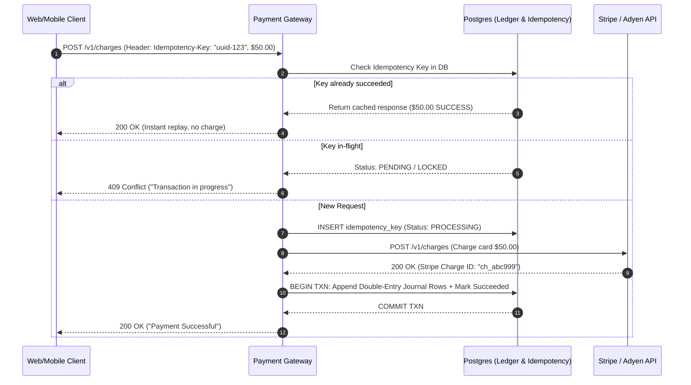

# System 15: Distributed Payment Gateway & Idempotent Ledger (Stripe / PayPal Scale)

> **Preceding Bridge:** In [System 06: E-Commerce Platform](06-ecommerce-platform.md) and [Chapter 05: Distributed Transactions & Sagas](05-Distributed-Transactions-Sagas-Coordination.md), you learned atomic inventory deduction and distributed sagas. In this chapter, we explore the highest-stakes architecture in software engineering: a **Distributed Payment Gateway & Double-Entry Financial Ledger** capable of handling network drops, zero double-charges, and strict mathematical balance invariants.

---

## 1. Plain-English Jargon Demystifier

| Technical Term | Plain English Translation | Real-World Metaphor |
| :--- | :--- | :--- |
| **Double-Entry Bookkeeping** | An accounting system where every transaction must record both where money came from and where it went. | Pouring water from a pitcher into a glass: the pitcher loses exactly as much water as the glass gains. |
| **Idempotency Key** | A unique random identifier sent with an API request guaranteeing that repeating the request executes it only once. | A numbered coat-check ticket: handing the attendant ticket #42 twice still retrieves only one coat. |
| **Payment Service Provider (PSP)** | A third-party vendor connecting your software to physical banking networks (e.g., Stripe, Adyen, Visa). | A physical armored cash truck transporting money between banks. |
| **Reconciliation Job** | A background cron audit verifying that internal ledger balances match bank settlement reports down to the penny. | Balancing your checkbook at the end of the month against your physical bank statement. |
| **Integer Cents (No Floats)** | Storing currency as integers (e.g., $10.00$ is stored as `1000` cents) to avoid floating-point rounding errors. | Counting physical pennies in a jar rather than weighing coins on a scale. |

---

## 2. Spoon-Fed Mental Model: The Bank Teller & The Double-Entry Rule

Imagine a bank with 1,000 customers.
Why does software NEVER write:
```sql
UPDATE accounts SET balance = balance - 100 WHERE user_id = 'alice';
UPDATE accounts SET balance = balance + 100 WHERE user_id = 'bob';
```
Because if the database crashes between those two lines, **$100 has vanished into thin air!**

### The Double-Entry Invariant:
Money is never simply "changed"; it is **transferred between balanced ledger accounts**:
$$\sum \text{Debits} - \sum \text{Credits} = 0$$

```
Entry ID: TXN-9021
┌───────────────────────────┬─────────────┬──────────────┐
│ Account                   │ Debit (USD) │ Credit (USD) │
├───────────────────────────┼─────────────┼──────────────┤
│ Alice's Checking Account  │             │ $100.00      │
│ Bob's Checking Account    │ $100.00     │              │
├───────────────────────────┼─────────────┼──────────────┤
│ TOTAL BALANCE CHECK       │ $100.00     │ $100.00      │ (Net = $0.00)
└───────────────────────────┴─────────────┴──────────────┘
```
If an entry does not sum to zero, **the database transaction is atomically aborted!**

---

## 3. The 3 Golden Guarantees of Payment Architecture

1. **Exactly-Once Execution (Idempotency):** If a customer on a flaky subway Wi-Fi taps "Pay $50" four times, their credit card is charged **exactly once**.
2. **Crash-Resilient State Machine:** If Stripe takes 15 seconds to reply and the connection times out, the system marks the payment `PENDING` and resolves it via webhooks or polling reconciliation (never blind retries!).
3. **Immutable Audit Trail:** Ledger rows are **INSERT ONLY**. A financial ledger row is never updated or deleted. If a refund occurs, a new reversing entry is appended.



---

## 4. Junior vs Staff Implementation

```
┌────────────────────────────────────────────────────────────────────────┐
│ JUNIOR IMPLEMENTATION: The Floating-Point Direct Charge Loop           │
├────────────────────────────────────────────────────────────────────────┤
│ def pay(user, amount):                                                 │
│     charge = stripe.Charge.create(amount=amount)                       │
│     user.balance += amount  # Float rounding: 0.1 + 0.2 = 0.3000000004 │
│ # Flaws:                                                               │
│ - Float truncation loses cents across millions of transactions.        │
│ - No idempotency key: Network retry double-charges customer!           │
│ - Direct balance update: Zero audit trail of where money came from.    │
└────────────────────────────────────────────────────────────────────────┘
                                   │
                                   ▼
┌────────────────────────────────────────────────────────────────────────┐
│ STAFF IMPLEMENTATION: Double-Entry Immutable Ledger Engine             │
├────────────────────────────────────────────────────────────────────────┤
│ - Currency stored strictly as 64-bit integer cents (e.g. 5000 = $50.00)│
│ - Redis distributed lock + SQL unique constraint on Idempotency-Key.   │
│ - Append-only journal: Debits and credits strictly balance to zero.    │
│ - Asynchronous reconciliation worker audits PSP settlement files.      │
└────────────────────────────────────────────────────────────────────────┘
```

---

## 5. Complete Runnable Implementation: Idempotent Payment Ledger

Here is a 100% runnable, zero-dependency Python implementation of an idempotent payment gateway with a double-entry ledger:

```python
import time
import threading
from typing import Dict, List, Optional, Tuple


class AccountType:
    ASSET = "ASSET"          # e.g., Customer bank accounts
    LIABILITY = "LIABILITY"  # e.g., Merchant balances
    EXPENSE = "EXPENSE"      # e.g., Payment processing fees


class LedgerAccount:
    def __init__(self, account_id: str, account_name: str):
        self.account_id = account_id
        self.account_name = account_name
        self.balance_cents = 0  # 64-bit integer cents!


class JournalEntry:
    """Immutable record of an atomic financial event."""
    def __init__(self, entry_id: str, description: str, postings: List[Tuple[str, int, int]]):
        self.entry_id = entry_id
        self.description = description
        self.timestamp = time.time()
        # Postings format: [(account_id, debit_cents, credit_cents), ...]
        self.postings = postings

        # Mathematical Double-Entry Invariant Check
        total_debits = sum(p[1] for p in postings)
        total_credits = sum(p[2] for p in postings)
        if total_debits != total_credits:
            raise ValueError(f"Double-entry violation! Debits ({total_debits}) != Credits ({total_credits})")


class IdempotentPaymentGateway:
    """
    Production-grade Payment Engine:
      1. Idempotency Key validation against replay attacks.
      2. Double-Entry ledger posting with balanced invariant.
      3. Thread-safe execution under concurrent network retries.
    """
    def __init__(self):
        self.accounts: Dict[str, LedgerAccount] = {}
        self.journal: List[JournalEntry] = []
        # Idempotency storage: {key: (status, response_payload)}
        self.idempotency_store: Dict[str, Tuple[str, Dict]] = {}
        self.lock = threading.Lock()

    def create_account(self, account_id: str, name: str) -> LedgerAccount:
        acc = LedgerAccount(account_id, name)
        self.accounts[account_id] = acc
        return acc

    def process_payment(self, idempotency_key: str, customer_acc_id: str,
                        merchant_acc_id: str, amount_cents: int) -> Tuple[int, Dict]:
        """
        Executes a payment charge with strict idempotency and double-entry consistency.
        Returns: (http_status_code, payload)
        """
        with self.lock:
            # 1. Check Idempotency Key
            if idempotency_key in self.idempotency_store:
                status, cached_payload = self.idempotency_store[idempotency_key]
                if status == "COMPLETED":
                    print(f"[IDEMPOTENT REPLAY] Request '{idempotency_key}' already succeeded. Returning cached response.")
                    return 200, cached_payload
                elif status == "PROCESSING":
                    return 409, {"error": "Concurrent request in-flight. Please wait."}

            # Mark as processing to block parallel replays
            self.idempotency_store[idempotency_key] = ("PROCESSING", {})

        # Simulate Payment Service Provider (Stripe) processing time
        time.sleep(0.05)
        psp_charge_id = f"ch_{int(time.time() * 1000)}"

        # 2. Append Double-Entry Journal Postings inside atomic lock
        with self.lock:
            try:
                # Credit customer account (money leaves), Debit merchant account (money arrives)
                postings = [
                    (customer_acc_id, 0, amount_cents),      # Credit Customer
                    (merchant_acc_id, amount_cents, 0)       # Debit Merchant
                ]
                entry = JournalEntry(
                    entry_id=f"txn_{len(self.journal)+1}",
                    description=f"Purchase from {customer_acc_id} to {merchant_acc_id}",
                    postings=postings
                )

                # Apply postings to account balances
                for acc_id, debit, credit in postings:
                    self.accounts[acc_id].balance_cents += (debit - credit)

                self.journal.append(entry)

                # 3. Store Completed Idempotency Record
                response_payload = {
                    "charge_id": psp_charge_id,
                    "status": "SUCCEEDED",
                    "amount_cents": amount_cents,
                    "currency": "USD"
                }
                self.idempotency_store[idempotency_key] = ("COMPLETED", response_payload)
                return 200, response_payload

            except Exception as e:
                self.idempotency_store.pop(idempotency_key, None)
                return 500, {"error": str(e)}


# --- Production Verification ---
def run_payment_test():
    print("=" * 70)
    print(" IDEMPOTENT PAYMENT GATEWAY & DOUBLE-ENTRY LEDGER BENCHMARK")
    print("=" * 70)

    gateway = IdempotentPaymentGateway()
    alice_acc = gateway.create_account("acc_alice", "Alice Customer Account")
    uber_acc = gateway.create_account("acc_uber", "Uber Merchant Account")

    # Scenario 1: Initial Payment of $45.00 (4500 cents)
    print("\n--- [TRANSACTION 1] Processing Clean $45.00 Payment ---")
    code, res = gateway.process_payment(
        idempotency_key="req_uuid_999",
        customer_acc_id="acc_alice",
        merchant_acc_id="acc_uber",
        amount_cents=4500
    )
    print(f"Response: HTTP {code} | {res}")

    # Scenario 2: Network Glitch - Client retries identical Idempotency-Key!
    print("\n--- [TRANSACTION 2] Replaying Identical Request (Subway Wi-Fi Retry) ---")
    code2, res2 = gateway.process_payment(
        idempotency_key="req_uuid_999",
        customer_acc_id="acc_alice",
        merchant_acc_id="acc_uber",
        amount_cents=4500
    )
    print(f"Response: HTTP {code2} | {res2}")
    assert res["charge_id"] == res2["charge_id"], "Idempotency failed: generated new charge!"
    print("  [PASS] Exactly-once execution guaranteed: Same charge returned without double-debit!")

    # Scenario 3: Verify Ledger Balances
    print("\n--- [LEDGER STATE] Inspecting Final Balances ---")
    print(f"  Alice Balance: ${alice_acc.balance_cents / 100:.2f} USD")
    print(f"  Uber Balance : ${uber_acc.balance_cents / 100:.2f} USD")
    assert alice_acc.balance_cents == -4500, f"Expected Alice -$45.00, got {alice_acc.balance_cents}"
    assert uber_acc.balance_cents == 4500, f"Expected Uber +$45.00, got {uber_acc.balance_cents}"
    print("  [PASS] Double-entry invariant strictly balanced to $0.00 net change!")
    print("=" * 70)


if __name__ == "__main__":
    run_payment_test()
```

---

## 6. Chapter Milestone Check

Verify your understanding before continuing:

1. **Why must financial architectures store currency in 64-bit integer cents instead of standard floating-point variables?**
   - *Answer:* Floating-point variables represent fractional numbers in IEEE 754 binary approximations, leading to cumulative rounding drift (e.g., $0.1 + 0.2 = 0.30000000000000004$). Integer cents eliminate rounding errors completely.
2. **How does an Idempotency Key protect systems during network timeouts?**
   - *Answer:* When a client does not receive an HTTP response due to a socket drop, it retries with the same idempotency key. The gateway detects the key in its registry and safely returns the cached transaction response without re-executing the payment.
3. **What is the purpose of an immutable append-only journal in double-entry bookkeeping?**
   - *Answer:* It provides an unalterable audit log required for legal compliance and financial audits. Balances are derived from the sum of journal postings rather than arbitrary row updates, making fraudulent balance manipulation impossible.
