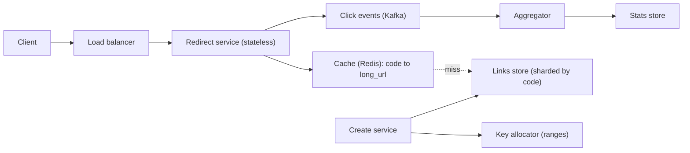

# HLD Case Study 16: URL Shortener (TinyURL / bit.ly)

> **Key Focus Areas:** Read-heavy design, unique key generation without collisions, 301 versus 302 redirects, caching hot links, expiry, abuse prevention.

---

## 1. Requirements and Scope

**Functional:** create a short link for a long URL (optionally a custom alias and an expiry date), redirect a short link to its target, delete or disable a link, basic click analytics.
**Non-functional:** redirects must be fast (p99 under 50 ms from cache) and highly available; a created link must never point to the wrong target; short codes are unguessable enough that links are not trivially enumerable; the system is **read-heavy** (roughly 100 reads per write).
**Out of scope for this answer:** user accounts and billing, link-in-bio pages, detailed analytics dashboards.

---

## 2. Back-of-the-Envelope Estimates

```python
new_per_day = 10e6
write_qps = new_per_day / 86400                  # ~116 writes/s
read_ratio = 100
read_qps = write_qps * read_ratio                # ~11,600 redirects/s average
peak_read_qps = read_qps * 3                     # ~35,000/s at peak
years = 5
total_urls = new_per_day * 365 * years           # 18.25 billion links
bytes_per_row = 500                              # short code, long URL (~300), timestamps, owner, flags
storage_tb = total_urls * bytes_per_row / 1e12   # ~9.1 TB, fits a sharded store easily
code_len = 7
keyspace = 62 ** code_len                        # 3.5e12 possible 7-character codes
utilisation = total_urls / keyspace              # 0.5% of the space used after five years
hot_fraction, bytes_per_cached = 0.2, 500
cache_gb = new_per_day * 30 * hot_fraction * bytes_per_cached / 1e9   # cache the hot 20% of 30 days of links
print(round(write_qps), round(read_qps), round(storage_tb, 1), f"{utilisation:.2%}", round(cache_gb))
assert 115 < write_qps < 117 and 9 < storage_tb < 9.3 and keyspace > 3e12 and utilisation < 0.01
```

Two conclusions drive the design: storage is small (single-digit terabytes) and reads dominate (tens of thousands per second), so **caching and a simple key-value store matter more than clever storage**.

---

## 3. API Design

```
POST /v1/links          {long_url, custom_alias?, expires_at?}  -> 201 {short_url, code}
GET  /{code}                                                    -> 301/302 Location: long_url
DELETE /v1/links/{code}                                         -> 204
GET  /v1/links/{code}/stats                                     -> 200 {clicks, by_day, by_country}
```

Rules: validate the URL scheme (`http` and `https` only, to block `javascript:` and `file:`), cap the URL length, reject a custom alias that is taken (409), and make creation **idempotent** per user and URL if you want the same short link returned for repeat requests.

---

## 4. Data Model

| Table | Key | Columns |
| :--- | :--- | :--- |
| `links` | `code` (primary) | `long_url`, `owner_id`, `created_at`, `expires_at`, `disabled` |
| `clicks` (append-only, off the hot path) | `(code, day)` | counters, or raw events into a stream |

A key-value store (DynamoDB, Cassandra, or sharded MySQL with `code` as the shard key) fits: every lookup is by `code`, there are no joins, and the primary key spreads load evenly when codes are random.

---

## 5. Architecture



The redirect path touches only the cache and, on a miss, one key lookup. Analytics are emitted asynchronously so a slow analytics pipeline can never delay a redirect.

---

## 6. Deep Dive: Generating Unique Short Codes

| Approach | How | Problem |
| :--- | :--- | :--- |
| Hash the URL, take 7 characters | `base62(md5(url))[:7]` | Collisions: two URLs can share a prefix; needs a check-and-retry loop and a salt |
| Random code, retry on conflict | pick 7 random characters, insert if absent | Fine at 0.5% utilisation (about one retry in 200), needs a unique constraint or conditional write |
| **Counter encoded in base 62** | the n-th link gets `base62(n)` | No collisions; codes are sequential and therefore guessable and enumerable |
| **Range allocation** | each app server leases a block of ids (for example 1,000) from a coordinator, then encodes them privately | Fast and collision-free; combine with an invertible shuffle if you need unguessable codes |

```python
import threading

ALPHABET = "0123456789abcdefghijklmnopqrstuvwxyzABCDEFGHIJKLMNOPQRSTUVWXYZ"

def encode(n: int) -> str:
    if n == 0:
        return ALPHABET[0]
    out = []
    while n:
        n, r = divmod(n, 62)
        out.append(ALPHABET[r])
    return "".join(reversed(out))

def decode(s: str) -> int:
    n = 0
    for ch in s:
        n = n * 62 + ALPHABET.index(ch)
    return n

class RangeAllocator:
    """Hands out disjoint id blocks, like a coordinator row incremented with an atomic update."""
    def __init__(self, block: int = 1000):
        self.block, self.next_start, self._lock = block, 0, threading.Lock()
    def lease(self):
        with self._lock:
            start = self.next_start
            self.next_start += self.block
            return start, start + self.block

class AppServer:
    def __init__(self, allocator: RangeAllocator):
        self.allocator, self.cur, self.end = allocator, 0, 0
    def next_code(self) -> str:
        if self.cur == self.end:
            self.cur, self.end = self.allocator.lease()
        self.cur += 1
        return encode(self.cur - 1)

assert encode(0) == "0" and encode(61) == "Z" and encode(62) == "10"
assert all(decode(encode(n)) == n for n in (0, 1, 61, 62, 3844, 10**9, 62**7 - 1))
assert len(encode(62 ** 7 - 1)) == 7                      # 7 characters cover 62**7 ids

alloc = RangeAllocator(block=1000)
servers = [AppServer(alloc) for _ in range(3)]
codes = [s.next_code() for _ in range(2500) for s in servers]
assert len(codes) == len(set(codes)) == 7500              # three servers, no coordination per request, no collisions
```

**Making codes unguessable.** A counter reveals how many links exist and lets anyone crawl them. Pass the id through a keyed permutation (a few rounds of Feistel, or a multiplication by a large odd constant modulo 62 to the 7th) before encoding. The mapping stays one-to-one, so uniqueness is preserved.

**301 or 302?** A `301` (permanent) is cached by browsers, so repeat visits skip your servers, but you lose click counts and cannot change the target. A `302` (temporary) hits you every time, which gives analytics and editable links. Most shorteners that sell analytics use `302`.

---

## 7. Scaling and Bottlenecks

1. **Reads:** cache `code -> long_url` with a TTL; the hot set is tiny compared with the 9 TB total. A CDN in front of the redirect service absorbs viral links.
2. **Hot keys:** one viral link can send tens of thousands of requests per second to a single cache shard; add a small in-process cache on every redirect server.
3. **Writes:** about 116 per second is trivial; the allocator is touched once per 1,000 links.
4. **Storage:** shard by `code`; random codes balance shards automatically.
5. **Expiry:** keep `expires_at` on the row and check it on read; delete expired rows lazily and with a background sweep, and never recycle a code quickly (an old link must not suddenly point somewhere new).

---

## 8. Failure Modes and Mitigations

| Failure | Effect | Mitigation |
| :--- | :--- | :--- |
| Cache down | Every redirect hits the database | Replica set plus a local cache; shed load rather than let the database fall over |
| Allocator down | No new ranges | Servers keep working until their block is used; lease larger blocks; run the allocator on a replicated store |
| Server crashes with an unused block | Up to 1,000 unused ids are lost | Acceptable: the keyspace is 3.5e12 |
| Abuse (phishing, malware links) | Reputation damage | Check targets against a safe-browsing list at creation, rate-limit creation per user and IP, support takedown |
| Custom alias race | Two users claim the same alias | Conditional insert (`INSERT ... IF NOT EXISTS`) and return 409 to the loser |

---

## 9. Trade-offs and Alternatives

- **Random codes vs counters:** random codes are unguessable and need a conflict check; counters need coordination and are enumerable unless permuted.
- **SQL vs key-value:** SQL is fine at this size and easier to operate; a key-value store scales further with less tuning.
- **Analytics inline vs asynchronous:** asynchronous costs eventual consistency in counts and buys a redirect path that cannot be slowed by reporting.
- **Short codes are case-sensitive:** base 62 doubles the density of base 36, but `a` and `A` differ; some products use base 36 for case-insensitive links at the cost of longer codes.

---

## 10. Interview Timeline (45 minutes) and Follow-ups

| Minutes | Do |
| :--- | :--- |
| 0 to 5 | Clarify scope, read/write ratio, link lifetime, custom aliases |
| 5 to 10 | The estimates block: QPS, 9 TB, 7-character codes |
| 10 to 20 | API and data model, then the redirect path with the cache |
| 20 to 35 | **Key generation** (the heart of the question), 301 versus 302 |
| 35 to 45 | Failures, abuse, analytics, scaling the hot link |

**Follow-ups to prepare:** How do you avoid guessable codes? How do you support custom aliases without races? How do you expire links and reuse codes safely? What changes at 100 times the traffic? How do you count clicks accurately without slowing redirects?
