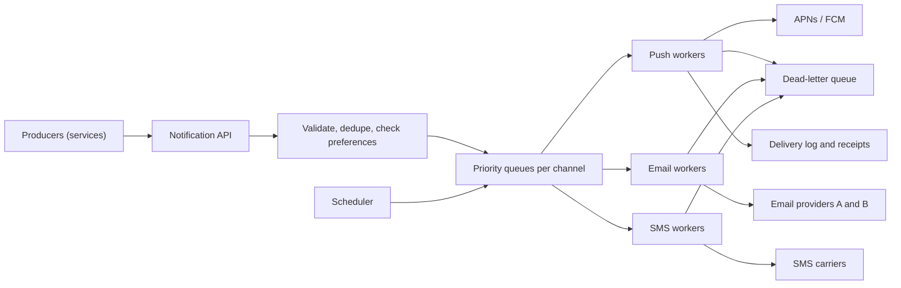

# HLD Case Study 17: Notification Service (Push, Email, SMS)

> **Key Focus Areas:** Decoupling producers from delivery, priority queues, deduplication, retries with backoff and a dead-letter queue, provider failover, user preferences, rate limiting, and fan-out for campaigns.

---

## 1. Requirements and Scope

**Functional:** other services submit "notify user X about event Y"; the platform picks channels (push, email, SMS, in-app) from the user's preferences, renders a template, delivers, and records the outcome. Support scheduled sends and broadcast campaigns to millions of users.
**Non-functional:** **at-least-once** delivery with deduplication so users do not get the same alert twice; critical messages (one-time passwords, fraud alerts) must not wait behind marketing sends; a provider outage must not lose messages; respect opt-outs and quiet hours.
**Out of scope for this answer:** building the email or SMS carriers themselves, rich content editors, A/B testing.

---

## 2. Back-of-the-Envelope Estimates

```python
users = 50e6
notifications_per_user_day = 5
per_day = users * notifications_per_user_day            # 250 million per day
avg_qps = per_day / 86400                               # ~2,900/s
campaign_size, campaign_window_s = 20e6, 600            # a marketing blast to 20M users over 10 minutes
campaign_qps = campaign_size / campaign_window_s        # ~33,000/s on top of the baseline
peak_qps = avg_qps * 5 + campaign_qps                   # transactional bursts plus the campaign
payload_bytes = 1_000
queue_gb_per_hour = peak_qps * 3600 * payload_bytes / 1e9   # if a provider stalls for an hour, the backlog we must hold
print(round(avg_qps), round(campaign_qps), round(peak_qps), round(queue_gb_per_hour))
assert 2_800 < avg_qps < 3_000 and 33_000 < campaign_qps < 34_000
```

The numbers say: average load is modest, **bursts dominate**, and the queue must absorb a stalled provider for hours. That points to durable queues and per-channel worker pools, not to a synchronous call chain.

---

## 3. API Design

```
POST /v1/notifications
  {user_id, type: "payment_failed", data: {...}, priority: "critical|normal|bulk",
   idempotency_key, send_at?}                                  -> 202 {notification_id}
PUT  /v1/users/{id}/preferences  {channels: {email: true, sms: false}, quiet_hours: "22:00-07:00"}
GET  /v1/notifications/{id}                                    -> 200 {status, attempts, channel}
```

Respond `202 Accepted` as soon as the request is validated and durably queued; delivery is asynchronous. The `idempotency_key` makes producer retries safe.

---

## 4. Data Model

| Table / topic | Key | Notes |
| :--- | :--- | :--- |
| `notifications` | `notification_id` | status (`queued`, `sent`, `failed`, `dead`), attempts, channel, timestamps |
| `idempotency` | `(producer, idempotency_key)` | TTL of a day; stops duplicate submissions |
| `preferences` | `user_id` | channels, opt-outs, quiet hours, locale, device tokens |
| Queues | one per `(channel, priority)` | `push-critical`, `email-bulk`, and so on |
| `dead_letters` | `notification_id` | messages that exhausted retries, for inspection and replay |

---

## 5. Architecture



---

## 6. Deep Dive: Priority, Deduplication and Retries

Workers pull from priority queues so critical messages overtake bulk ones, skip duplicates, retry transient failures with exponential backoff, and move exhausted messages to a dead-letter queue.

```python
import heapq
import itertools

PRIORITY = {"critical": 0, "normal": 1, "bulk": 2}

class Dispatcher:
    def __init__(self, provider, max_attempts=3, base_delay=1.0):
        self.provider, self.max_attempts, self.base_delay = provider, max_attempts, base_delay
        self.heap, self.seq = [], itertools.count()
        self.seen, self.dead, self.delivered, self.sleeps = set(), [], [], []

    def submit(self, key, priority, payload):
        if key in self.seen:                                  # idempotency: the same key is accepted once
            return False
        self.seen.add(key)
        heapq.heappush(self.heap, (PRIORITY[priority], next(self.seq), key, payload, 0))
        return True

    def run(self):
        while self.heap:
            prio, seq, key, payload, attempts = heapq.heappop(self.heap)
            try:
                self.provider(payload)
                self.delivered.append(key)
            except ConnectionError:
                attempts += 1
                if attempts >= self.max_attempts:
                    self.dead.append(key)                     # park it for a human or a replay job
                else:
                    self.sleeps.append(self.base_delay * 2 ** (attempts - 1))
                    heapq.heappush(self.heap, (prio, next(self.seq), key, payload, attempts))

calls = []
def flaky(payload):
    calls.append(payload)
    if payload == "poison":
        raise ConnectionError("provider rejects this forever")
    if payload == "blip" and calls.count("blip") == 1:
        raise ConnectionError("one transient failure")

d = Dispatcher(flaky)
assert d.submit("k1", "bulk", "promo") and d.submit("k2", "critical", "otp") and d.submit("k3", "normal", "receipt")
assert d.submit("k2", "critical", "otp") is False             # duplicate submission is dropped
assert d.submit("k4", "normal", "blip") and d.submit("k5", "normal", "poison")
d.run()
assert d.delivered[0] == "k2"                                 # the critical message went first
assert set(d.delivered) == {"k1", "k2", "k3", "k4"}           # the transient failure succeeded on retry
assert d.dead == ["k5"] and d.sleeps.count(1.0) == 2 and 2.0 in d.sleeps   # backoff 1s, 2s, then dead-letter
```

**Why at-least-once and not exactly-once.** A worker can send an email and crash before recording success; on restart it will send again. Remove the user-visible effect with an idempotency key at the provider (many accept one) and a "sent" check before sending; accept that rare duplicates are better than lost one-time passwords.

**Preferences and policy** run before queuing: skip channels the user turned off, delay non-critical sends until quiet hours end, collapse similar messages ("5 new comments" instead of five pushes), and enforce a per-user rate limit so a bug in a producer cannot spam someone.

**Provider failover.** Keep at least two providers per channel. Track the success rate and latency per provider and shift traffic when the failure rate crosses a threshold (a circuit breaker), then probe the failed one occasionally to bring it back.

---

## 7. Scaling and Bottlenecks

1. **Queues per channel and priority:** workers scale independently, and a slow SMS carrier cannot block push.
2. **Campaign fan-out:** a single "email 20 million users" request becomes a job that pages through the audience and enqueues in batches at a controlled rate, so it neither overwhelms queues nor starves transactional traffic.
3. **Provider rate limits:** each provider caps requests per second; a token bucket per provider paces the workers.
4. **Device token churn:** push tokens go stale; remove tokens the provider reports as invalid so the audience does not decay silently.
5. **Hot users and hot events:** shard queues by `user_id` so per-user ordering and rate limits stay local.

---

## 8. Failure Modes and Mitigations

| Failure | Effect | Mitigation |
| :--- | :--- | :--- |
| Provider outage | Backlog grows | Retry with backoff, fail over to a second provider, size the queue for hours of backlog |
| Poison message | Retries forever and blocks a worker | Maximum attempts, then dead-letter queue with an alert |
| Producer retries | Duplicate notifications | Idempotency key stored with a TTL |
| Worker crash after send | Duplicate on restart | Provider-side idempotency, "already sent" check, accept rare duplicates |
| Campaign overload | Transactional messages delayed | Separate priority queues and worker pools; cap bulk throughput |
| Wrong audience (bug) | Mass misdelivery | Dry-run counts, staged rollout (1%, 10%, 100%), a kill switch that pauses a campaign |

---

## 9. Trade-offs and Alternatives

- **Synchronous call versus queue:** synchronous is simpler and loses messages on any downstream blip; a queue adds latency measured in milliseconds and gives durability.
- **One queue per priority versus weighted fair queuing:** strict priority can starve bulk traffic; weighted sharing guarantees a floor for bulk while keeping critical fast.
- **Build versus buy:** carriers and large providers handle deliverability reputation, which is hard; build only the orchestration, preferences and policy layer.
- **At-least-once with idempotent delivery versus exactly-once:** exactly-once across an external provider is not achievable in general; design for safe repetition.

---

## 10. Interview Timeline (45 minutes) and Follow-ups

| Minutes | Do |
| :--- | :--- |
| 0 to 5 | Channels, priorities, delivery guarantee, scope |
| 5 to 10 | Estimates: average QPS versus campaign bursts |
| 10 to 20 | API (202 plus idempotency key), architecture with queues per channel |
| 20 to 32 | Deep dive: priority, dedupe, retries, DLQ, provider failover |
| 32 to 40 | Preferences, quiet hours, fan-out of campaigns, rate limits |
| 40 to 45 | Failure modes, observability (delivery rate, queue age, bounce rate) |

**Follow-ups to prepare:** How do you guarantee a one-time password is never stuck behind a promotion? How do you prevent duplicates after a worker crash? How do you send to 100 million users without melting the providers? How do you handle a user with many devices? What do you measure to know delivery is healthy?
