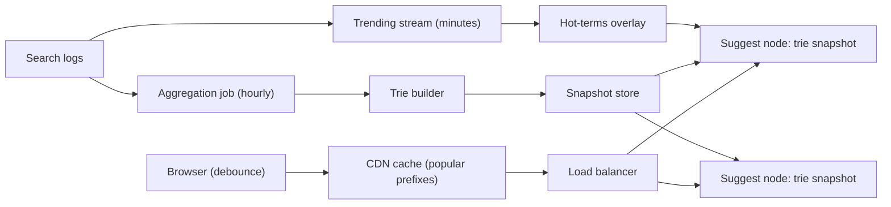

# HLD Case Study 18: Typeahead / Search Autocomplete

> **Key Focus Areas:** Prefix lookup in memory, top-k at every node, offline versus online ranking, sharding by prefix, latency budget, trending updates.

---

## 1. Requirements and Scope

**Functional:** as the user types, return the 5 best completions for the current prefix, ranked by popularity (and recency); suggestions follow new trends within minutes to hours; offensive or blocked terms never appear.
**Non-functional:** end-to-end under 100 ms (the user is typing); the service is read-heavy and tolerates **slightly stale** rankings; high availability, because a missing suggestion box degrades but does not break search.
**Out of scope for this answer:** spelling correction, personalised ranking beyond a short overlay, multi-language segmentation.

---

## 2. Back-of-the-Envelope Estimates

```python
searches_per_day = 5e9
avg_query_len = 12
requests_per_search = 5                           # client debounces, so not one request per keystroke
suggest_qps = searches_per_day * requests_per_search / 86400   # ~290,000/s average
peak_qps = suggest_qps * 3
distinct_queries = 1e9                            # long tail: most queries are rare
top_terms = 100e6                                 # keep only terms with enough volume
bytes_per_term = 40
raw_terms_gb = top_terms * bytes_per_term / 1e9   # 4 GB of term text
prefixes_per_term = avg_query_len
topk_entries = top_terms * prefixes_per_term      # worst case 1.2B prefix nodes before sharing
trie_gb = 100e6 * 30 * 8 / 1e9 + 4                # a compressed trie shares prefixes: rough 30 nodes of 8 bytes per term plus text
print(round(suggest_qps), round(peak_qps), raw_terms_gb, round(trie_gb))
assert 280_000 < suggest_qps < 300_000 and trie_gb < 50
```

The whole index fits in the RAM of one large machine, so the problem is **serving 300,000 to 900,000 lookups per second with low latency**, not storage. Replicate the index many times rather than sharding it deeply.

---

## 3. API Design

```
GET /v1/suggest?q=how+to&limit=5&lang=en   -> 200 {"suggestions": ["how to tie a tie", ...]}
```

Cache headers matter: suggestions for popular prefixes can be cached for 1 to 5 minutes at the CDN and in the browser. Debounce on the client (wait about 100 to 200 ms after the last keystroke) and cancel superseded requests.

---

## 4. Data Model

Offline pipeline (batch or stream): `search logs -> count by (term, time window) -> filter -> build index`. Serving index: a trie in memory where **each node stores the top-k completions for its prefix**, so a lookup is "walk the prefix, return the node's list" with no subtree scan.

| Item | Stored where | Notes |
| :--- | :--- | :--- |
| Raw query logs | Kafka then object storage | The source of truth for rankings |
| Term counts per window | Batch job output | Decay old counts so trends can rise |
| Serving trie (immutable snapshot) | RAM on every serving node | Rebuilt and swapped atomically |
| Block list | Small side set | Applied at build time and again at serve time |

---

## 5. Architecture



---

## 6. Deep Dive: The Trie with Top-k at Each Node

Walking a trie and collecting every completion under a prefix is too slow for short prefixes ("a" has millions). Precompute the best k at every node:

```python
import heapq
import random

class TrieNode:
    __slots__ = ("children", "top")
    def __init__(self):
        self.children = {}
        self.top = []                                  # list of (count, term), best first, length <= k

class SuggestTrie:
    def __init__(self, k: int = 5):
        self.k, self.root = k, TrieNode()

    def insert(self, term: str, count: int) -> None:
        node = self.root
        self._offer(node, term, count)                  # the root answers the empty prefix: the global top-k
        for ch in term:
            node = node.children.setdefault(ch, TrieNode())
            self._offer(node, term, count)

    def _offer(self, node: TrieNode, term: str, count: int) -> None:
        node.top = [(c, t) for c, t in node.top if t != term]
        node.top.append((count, term))
        node.top.sort(key=lambda x: (-x[0], x[1]))      # most frequent first, ties alphabetical
        del node.top[self.k:]

    def suggest(self, prefix: str) -> list:
        node = self.root
        for ch in prefix:
            node = node.children.get(ch)
            if node is None:
                return []
        return [t for _, t in node.top]

random.seed(3)
words = [f"{random.choice('abc')}{random.choice('abc')}{''.join(random.choices('xyz', k=3))}" for _ in range(400)]
counts = {w: random.randint(1, 1000) for w in set(words)}
trie = SuggestTrie(k=5)
for w, c in counts.items():
    trie.insert(w, c)

def brute(prefix, k=5):
    hits = sorted(((c, w) for w, c in counts.items() if w.startswith(prefix)), key=lambda x: (-x[0], x[1]))
    return [w for _, w in hits[:k]]

for prefix in ["a", "b", "ab", "ca", "cax", "zzz", ""]:
    assert trie.suggest(prefix) == brute(prefix), prefix        # equals the brute-force answer on every prefix
```

**Cost.** Memory grows with `terms x prefix length x k`, which is why real systems share prefixes (a compressed or radix trie), cap k at 5 to 10, and drop rare terms. Lookups cost `O(prefix length)` regardless of how many terms exist.

**Ranking signals.** Start with frequency over a time window; add recency decay (a weekly count weighted above a yearly count), geography and language, and a click-through signal ("which suggestion did users actually pick"). Keep ranking offline; the serving node only reads lists.

**Trending.** An hourly rebuild is too slow for breaking news. Run a small streaming job that detects terms whose rate jumped, and merge those into the results as an overlay at serve time.

---

## 7. Scaling and Bottlenecks

1. **Replicate, do not shard, the small index:** a few gigabytes per node means every node can answer every prefix; scale by adding replicas behind a load balancer.
2. **Shard only if the index outgrows memory:** shard by the first one or two characters, and remember skew (the letter "s" is far hotter than "x"); split hot prefixes further.
3. **Cache aggressively:** a few thousand short prefixes account for most traffic; CDN and in-process caches absorb them.
4. **Snapshot swap:** build the new trie off to the side, then switch a pointer atomically so lookups never see a half-built index.
5. **Client discipline:** debounce, cancel in-flight requests, and do not query below a minimum length for very common prefixes if latency demands it.

---

## 8. Failure Modes and Mitigations

| Failure | Effect | Mitigation |
| :--- | :--- | :--- |
| Suggest service down | No suggestions, search still works | The UI hides the dropdown; never block the search box |
| Bad build (empty or corrupt trie) | Wrong or empty suggestions everywhere | Validate a snapshot (size, sample queries) before swapping; keep the previous snapshot for instant rollback |
| Offensive term trending | Reputation damage | Block list applied at build and serve time, plus a rapid takedown path |
| Stale trends | Users see yesterday's popular terms | Streaming overlay and short snapshot intervals |
| Hot prefix overload | One node saturates | Replicas plus CDN caching for the top prefixes |

---

## 9. Trade-offs and Alternatives

- **Trie versus a search index (Elasticsearch completion suggester):** a search engine is faster to build and richer (fuzzy matching, filters); a custom in-memory trie wins on raw latency and cost at very high QPS.
- **Per-node top-k versus computing on the fly:** per-node lists cost memory and make lookups constant time; on-the-fly scans cost nothing in memory and are too slow for short prefixes.
- **Freshness versus stability:** rebuilding often tracks trends but makes suggestions jitter; users prefer stable lists with a small trending slice.
- **Personalisation:** a small per-user overlay (recent searches) merged client-side or at the edge keeps the shared index cacheable.

---

## 10. Interview Timeline (45 minutes) and Follow-ups

| Minutes | Do |
| :--- | :--- |
| 0 to 5 | Latency target, freshness expectation, scope |
| 5 to 10 | Estimates: QPS and index size (it fits in memory) |
| 10 to 20 | Data structure: trie with top-k per node, and why |
| 20 to 30 | Offline pipeline, serving architecture, snapshot swap |
| 30 to 40 | Trending overlay, ranking, sharding and caching |
| 40 to 45 | Failure modes, abuse filtering, personalisation |

**Follow-ups to prepare:** How do you update the trie without downtime? How do you handle a term that suddenly trends? How do you shard when the index no longer fits one node? How do you avoid suggesting private or offensive queries? How do you measure suggestion quality?
