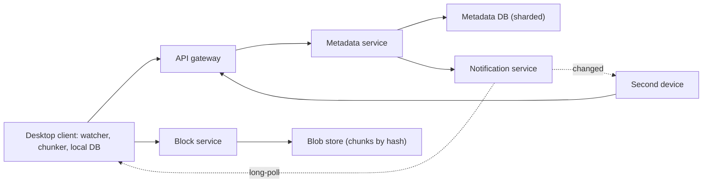

# HLD Case Study 19: File Storage and Sync (Dropbox / Google Drive)

> **Key Focus Areas:** Chunking and deduplication, content-defined boundaries, metadata versus blob storage, resumable uploads, sync protocol with change cursors, conflict resolution, and sharing.

---

## 1. Requirements and Scope

**Functional:** upload and download files up to tens of gigabytes, keep folders in sync across a user's devices, version history, share files and folders with permissions, resume interrupted uploads.
**Non-functional:** **never lose or corrupt a file** (durability over everything); after an edit, other devices see the change within seconds; bandwidth efficient (do not re-upload a whole file for a small edit); offline edits reconcile when a device reconnects.
**Out of scope for this answer:** real-time co-editing (a different problem built on operational transforms or CRDTs), search over file contents, enterprise administration.

---

## 2. Back-of-the-Envelope Estimates

```python
users = 100e6
avg_stored_gb = 5
raw_pb = users * avg_stored_gb / 1e6                    # 500 PB of logical data
dedup_savings = 0.3                                     # shared files and repeated chunks: assume 30% saved
stored_pb = raw_pb * (1 - dedup_savings)                # 350 PB after deduplication
replication_overhead = 1.5                              # erasure coding, not 3 full copies
physical_pb = stored_pb * replication_overhead          # 525 PB on disk
dau = 20e6
changes_per_user_day = 10
metadata_ops_per_day = dau * changes_per_user_day * 5   # list, upload-start, commit, notify, download
metadata_qps = metadata_ops_per_day / 86400             # ~11,600/s average
chunk_mb = 4
files_gb = 1                                            # one 1 GB file
chunks_per_file = files_gb * 1024 / chunk_mb            # 256 chunks
print(raw_pb, stored_pb, physical_pb, round(metadata_qps), chunks_per_file)
assert 340 < stored_pb < 360 and 11_000 < metadata_qps < 12_000 and chunks_per_file == 256
```

Two systems with very different shapes: a **blob store** for hundreds of petabytes (bandwidth-bound, append-mostly) and a **metadata store** with thousands of small, consistent transactions per second.

---

## 3. API Design

```
POST /v1/files/begin     {path, size, chunk_hashes[]}   -> 200 {upload_id, missing_chunks[]}   // dedupe check
PUT  /v1/chunks/{hash}   (body: chunk bytes)            -> 204                                // resumable, idempotent
POST /v1/files/commit    {upload_id, base_version}      -> 200 {version} | 409 conflict
GET  /v1/changes?cursor=C                               -> 200 {entries[], next_cursor}       // long-poll for sync
GET  /v1/files/{id}/versions/{v}                        -> chunk list, then download chunks
```

The client uploads **only the chunks the server does not already have**, and a file becomes visible only at `commit`, so a half-uploaded file never appears.

---

## 4. Data Model

| Store | Content | Why |
| :--- | :--- | :--- |
| Metadata DB (sharded relational) | file tree, per-file version list, `version -> [chunk hashes]`, ACLs, change log with a per-user cursor | Needs transactions and consistent reads |
| Blob store | chunks keyed by `SHA-256` of their content | Immutable, deduplicated, replicated or erasure coded |
| Notification channel | "something changed" pings per user | So devices fetch changes without polling |

Content-addressed chunks are immutable, so a file version is just an ordered list of hashes; two versions share every chunk that did not change.

---

## 5. Architecture



---

## 6. Deep Dive: Why Chunk Boundaries Must Follow the Content

Fixed-size chunks break when bytes are inserted: every following boundary shifts, every chunk hash changes, and the whole file re-uploads. **Content-defined chunking** cuts where a hash of the last few bytes matches a pattern, so boundaries follow the data and an insertion only changes the chunks around it.

```python
import hashlib
import random

def fixed_chunks(data: bytes, size: int = 1024):
    return [data[i:i + size] for i in range(0, len(data), size)]

def cdc_chunks(data: bytes, mask: int = 0x3FF, min_size: int = 256, max_size: int = 4096, window: int = 16):
    chunks, start = [], 0
    for i in range(len(data)):
        size = i - start + 1
        if size < min_size:
            continue
        h = int.from_bytes(hashlib.blake2b(data[i - window + 1:i + 1], digest_size=4).digest(), "big")
        if (h & mask) == 0 or size >= max_size:               # boundary where the content says so (or at the cap)
            chunks.append(data[start:i + 1])
            start = i + 1
    if start < len(data):
        chunks.append(data[start:])
    return chunks

def digests(chunks):
    return [hashlib.sha256(c).hexdigest() for c in chunks]

rng = random.Random(1)
original = bytes(rng.randrange(256) for _ in range(200_000))
edited = b"X" + original                                       # insert one byte at the very start

assert b"".join(cdc_chunks(original)) == original               # chunking is lossless
fixed_old, fixed_new = set(digests(fixed_chunks(original))), set(digests(fixed_chunks(edited)))
cdc_old, cdc_new = set(digests(cdc_chunks(original))), set(digests(cdc_chunks(edited)))
assert len(fixed_new - fixed_old) == len(fixed_new)              # fixed size: every chunk changed, nothing reusable
assert len(cdc_new - cdc_old) <= 3                               # content-defined: only the chunks near the edit changed
```

On a 200 KB test file with a single inserted byte, fixed chunks reuse nothing while content-defined chunks upload about one new chunk. Production systems use a rolling hash (Rabin fingerprint or gear hash) that is much cheaper than hashing every window with BLAKE2 as this teaching version does.

**Deduplication** follows for free: before uploading, the client sends the hashes, and the server replies with the ones it lacks. If any user has uploaded that chunk before, nothing is transferred. Privacy caveat: cross-user dedupe can leak that a file exists (a guesser can test whether a hash is known); many services dedupe only within an account for sensitive tiers.

**Sync protocol.** Every committed change appends to a per-user change log with an increasing cursor. A device stores the last cursor it processed and long-polls `/changes?cursor=C`; on reconnect it simply continues from `C`. Pings only say "something changed"; the log is the source of truth, which makes missed pings harmless.

**Conflicts.** Commit carries the version the edit was based on (`base_version`). If the server's current version differs, reject with `409`; the client keeps both and saves the loser as "report (conflicted copy)". Merge automatically only for formats you understand.

---

## 7. Scaling and Bottlenecks

1. **Blob store:** hundreds of petabytes; chunks are immutable, so use erasure coding on cold data and replication on hot data, with tiering by age.
2. **Metadata:** shard by user or namespace so a user's tree and change log live on one shard (cheap transactions); shared folders need cross-shard care.
3. **Upload bandwidth:** parallel chunk uploads, resumable per chunk, and client-side throttling.
4. **Change fan-out:** one change in a shared folder notifies many devices; send tiny pings and let devices pull.
5. **Hot chunks:** popular files concentrate reads on a few chunks; cache them at the edge.

---

## 8. Failure Modes and Mitigations

| Failure | Effect | Mitigation |
| :--- | :--- | :--- |
| Upload interrupted | Partial file | Chunk uploads are idempotent; `begin` returns which chunks are still missing, and nothing is visible before `commit` |
| Corrupted chunk | Wrong data served | Verify the hash on write and on read; the hash is the integrity check |
| Metadata lost | Chunks exist but no file points to them | Replicate metadata synchronously; keep a change log you can replay; garbage-collect unreferenced chunks only after a safety delay |
| Concurrent edits on two devices | Lost update | `base_version` check plus conflicted copies |
| Missed notification | A device stays stale | Cursor-based pull on every reconnect and on a timer |
| Accidental delete | User loses data | Soft delete with a retention window and version history |

---

## 9. Trade-offs and Alternatives

- **Chunk size:** small chunks dedupe better and cost more metadata; large chunks are cheap to track and re-upload more on small edits. Typical sizes are 1 to 8 MB with content-defined boundaries.
- **Fixed versus content-defined chunking:** fixed is simple and fast and fails on insertions; content-defined costs CPU and wins on edits.
- **Global versus per-user dedupe:** global saves the most storage and has privacy risks; per-user is safer and less efficient.
- **Last-writer-wins versus conflict copies:** last-writer-wins silently loses data; conflict copies preserve everything at the cost of user tidying.

---

## 10. Interview Timeline (45 minutes) and Follow-ups

| Minutes | Do |
| :--- | :--- |
| 0 to 5 | Scope: sync versus storage, file size limits, sharing |
| 5 to 10 | Estimates: storage, metadata QPS |
| 10 to 20 | Split metadata from blobs; API with begin, chunk upload, commit |
| 20 to 32 | **Chunking and dedupe**, sync cursor, conflicts |
| 32 to 40 | Scaling the metadata shards and the blob tier |
| 40 to 45 | Failure modes, privacy, versioning and recovery |

**Follow-ups to prepare:** How do you resume a 40 GB upload? How do you detect which chunks changed after an insertion? How do two devices stay consistent after being offline? How do you share a folder without copying data? How do you delete data for good (legal requirement) when chunks are shared?
